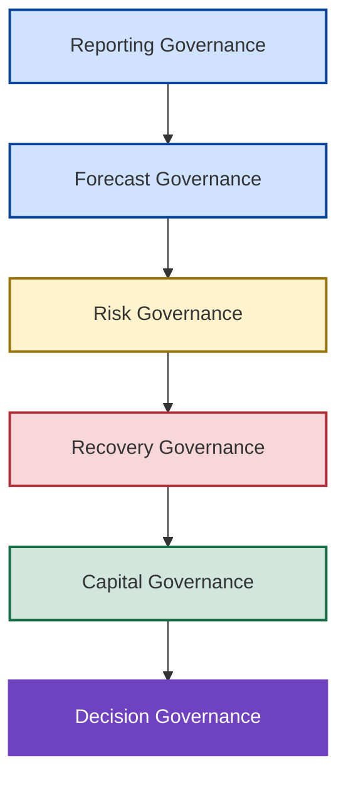
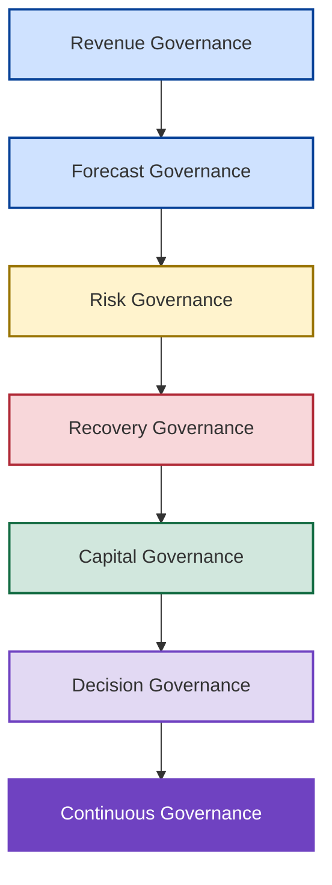

# 🏛️ Enterprise Revenue Governance Framework

## Governing Revenue Intelligence, Forecast Risk, Capital Allocation & Decision Intelligence

<p align="center">

🏠 [Repository Home](../README.md)

📖 [Repository Index](../INDEX.md)

</p>

---

<p align="center">


</p>

---

## 📌 Executive Overview

Enterprise forecasting has traditionally focused on reporting historical performance and producing periodic forecast submissions. As organizations become increasingly dependent upon recurring revenue models and longer planning horizons, forecasting must evolve into a broader governance capability capable of identifying risk, governing intervention decisions, allocating capital, and supporting executive decision-making.

The New Bridge simulation demonstrated how rapidly forecast confidence can deteriorate despite strong historical attainment, highlighting the need for structured governance mechanisms that extend beyond traditional reporting and forecasting processes.

The Enterprise Revenue Governance Framework defines the governance domains, decision rights, escalation paths, and management disciplines required to support Revenue Governance, Forecast Governance, Risk Governance, Recovery Governance, Capital Governance, and Decision Governance across the enterprise.

---

## 🎯 Business Problem

Traditional forecasting environments frequently suffer from:

❌ Backward-looking reporting

❌ Single-point forecast assumptions

❌ Limited risk visibility

❌ Late deterioration detection

❌ Reactive recovery planning

❌ Fragmented decision-making

As a result, organizations frequently discover fiscal-year exposure too late to deploy effective intervention strategies, forcing leadership into compressed recovery cycles with limited strategic options.

---

## 🏛️ Governance Maturity Model

The framework is designed to evolve organizations from reporting-centric forecasting toward integrated enterprise governance.



---

## 🧠 Governance Philosophy

The framework is built upon a simple principle:

> Enterprise forecasting should be governed as a business capability rather than managed as a reporting process.

This shifts organizational focus from:

```text
Visibility
```

to:

```text
Decision Quality
```

and creates a structured governance model for managing uncertainty, exposure, intervention, and executive decision-making.

---

## ❓ Governance Questions Framework

Each governance domain exists to answer a specific enterprise question.

| Governance Domain   | Primary Question                      |
| ------------------- | ------------------------------------- |
| Revenue Governance  | What is happening?                    |
| Forecast Governance | What is likely to happen?             |
| Risk Governance     | What could go wrong?                  |
| Recovery Governance | Should intervention occur?            |
| Capital Governance  | Where should investment be deployed?  |
| Decision Governance | What decision should leadership make? |

Together these domains form an integrated governance chain that connects visibility, forecasting, risk management, capital allocation, and executive action.

---

## 🏗️ Enterprise Revenue Governance Model



---

## 📊 Governance Domain 1 — Revenue Governance

Revenue Governance establishes a trusted and governed view of enterprise commercial performance.

### Core Responsibilities

* ARR Governance
* ACV Governance
* Revenue Realization Governance
* Bookings Governance
* Customer Segmentation Governance
* Revenue Motion Governance
* Commercial Performance Measurement

### Governance Objective

Create a consistent, trusted, and auditable view of enterprise revenue performance.

### Primary Outcome

A single governed source of truth for revenue measurement and commercial performance.

---

## 📈 Governance Domain 2 — Forecast Governance

Forecast Governance evaluates future performance under multiple confidence assumptions.

### Core Responsibilities

* Full Pipe Coverage
* Qualified Pipe Coverage
* High Confidence Coverage
* Budget Attainment Governance
* Scenario Forecasting
* Pipeline Survivability Assessment

### Governance Objective

Continuously evaluate fiscal-year recoverability and forecast confidence.

### Primary Outcome

A governed view of future performance under multiple planning assumptions.

---

## ⚠️ Governance Domain 3 — Risk Governance

Risk Governance identifies emerging deterioration before fiscal commitments become vulnerable.

### Core Governance Responsibilities

* Coverage Gap Monitoring
* Forecast Deterioration Monitoring
* Geographic Exposure Analysis
* Pipeline Quality Assurance (Pipeline hygiene)
* Confidence Calibration

### Governance Objective

Create early visibility into enterprise exposure.

### Primary Outcome

Structured early-warning detection of commercial risk.

---

## 🛡️ Governance Domain 4 — Recovery Governance

The New Bridge simulation demonstrated that forecast coverage could decline from **105.1% under Full Pipe assumptions** to **78.0% under High Confidence assumptions**, creating a potential **$35M exposure** despite strong historical attainment.

Recovery Governance exists to ensure that intervention decisions are governed, repeatable, and aligned to enterprise priorities when exposure reaches material levels.

### Core Governance Responsibilities

* Central Risk Reserve (CRR)
* Recovery Readiness
* Intervention Planning
* Recovery Scenario Governance
* Escalation Frameworks

### Governance Objective

Determine when intervention becomes necessary and establish governance for recovery execution.

### Primary Outcome

Disciplined and auditable intervention decisions.

---

## 💰 Governance Domain 5 — Capital Governance

The High Confidence scenario required approximately **$18M of recovery capital** to address nearly **$35M of forecast exposure**, demonstrating that capital deployment decisions materially influence fiscal-year outcomes.

Capital Governance ensures that limited investment resources are allocated to the highest-impact opportunities through structured governance and objective recovery economics.

### Core Governance Responsibilities

* ROI Determination
* Investment Prioritization
* Geography Selection & Capital Allocation 
* Investment Levers & Optimization 
* Recovery Efficiency Measurement

### Governance Objective

Govern how recovery capital is prioritized and deployed.

### Primary Outcome

Maximum forecast uplift with disciplined capital allocation.

---

## 🎯 Governance Domain 6 — Decision Governance

Recovery Optimization identified efficient intervention portfolios, while Investment Tradeoff Analysis evaluated alternative recovery strategies requiring between **$5.99M and $18.0M** of investment. The remaining challenge was determining which portfolio leadership should ultimately fund.

Decision Governance exists to ensure that analytical recommendations are translated into accountable executive decisions.

### Core Governance Responsibilities

* Scenario Evaluation
* Portfolio Selection
* Investment Tradeoff Analysis
* Risk Tolerance Assessment
* Executive Decision Frameworks

### Governance Objective

Support disciplined decision-making under uncertainty.

### Primary Outcome

Governed executive decisions aligned to enterprise objectives.

---

## 🔄 Continuous Governance Loop

The framework intentionally operates as a closed-loop governance system.

This ensures that revenue visibility, forecasting, risk management, intervention planning, capital allocation, and executive decision-making remain continuously aligned.

---

## 🏛️ Reference Implementation — New Bridge

The New Bridge repository serves as a reference implementation of the governance framework.

| Repository Artifact                        | Governance Domain                     |
| ------------------------------------------ | ------------------------------------- |
| SaaS Financial Model                       | Revenue Governance                    |
| Forecast Risk Model                        | Forecast Governance & Risk Governance |
| Central Risk Reserve                       | Recovery Governance                   |
| Recovery Optimization                      | Capital Governance                    |
| Investment Tradeoff Analysis               | Decision Governance                   |
| Institutional Lessons & Strategic Insights | Institutional Learning                |
| Next Generation Revenue Operating Model    | Future-State Evolution                |

---

## 🚀 Governance Outcomes

Organizations implementing this framework gain the ability to:

✅ Move beyond historical reporting

✅ Govern forecast confidence

✅ Detect risk earlier

✅ Escalate exposure consistently

✅ Improve intervention discipline

✅ Optimize capital allocation

✅ Strengthen executive decision-making

✅ Institutionalize enterprise governance

---

## 🎯 Strategic Outcome

The Enterprise Revenue Governance Framework provides a structured governance model for managing forecast visibility, exposure detection, intervention planning, capital allocation, and executive decision-making.

Rather than treating these activities as isolated processes, the framework integrates them into a coordinated governance system that supports better decisions under uncertainty and improves the organization's ability to manage fiscal-year performance proactively.

---

## 👤 Author

**Anil Jacob**

Enterprise BI • Revenue Operations Strategy • Decision Intelligence • Executive Analytics

---

## 📜 Repository Context

All forecasts, governance frameworks, operating models, optimization engines, portfolio allocations, recovery strategies, and business scenarios contained within this repository are synthetic and intended exclusively for portfolio, educational, and strategic demonstration purposes.

The Enterprise Revenue Governance Framework illustrates how organizations can govern revenue intelligence, forecast risk, recovery intervention, capital allocation, and executive decision-making through a unified governance model.
