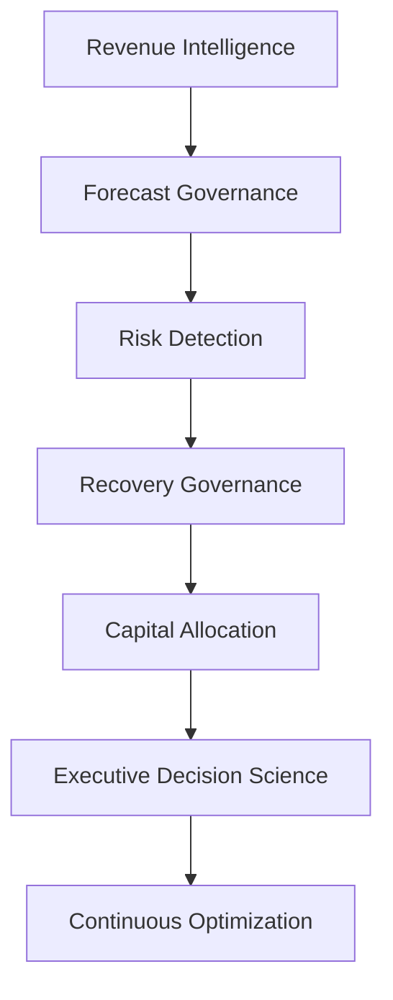
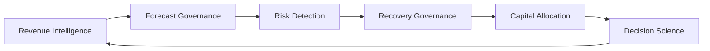

# 🏛️ Commercial Governance Reference Architecture

## Enterprise Revenue Operating System for Forecast Governance, Recovery Optimization & Executive Decision Science

[⬅ Back to README](../README.md)

---

<p align="center">


</p>

---

## 📌 Executive Overview

Most enterprise forecasting environments were designed to answer a single question:

> What happened?

Modern commercial organizations require a more sophisticated operating model capable of answering:

* What is likely to happen?
* What risks are emerging?
* How severe are those risks?
* What interventions are available?
* What investments should be prioritized?
* How should leadership respond?

The Commercial Governance Reference Architecture was developed to answer these questions through an integrated operating model spanning:

* revenue intelligence,
* forecast governance,
* risk management,
* recovery optimization,
* capital allocation,
* and executive decision science.

---

## 🎯 Business Problem

Traditional forecasting environments frequently suffer from:

❌ backward-looking reporting

❌ single-point forecast assumptions

❌ limited risk visibility

❌ late deterioration detection

❌ reactive recovery planning

❌ fragmented decision-making

As a result, organizations often discover fiscal year exposure too late to deploy effective intervention strategies.

---

## 🏛️ Architecture Vision

The architecture is designed to evolve organizations from:

### Traditional Forecast Management

```text
Historical Reporting
        ↓
Forecast Submission
        ↓
Budget Variance
        ↓
Executive Escalation
```

To:

### Commercial Governance Operating System

```text
Revenue Intelligence
        ↓
Forecast Governance
        ↓
Risk Detection
        ↓
Recovery Readiness
        ↓
Capital Allocation
        ↓
Decision Science
```

---

## 🧠 Core Architecture Principle

The architecture is built around a single operating philosophy:

> Enterprise forecasting should be treated as a governance capability rather than a reporting process.

This shifts the focus from:

```text
Visibility
```

to:

```text
Decision Quality
```

---

## 🏗️ Commercial Governance Capability Model



---

## 📊 Layer 1 — Revenue Intelligence

Revenue Intelligence establishes the commercial foundation of the operating model.

### Core Capabilities

* ARR Modeling
* ACV Modeling
* Revenue Realization
* Bookings Management
* Customer Segmentation
* Cohort Analysis
* Revenue Motion Attribution

#### Primary Objective

Create a trusted view of enterprise revenue performance and recurring revenue economics.

---

## 📈 Layer 2 — Forecast Governance

Forecast Governance continuously evaluates enterprise recoverability.

### Core Capabilities

* Full Pipe Coverage
* Qualified Pipe Coverage
* High Confidence Coverage
* Budget Attainment Modeling
* Scenario Forecasting
* Pipeline Survivability Analysis

#### Primary Objective

Understand future fiscal performance under multiple confidence assumptions.

---

## ⚠️ Layer 3 — Risk Detection

Risk Detection identifies emerging deterioration before fiscal commitments become vulnerable.

### Core Capabilities

* Coverage Gap Monitoring
* Forecast Deterioration Tracking
* Geographic Exposure Analysis
* Pipeline Quality Assessment
* Confidence Calibration

#### Primary Objective

Create early warning visibility into forecast risk.

---

## 🛡️ Layer 4 — Recovery Governance

Recovery Governance determines when intervention becomes necessary.

### Core Capabilities

* Central Risk Reserve (CRR)
* Recovery Readiness
* Intervention Planning
* Recovery Scenario Modeling
* Executive Escalation Frameworks

#### Primary Objective

Provide structured responses to deteriorating forecast conditions.

---

## 💰 Layer 5 — Capital Allocation

Capital Allocation optimizes how limited recovery resources are deployed.

### Core Capabilities

* ROI Modeling
* Investment Prioritization
* Geography Allocation
* Lever Optimization
* Recovery Efficiency Analysis

#### Primary Objective

Maximize forecast uplift while preserving capital efficiency.

---

## 🎯 Layer 6 — Executive Decision Science

Executive Decision Science transforms analytics into actionable leadership decisions.

### Core Capabilities

* Scenario Comparison
* Investment Tradeoff Analysis
* Recovery Economics
* Risk Appetite Assessment
* Strategic Decision Frameworks

#### Primary Objective

Enable disciplined decision-making under uncertainty.

---

## 🔄 Continuous Optimization Loop

The architecture intentionally operates as a closed-loop governance system.



This ensures commercial performance continuously informs future planning, investment allocation, and governance decisions.

---

## 🏛️ Reference Implementation — New Bridge

The New Bridge repository serves as the reference implementation of this architecture.

| Repository Section              | Architecture Layer      |
| ------------------------------- | ----------------------- |
| SaaS Financial Model            | Revenue Intelligence    |
| Pipeline Governance             | Forecast Governance     |
| Forecast Risk Model             | Risk Detection          |
| CRR Optimization                | Recovery Governance     |
| Recovery Optimization           | Capital Allocation      |
| Investment Tradeoff Analysis    | Decision Science        |
| Executive Lessons Learned       | Institutional Learning  |
| Next Generation Operating Model | Continuous Optimization |

---

## 🚀 Architecture Outcomes

Organizations implementing this architecture gain the ability to:

✅ move beyond historical reporting

✅ detect risk earlier

✅ continuously evaluate recoverability

✅ optimize recovery investments

✅ improve capital allocation decisions

✅ institutionalize commercial governance

✅ improve executive decision quality

---

## 🎯 Strategic Outcome

The Commercial Governance Reference Architecture transforms enterprise forecasting from a reporting exercise into a comprehensive operating system for:

* revenue intelligence,
* commercial governance,
* recovery management,
* capital allocation,
* and executive decision-making.

The result is a more resilient, more predictable, and more governable commercial organization.

---

### 👤 Author

**Anil Jacob**
Enterprise BI • RevOps Strategy • Executive Analytics • Forecast Governance

---

### 📜 Repository Context

The architecture, operating models, forecasts, governance frameworks, optimization models, and business scenarios presented throughout this repository are synthetic and intended exclusively for portfolio, educational, and strategic demonstration purposes.
