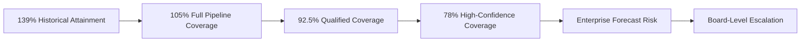
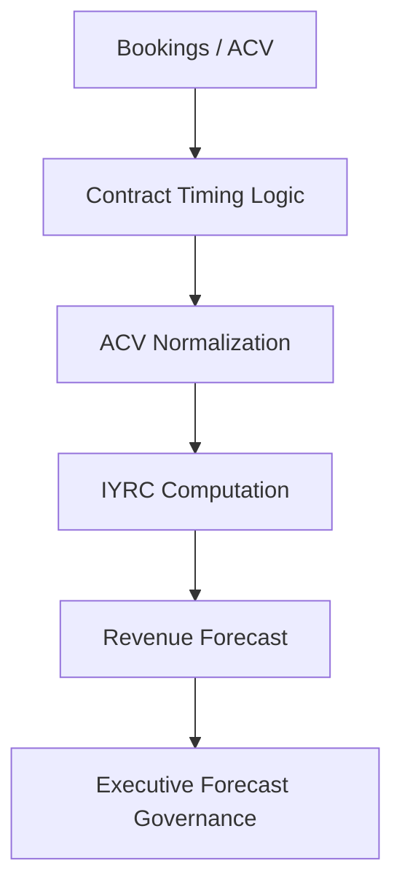
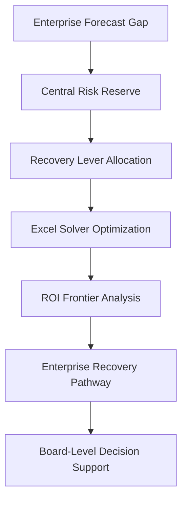
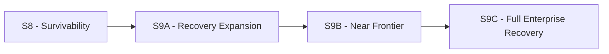

# 🏛️ Executive Summary  
## 🚀 New Bridge SaaS Operating System  
### 📈 Board-Level Forecast Governance & Recovery Optimization Simulation

---

---

# 📌 Executive Overview

New Bridge is a simulated enterprise SaaS organization designed to model how modern subscription businesses govern commercial operations, forecast performance, pipeline risk, and enterprise recovery strategies under deteriorating operating conditions.

The project was intentionally built as a:

# 🏢 Fortune 500 Commercial Governance Simulation

bridging:

- Enterprise Business Intelligence
- Revenue Operations (RevOps)
- SaaS Financial Modeling
- Forecast Governance
- Executive Analytics
- Portfolio Optimization
- Recovery Strategy
- Enterprise Risk Mitigation

Unlike traditional analytics portfolios focused purely on reporting or dashboards, this platform simulates how executive leadership teams manage:

- growth,
- commercial exposure,
- forecast deterioration,
- capital allocation,
- and enterprise survivability

within a global SaaS operating environment.

---

# 🌍 Strategic Business Context

At the end of Fiscal Q3 FY26, New Bridge appeared operationally healthy from a historical performance perspective.

---

## 📈 Historical Operating Performance

| Metric | Result |
|---|---:|
| Historical Revenue Attainment | 139% |
| Geographic Performance | All major regions above target |
| Pipeline Activity | Strong |
| Revenue Expansion | Healthy |
| Commercial Momentum | Positive |

At face value, the organization appeared to be outperforming expectations across global markets.

However, once the enterprise transitioned from a historical operational lens to a forward-looking fiscal forecast perspective, significant enterprise risk exposure emerged.

---

# ⚠️ Forecast Governance Breakdown

## 📉 Enterprise Coverage Deterioration

| Forecast Scenario | Enterprise Coverage |
|---|---:|
| Full Pipeline Coverage | 105.0% |
| Qualified Pipeline Coverage | 92.5% |
| High-Confidence Pipeline Coverage | 78.0% |

This revealed a critical governance problem:

> Strong historical performance was masking severe forward-looking forecast fragility.

The organization had become increasingly dependent on:

- lower-confidence pipeline,
- late-quarter recovery execution,
- geographic concentration,
- and aggressive forecast assumptions.

This created escalating enterprise exposure against fiscal commitments and materially increased the probability of missing full-year operating targets.

---

## 🚀 Launch Interactive Power BI Experience

<a href="https://app.powerbi.com/view?r=eyJrIjoiNDcxZTU3M2YtMjQ5Ni00ODRhLTk3NTYtM2Q3NmJhYjU0ZGZlIiwidCI6ImY2NTRlNzkxLWY4NTgtNDZkNi05MWE5LTE5YzlmZTA4YTc0ZiJ9&pageName=1620bb6e7a6a9c45a384" frameborder="0" allowFullScreen="true"></iframe>>
  
</a>

---

# 🧠 Executive Narrative Progression

---

# 🏗️ Enterprise SaaS Operating System

The project models a governed SaaS commercial operating system including:

- ARR transaction modeling
- ACV normalization
- Revenue realization logic
- Fiscal calendar engineering
- Opportunity lifecycle simulation
- Pipeline governance
- Forecast calibration
- Executive KPI management
- Geography-level risk analysis

The platform intentionally bridges:

| Business Domain | Capability |
|---|---|
| Enterprise BI | Executive reporting & semantic modeling |
| RevOps | Pipeline governance & commercial operations |
| SaaS Finance | ARR / ACV / IYRC mechanics |
| Forecast Governance | Multi-scenario calibration |
| Executive Analytics | Decision-support systems |
| Commercial Strategy | Recovery optimization |
| Portfolio Governance | Geographic investment allocation |

---

# 🏛️ Enterprise Commercial Intelligence Architecture

---

# 🧮 ARR → Revenue Realization Framework

The simulation models how SaaS commercial activity translates into fiscal outcomes through governed revenue realization mechanics.

Core modeling components include:

- Annual Contract Value (ACV)
- Annual Recurring Revenue (ARR)
- In-Year Revenue Contribution (IYRC)
- Revenue timing logic
- Fiscal period allocation
- Opportunity lifecycle causality

---

## 📊 Revenue Realization Flow

---

# 🌍 Geography-Level Forecast Governance

The framework models forecast deterioration across multiple global operating regions including:

- NA West
- NA East
- DACH
- UKI
- India
- ANZ
- Brazil
- Middle East

The project demonstrates how enterprise forecast exposure becomes unevenly distributed across global commercial portfolios under deteriorating pipeline conditions.

---

# 🛡️ Central Risk Reserve (CRR)

One of the project’s primary strategic innovations is the introduction of a:

# 🏦 Central Risk Reserve (CRR)

The CRR acts as an institutional recovery-capital framework designed to preserve enterprise forecast attainment under severe downside conditions.

The framework models how enterprise leadership can deploy economically rational recovery investments across global commercial portfolios.

---

# 🎯 Recovery Investment Levers

| Lever | Strategic Purpose |
|---|---|
| RAF Acceleration | Pipeline expansion & scalable recovery |
| Renewal Optimization | Installed-base recovery efficiency |
| Tactical Discounts | Controlled late-stage recovery support |
| Geographic Allocation | Portfolio efficiency prioritization |

---

# ⚙️ Enterprise Recovery Optimization Framework

---

# 📈 Recovery Frontier Analysis

The repository models progressively severe enterprise stress environments.

| Scenario | Strategic Interpretation |
|---|---|
| S8 | Survivability Triage |
| S9A | Recovery Expansion |
| S9B | Near Recovery Frontier |
| S9C | Full Enterprise Recovery Frontier |

The optimization framework evaluates:

- recovery efficiency,
- marginal ROI deterioration,
- binding constraints,
- geographic prioritization,
- and enterprise survivability economics.

---

# 📊 Enterprise Recovery Progression

---

# 🚀 S9C — Enterprise Recovery Frontier

Scenario S9C mathematically demonstrated that full enterprise forecast recovery became achievable once scalable RAF acceleration and high-efficiency renewal optimization were sufficiently expanded while maintaining disciplined discount governance.

---

## 📌 S9C Outcome Summary

| Metric | Value |
|---|---:|
| Total Enterprise CRR | 18.0M |
| Forecast Recovery Achieved | 34.76M |
| Residual Enterprise Exposure | 0 |
| Recovery Efficiency | 100% |
| Effective Portfolio ROI | 1.93x |

This established the organization’s:

# 📈 Enterprise Recovery Frontier

the point at which complete global forecast recovery became mathematically achievable under severe downside stress conditions.

---

# 🧠 Strategic Executive Insights

The project demonstrates that enterprise SaaS survivability under deteriorating commercial conditions depends on:

✅ Institutional governance discipline  
✅ Forecast calibration maturity  
✅ Economically rational recovery investment  
✅ Geography-aware capital allocation  
✅ Controlled pricing governance  
✅ Executive decision intelligence  
✅ Portfolio optimization discipline  

---

# 🎯 Strategic Outcome

New Bridge ultimately evolved beyond a traditional analytics initiative into a:

# 🏢 Board-Level Commercial Governance Platform

demonstrating how enterprise SaaS organizations can:

- operationalize commercial intelligence,
- govern forecast risk institutionally,
- optimize recovery capital deployment,
- and preserve enterprise resilience under severe operating stress.

The project intentionally bridges:

- Enterprise BI
- RevOps
- SaaS Finance
- Forecast Governance
- Executive Analytics
- Commercial Strategy
- Portfolio Optimization

within a unified enterprise operating simulation.

---

# 👤 Author

**Anil Jacob**  
Enterprise BI • RevOps Strategy • Executive Analytics • Forecast Governance

---

# 📜 Repository Purpose

This repository is published for:

- executive portfolio demonstration,
- commercial governance simulation,
- strategic analytics showcase,
- and enterprise forecasting research.

All datasets and business entities within this repository are simulated for portfolio and educational purposes.
