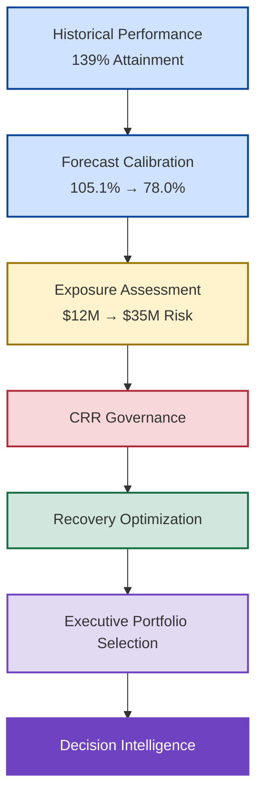
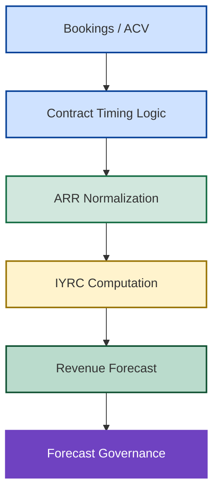
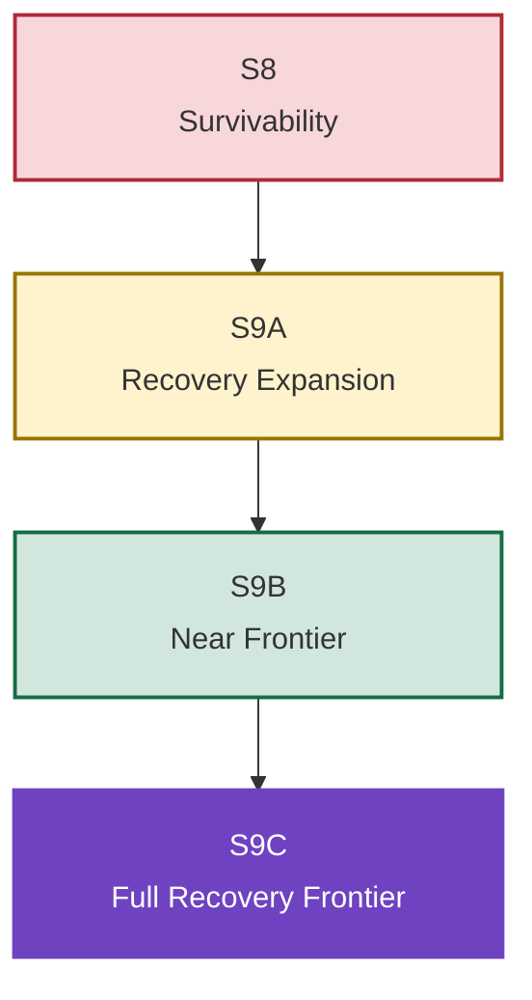

# 🏛️ Executive Summary

## 🚀 New Bridge SaaS Revenue Operating System

### 📈 Board-Level Revenue Governance, Recovery Optimization & Decision Intelligence Simulation

---

---

## 📌 Executive Overview

At the end of Fiscal Q3 FY26, New Bridge appeared operationally healthy, achieving **139% historical budget attainment** across major geographies. However, confidence-calibrated forecasting revealed that enterprise coverage could deteriorate from **105.1% under Full Pipe assumptions** to **78.0% under High Confidence assumptions**, creating a potential **$35M forecast exposure** despite strong historical performance.

This repository demonstrates how revenue governance, forecast risk management, recovery governance, capital allocation, recovery optimization, and decision intelligence can be integrated into a single operating framework capable of identifying, governing, and recovering enterprise exposure under deteriorating commercial conditions.

What began as a revenue analytics simulation ultimately evolved into a board-level decision intelligence operating system for managing uncertainty, allocating recovery capital, and protecting fiscal-year performance.

---

## 🌍 Strategic Business Context

At the end of Fiscal Q3 FY26, New Bridge appeared to be outperforming expectations across major operating regions.

### 📈 Historical Operating Performance

| Metric                        |       Result |
| ----------------------------- | -----------: |
| Historical Revenue Attainment |         139% |
| Geographic Performance        | Above Target |
| Revenue Expansion             |      Healthy |
| Pipeline Activity             |       Strong |
| Commercial Momentum           |     Positive |

Viewed through a traditional reporting lens, the organization appeared operationally healthy.

However, confidence-calibrated forecasting revealed a materially different picture of future performance.

---

## ⚠️ Enterprise Exposure Summary

### Forecast Coverage Deterioration

| Forecast Scenario | Coverage | Exposure |
| ----------------- | -------: | -------: |
| Full Pipe         |   105.1% |     None |
| Qualified Pipe    |    92.5% |    ~$12M |
| High Confidence   |    78.0% |    ~$35M |

The analysis demonstrated that strong historical performance was masking significant forward-looking exposure.

As confidence assumptions became more restrictive, enterprise coverage deteriorated rapidly, exposing increasing dependence on lower-confidence pipeline and creating material risk against fiscal-year commitments.

---

## 🧠 New Bridge Executive Decision Journey

The New Bridge journey illustrates how an organization can progress from historical performance measurement to governed executive decision-making through structured forecasting, exposure assessment, recovery governance, and portfolio optimization.

---

## 📷 Executive Dashboard Preview

---

### 🚀 Launch Interactive Power BI Experience

---

## 🏗️ Enterprise Revenue Operating System

New Bridge models an integrated SaaS revenue operating system spanning commercial performance measurement, forecasting, risk governance, capital allocation, and executive decision support.

| Business Domain       | Capability                                       |
| --------------------- | ------------------------------------------------ |
| Revenue Governance    | ARR, ACV & Revenue Performance Management        |
| Forecast Governance   | Multi-Scenario Forecast Calibration              |
| Risk Governance       | Enterprise Exposure Assessment                   |
| Recovery Governance   | CRR Activation & Intervention Planning           |
| Capital Governance    | Recovery Investment Allocation                   |
| Decision Intelligence | Portfolio Selection & Executive Decision Support |

The platform intentionally connects revenue performance, forecast confidence, exposure management, recovery planning, and executive decision-making within a single operating framework.

---

## 🧮 Revenue Realization Framework

The simulation models how commercial activity ultimately translates into fiscal outcomes through governed revenue realization mechanics.

Core modeling components include:

* Annual Contract Value (ACV)
* Annual Recurring Revenue (ARR)
* In-Year Revenue Contribution (IYRC)
* Revenue Timing Logic
* Fiscal Calendar Allocation
* Opportunity Lifecycle Modeling

### 📊 Revenue Realization Flow

---

## 🌍 Geography-Level Exposure Analysis

The simulation demonstrated that forecast exposure was not distributed evenly across all operating regions.

Material deterioration was concentrated within a relatively small number of geographies, while several regions contributed only marginal exposure. For example, selected Middle East & Africa subregions contributed approximately **$513K** of forecast deterioration under the High Confidence scenario and were therefore excluded from the recovery investment program.

This highlighted a critical governance principle:

> Recovery capital should follow material exposure rather than geographic coverage.

---

## 🛡️ Central Risk Reserve (CRR)

The Central Risk Reserve (CRR) was developed as a governance mechanism for determining when intervention should occur, where recovery capital should be deployed, and how limited resources should be prioritized during periods of forecast deterioration.

Rather than acting as a simple funding pool, the CRR established the governance structure through which recovery investments were evaluated, approved, prioritized, and monitored.

---

## 🎯 Recovery Investment Levers

| Lever                  | Strategic Purpose                     |
| ---------------------- | ------------------------------------- |
| RAF Acceleration       | Pipeline Expansion & Revenue Recovery |
| Renewal Optimization   | Installed-Base Recovery               |
| Tactical Discounts     | Controlled Late-Stage Recovery        |
| Geographic Allocation  | Capital Prioritization                |
| Portfolio Optimization | Recovery Efficiency Maximization      |

---

## ⚙️ Recovery Optimization & Frontier Analysis

Recovery Optimization demonstrated that multiple intervention portfolios could restore fiscal-year attainment under deteriorating forecast conditions.

Frontier Analysis was then used to identify the point at which additional recovery investment ceased to produce meaningful incremental benefit, establishing the economic boundary of enterprise recovery.

## Recovery Frontier Progression

---

## 📊 Recovery Portfolio Comparison

| Metric            | Qualified Pipe | High Confidence |
| ----------------- | -------------: | --------------: |
| Forecast Exposure |          ~$12M |           ~$35M |
| CRR Investment    |         $5.99M |          $18.0M |
| Forecast Recovery |        $11.89M |         $34.76M |
| Portfolio ROI     |          1.70x |           1.93x |
| Recovery Outcome  |  Full Recovery |   Full Recovery |

The Qualified Pipe portfolio emphasized capital efficiency, while the High Confidence portfolio emphasized fiscal-year survivability under more conservative planning assumptions.

---

## 🎯 Recovery Frontier Outcome

## S9C — Enterprise Recovery Frontier

The S9C scenario planning on Solver demonstrated that complete enterprise recovery became achievable once scalable RAF acceleration and high-efficiency renewal optimization were expanded sufficiently while maintaining disciplined discount governance.

| Metric               |   Value |
| -------------------- | ------: |
| Total CRR Investment |  $18.0M |
| Forecast Recovery    | $34.76M |
| Residual Exposure    |      $0 |
| Recovery Efficiency  |    100% |
| Portfolio ROI        |   1.93x |

This established the enterprise recovery frontier and defined the economic boundary of full forecast recovery under severe downside conditions.

---

## 🧠 Institutional Insights

✅ Strong historical performance can conceal material future exposure

✅ Forecast confidence is more important than forecast volume

✅ Recovery capital should follow material exposure rather than geographic coverage

✅ Recovery effectiveness depends as much on timing as investment magnitude

✅ Optimization improves decision quality but does not replace leadership accountability

✅ Revenue Intelligence creates visibility, while Decision Intelligence improves outcomes

---

## 🎯 Strategic Outcome

New Bridge evolved from a revenue analytics initiative into a decision intelligence operating system capable of connecting revenue governance, forecast risk management, recovery governance, portfolio optimization, and executive decision support within a single enterprise framework.

The repository demonstrates how organizations can move beyond traditional reporting and forecasting to build a more disciplined operating model for managing uncertainty, allocating capital, and protecting fiscal-year performance under deteriorating commercial conditions.

---

### 👤 Author

**Anil Jacob**

Enterprise BI • Revenue Operations Strategy • Decision Intelligence • Executive Analytics

---

### 📜 Repository Purpose

This repository is published as a strategic portfolio demonstrating how enterprise SaaS organizations can integrate revenue governance, forecast risk management, recovery optimization, capital allocation, and decision intelligence into a single operating framework.

All datasets, forecasts, operating environments, governance models, optimization outputs, and business entities contained within this repository are synthetic and intended exclusively for portfolio, educational, and strategic demonstration purposes.
