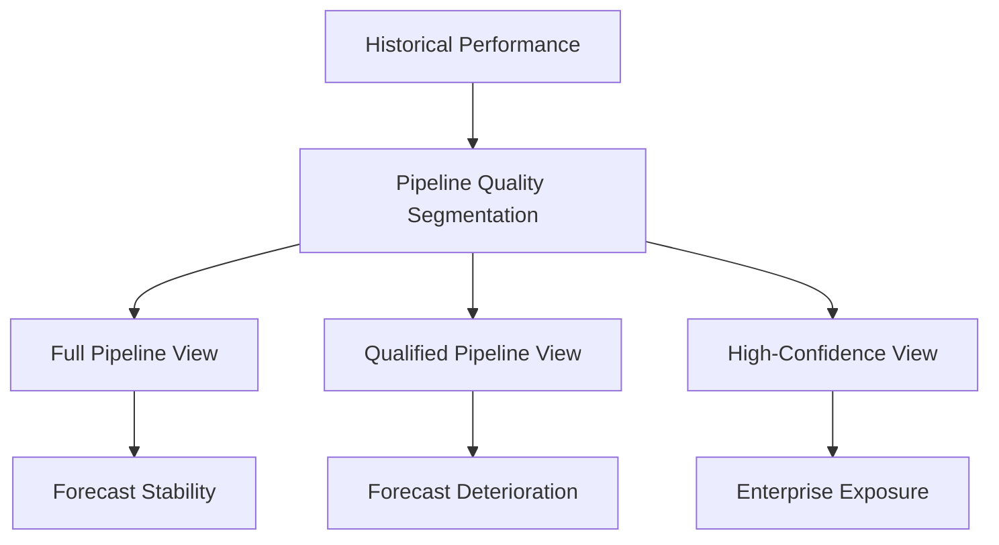

# ⚠️ Forecast Risk Problem  
## 📉 Historical Success vs Forward-Looking Forecast Fragility

[⬅ Back to Executive Summary](../01_Executive_Summary/executive-summary.md) | [⬅ Back to README](../README.md)

---

---

# 📌 Business Problem Overview

One of the most dangerous characteristics of enterprise SaaS forecasting environments is that organizations can appear operationally healthy while simultaneously accumulating severe forward-looking commercial risk.

This project intentionally models that governance failure.

At the end of Fiscal Q3 FY26, New Bridge appeared to be operating from a position of strength:

- strong historical attainment,
- healthy pipeline activity,
- geographic overperformance,
- and positive commercial momentum.

However, once the organization transitioned from a reverse-looking operational perspective to a forward-looking fiscal forecast perspective, significant structural fragility emerged across the enterprise forecast portfolio.

The result was a widening disconnect between:

| Reverse-Looking Reality | Forward-Looking Reality |
|---|---|
| Strong historical attainment | Deteriorating forecast confidence |
| Positive dashboard optics | Weakening pipeline quality |
| Geographic overperformance | Rising enterprise exposure |
| Strong commercial momentum | Increasing Q4 dependency |

---

# 📈 Historical Performance Confidence

From a historical operating perspective, New Bridge appeared to be outperforming enterprise expectations.

---

## 📊 Historical Operating Metrics

| Metric | Result |
|---|---:|
| Historical Revenue Attainment | 139% |
| Geographic Performance | All regions above target |
| Revenue Expansion | Healthy |
| Pipeline Volume | Strong |
| Commercial Momentum | Positive |

This created the perception of:

✅ strong execution  
✅ forecast stability  
✅ commercial health  
✅ enterprise momentum  

At face value, executive leadership had little reason to suspect that material forecast deterioration was already forming beneath the surface.

---

# ⚠️ Transition From Historical Reporting to Forecast Governance

The turning point occurred when the organization shifted focus away from:

# 📜 Historical Attainment

toward:

# 🔮 Full-Year Forecast Survivability

This transition fundamentally changed the interpretation of enterprise performance.

The organization was no longer asking:

> “How well have we performed historically?”

Instead, leadership was now asking:

> “Can the enterprise still credibly achieve full-year fiscal commitments?”

This exposed a completely different risk profile.

---

# 📉 Forecast Coverage Deterioration

Once the pipeline was segmented by confidence quality, forecast survivability deteriorated rapidly.

---

## 📊 Enterprise Coverage Analysis

| Forecast Scenario | Enterprise Coverage |
|---|---:|
| Full Pipeline Coverage | 105.0% |
| Qualified Pipeline Coverage | 92.5% |
| High-Confidence Pipeline Coverage | 78.0% |

The deterioration curve revealed a critical governance problem:

> The enterprise had become structurally dependent on lower-confidence pipeline assumptions to preserve full-year forecast viability.

---

# 🧠 Forecast Escalation Narrative

---

# 🔥 The Institutional Governance Failure

The core problem was not historical performance weakness.

The core problem was:

# ⚠️ Forecast Quality Deterioration

The organization’s apparent success was increasingly reliant on:

- lower-confidence pipeline,
- aggressive forecast assumptions,
- geographic concentration,
- and late-quarter recovery dependency.

This created a hidden structural weakness inside the operating model.

---

# 🧱 Forecast Risk Concentration

The project intentionally models how forecast risk becomes concentrated across multiple dimensions simultaneously.

---

## 🌍 Geographic Exposure

Forecast deterioration was unevenly distributed across global operating regions including:

- NA West
- NA East
- DACH
- UKI
- India
- ANZ
- Brazil
- Middle East

Certain geographies remained relatively stable while others experienced significant forecast deterioration under stricter confidence assumptions.

---

## ⏳ Temporal Exposure

The enterprise became increasingly dependent on:

- Q4 pipeline conversion,
- late-quarter acceleration,
- and compressed recovery execution windows.

This materially increased operational fragility.

---

## 📦 Pipeline Quality Exposure

The widening gap between:

- Full Pipeline Coverage,
- Qualified Pipeline Coverage,
- and High-Confidence Coverage

demonstrated that a substantial portion of forecast survivability depended on increasingly uncertain commercial opportunities.

---

# 📊 Forecast Survivability Model

---

# 🛑 Why Traditional Reporting Fails

Traditional enterprise reporting environments often overemphasize:

- historical attainment,
- operational dashboards,
- aggregate pipeline volume,
- and reverse-looking KPIs.

However, these views frequently fail to measure:

❌ pipeline survivability  
❌ forecast confidence quality  
❌ geographic concentration risk  
❌ recovery dependency  
❌ forward-looking exposure  

As a result, organizations can remain unaware of structural forecast deterioration until late-stage fiscal recovery becomes extremely difficult.

---

# 🏛️ The Strategic Governance Challenge

The executive challenge facing New Bridge became:

> How can a SaaS enterprise preserve forecast credibility once forward-looking pipeline confidence begins deteriorating?

This transformed the problem from:

# 📊 Reporting

into:

# 🧠 Institutional Forecast Governance

The organization now required:

- risk-aware forecast calibration,
- enterprise exposure management,
- commercial recovery prioritization,
- and economically rational intervention mechanisms.

---

# ⚙️ Transition Into Recovery Governance

The forecast deterioration analysis directly triggered the need for a:

# 🏦 Central Risk Reserve (CRR)

framework designed to:

- preserve enterprise forecast attainment,
- optimize recovery investments,
- and mitigate deteriorating pipeline conditions through controlled commercial interventions.

This became the foundation for the project’s:

- recovery optimization framework,
- Solver-based scenario analysis,
- and enterprise recovery frontier modeling.

---

# 🚀 Executive-Level Implication

The most important strategic insight from this analysis was:

> Enterprise SaaS organizations do not fail forecasting because dashboards are inaccurate.

They fail because:

- pipeline confidence deteriorates,
- recovery dependency escalates,
- and governance systems fail to detect survivability risk early enough.

The New Bridge simulation intentionally demonstrates how enterprise forecast governance must evolve beyond traditional reporting into:

# 🏛️ Board-Level Commercial Risk Management

---

# 📈 Strategic Outcome

The forecast deterioration analysis ultimately established the foundation for:

✅ Central Risk Reserve (CRR) deployment  
✅ Recovery investment optimization  
✅ Solver-based recovery modeling  
✅ Enterprise survivability analysis  
✅ Geographic recovery prioritization  
✅ Board-level commercial governance  

This transition marked the evolution of New Bridge from:

# 📊 Enterprise Reporting Platform

into:

# 🧠 Enterprise Forecast Governance & Recovery Operating System

---

# 👤 Author

**Anil Jacob**  
Enterprise BI • RevOps Strategy • Executive Analytics • Forecast Governance

---

# 📜 Repository Context

All business entities, financial figures, forecasts, datasets, and scenarios within this repository are simulated for portfolio, educational, and strategic demonstration purposes.
