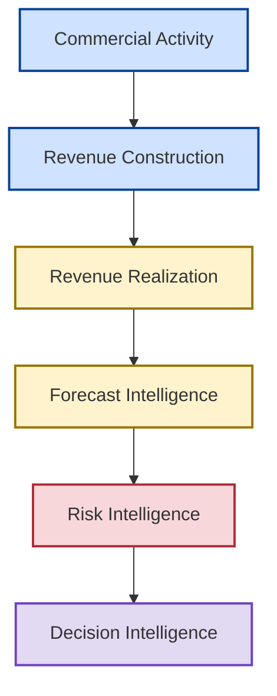

# 🏛️ Revenue Information Architecture

## 📊 Enterprise Revenue Intelligence & Information Flow Architecture

[⬅ Back to README](../README.md)

---

---

## 📌 Executive Overview

Revenue information is one of the most strategically important assets within a SaaS enterprise.

Every executive decision concerning growth, forecasting, investment, risk management, recovery planning, and fiscal performance ultimately depends on the quality, consistency, and governance of revenue information.

The purpose of a Revenue Information Architecture is to describe how commercial information originates, transforms, accumulates, and ultimately supports executive decision-making.

The New Bridge Revenue Information Architecture defines the information domains, business metrics, and transformation pathways that convert commercial activity into enterprise intelligence.

---

## 🎯 Architecture Objective

The architecture answers a single question:

> How does commercial activity become executive decision intelligence?

The architecture traces the complete information journey from individual sales transactions through revenue realization, forecast governance, risk visibility, recovery planning, and executive decision support.

---

## 🧠 Core Architecture Principle

The architecture is built around a foundational principle:

> Decisions are only as reliable as the information that supports them.

The quality of executive decisions depends on the quality of the underlying information supply chain.

---

## 🏛️ Revenue Information Architecture

### Revenue Information Flow

---

## 📊 Information Domains

The architecture is organized into six information domains.

| Domain | Purpose |
|----------|----------|
| Commercial Activity | Capture customer transactions |
| Revenue Construction | Build recurring revenue metrics |
| Revenue Realization | Translate bookings into fiscal outcomes |
| Forecast Intelligence | Evaluate future attainment |
| Risk Intelligence | Quantify exposure |
| Decision Intelligence | Support executive decisions |

---

## 🧩 Revenue Information Domain Model

---

## 1️⃣ Commercial Activity Domain

### Purpose

Captures customer-facing commercial events.

### Core Information Assets

- Opportunities
- Bookings
- Contracts
- Products
- Customers
- Territories

#### Business Question

> What commercial activity occurred?

---

## 2️⃣ Revenue Construction Domain

### Purpose

Transforms commercial transactions into standardized revenue metrics.

### Core Information Assets

- ACV
- ARR
- Customer ARR
- Product ARR
- Segment ARR
- Geographic ARR

#### Business Question

> What recurring revenue was created?

---

## 3️⃣ Revenue Realization Domain

### Purpose

Determines how recurring revenue contributes toward fiscal outcomes.

### Core Information Assets

- IYRC
- Budget Contribution
- Revenue Timing
- Realization Curves

### Business Question

> How much revenue will materialize this fiscal year?

---

## 4️⃣ Forecast Intelligence Domain

### Purpose

Evaluates future attainment potential.

### Core Information Assets

- Coverage Ratios
- Pipeline States
- Confidence Levels
- Forecast Scenarios

### Business Question

> How likely are fiscal commitments to be achieved?

---

## 5️⃣ Risk Intelligence Domain

### Purpose

Transforms forecast information into measurable enterprise exposure.

### Core Information Assets

- Coverage Gaps
- Exposure Levels
- Survivability Metrics
- Geographic Risk

### Business Question

> What risks threaten fiscal performance?

---

## 6️⃣ Decision Intelligence Domain

### Purpose

Supports executive action and investment decisions.

### Core Information Assets

- Recovery Options
- Investment Scenarios
- Tradeoff Models
- Decision Packages

### Business Question

> What action should leadership take?

---

## 🔄 Revenue Information Lineage

The architecture organizes information into progressively higher levels of business value.

### Information Lineage Model

The architecture demonstrates how information gains strategic value as it progresses through the enterprise intelligence lifecycle.

---

## 📂 Repository Mapping

| Repository Section | Information Domain |
|---------------------|---------------------|
| SaaS Financial Model | Revenue Construction |
| Pipeline Governance | Forecast Intelligence |
| Forecast Risk Model | Risk Intelligence |
| CRR Optimization | Recovery Planning |
| Recovery Optimization | Decision Intelligence |
| Investment Tradeoff Analysis | Decision Intelligence |

---

## 🎯 Architecture Implications

The Revenue Information Architecture establishes the information backbone of the New Bridge operating system.

It defines how commercial activity becomes revenue intelligence, forecast intelligence, risk intelligence, recovery intelligence, and ultimately executive decision intelligence.

The architecture provides the semantic bridge between business capabilities and analytical solutions.

---

## 🚀 Strategic Outcome

The Revenue Information Architecture transforms revenue information from a collection of disconnected metrics into a governed enterprise information supply chain.

This architecture enables consistent revenue governance, forecast governance, risk management, recovery planning, and executive decision-making across the enterprise.

---

### 👤 Author

**Anil Jacob**

Enterprise BI • RevOps Strategy • Executive Analytics • Forecast Governance

---

### 📜 Repository Context

All information domains, business metrics, governance models, analytical environments, and business scenarios presented throughout this repository are synthetic and intended exclusively for portfolio, educational, and strategic demonstration purposes.
