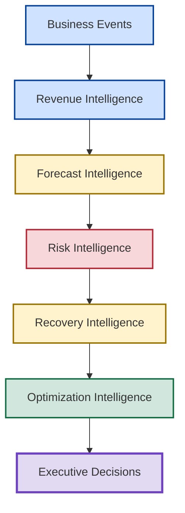
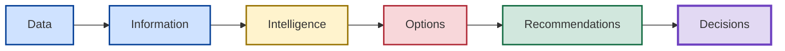
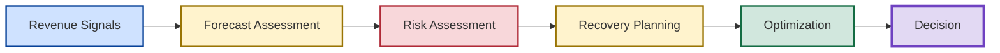
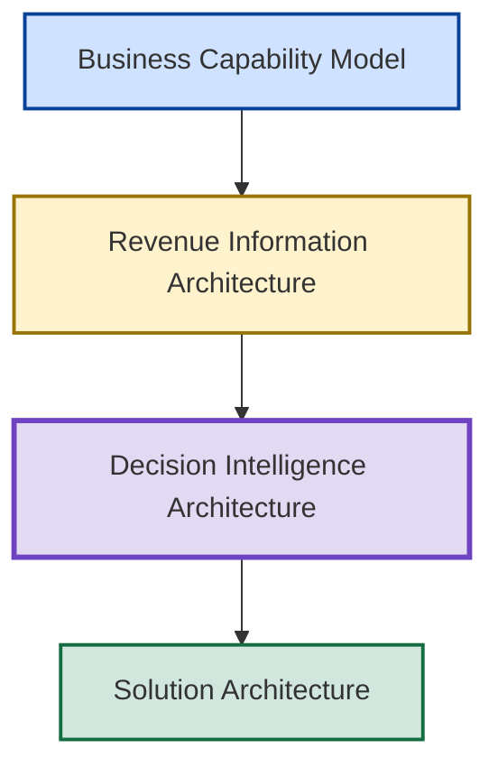

# 🧠 Decision Intelligence Architecture

## 🏛️ Enterprise Decision Intelligence & Executive Decision Support Architecture

[⬅ Back to README](../README.md)

---

<p align="center">


</p>

---

## 📌 Executive Overview

Organizations generate enormous volumes of data, metrics, reports, dashboards, and forecasts.

Yet the ultimate purpose of these assets is not information production.

The ultimate purpose is decision-making.

The Decision Intelligence Architecture defines how enterprise information is progressively transformed into actionable intelligence capable of supporting executive decisions under uncertainty.

The architecture provides a structured model describing how organizations move beyond reporting and analytics toward:

- forecast governance,
- risk visibility,
- recovery planning,
- optimization,
- and executive decision support.

The architecture serves as the decision-making backbone of the New Bridge operating system.

---

## 🎯 Architecture Objective

The architecture answers a single question:

> How does enterprise information become executive action?

The architecture defines the information, intelligence, optimization, and decision layers required to support high-quality decisions within a modern SaaS operating environment.

---

## 🧠 Core Architecture Principle

The architecture is built around a foundational principle:

> Information creates awareness. Intelligence creates understanding. Decisions create outcomes.

Organizations do not create value by producing information.

Organizations create value by improving decision quality.

---

## 🏛️ Decision Intelligence Architecture

### Enterprise Decision Intelligence Stack



---

## 📊 Decision Intelligence Layers

| Layer | Purpose |
|---------|----------|
| Business Events | Capture enterprise activity |
| Revenue Intelligence | Understand commercial performance |
| Forecast Intelligence | Evaluate future outcomes and budget attainment |
| Risk Intelligence | Quantify exposure |
| Recovery Intelligence | Identify intervention options |
| Optimization Intelligence | Evaluate investment alternatives |
| Executive Decisions | Select preferred action |

---

## 🧩 Decision Intelligence Domain Model

The architecture organizes intelligence into progressively higher levels of business value.



The architecture demonstrates that decisions emerge from multiple stages of transformation rather than from raw information alone.

---

## 1️⃣ Business Events Layer

### Purpose

Captures enterprise activities requiring governance and management attention.

### Examples

- Sales Transactions
- Customer Activity
- Renewals
- New Logos
- Expansion Events
- Pipeline Changes
- Revenue Commitments

### Business Question

> What happened?

---

## 2️⃣ Revenue Intelligence Layer

### Purpose

Transforms commercial activity into governed business performance metrics.

### Intelligence Assets

- ARR
- ACV
- Revenue Realization
- Budget Attainment
- Growth Metrics

### Business Question

> What is the commercial impact in relation to budget goals?

---

## 3️⃣ Forecast Intelligence Layer

### Purpose

Evaluates future performance expectations.

### Intelligence Assets

- Coverage Ratios (to budget)
- Pipeline Confidence (Full Pipeline, Qualified Pipeline and High Pipeline)
- Forecast Scenarios (best to worst)
- Survivability Assessments

### Business Question

> What is likely to happen?

---

## 4️⃣ Risk Intelligence Layer

## Purpose

Converts forecast uncertainty into measurable exposure.

### Intelligence Assets

- Variance to Budget
- Exposure Analysis
- Confidence Deterioration
- Geographic Risk Profiles

### Business Question

> What could go wrong?

---

## 5️⃣ Recovery Intelligence Layer

### Purpose

Identifies available intervention pathways.

### Intelligence Assets

- Recovery Levers
- Recovery Playbooks
- CRR Activation
- Intervention Options (Investments)

### Business Question

> What can be done?

---

## 6️⃣ Optimization Intelligence Layer

### Purpose

Evaluates alternative actions and investment tradeoffs.

### Intelligence Assets

- ROI Models (Evaluate past investment ROI)
- Capital Allocation Scenarios (Investment optimization)
- Recovery Curves (Forecast uplift vs. investment capital vs. constraints)
- Tradeoff Analysis

### Business Question

> What are the best business investment levers and capital allocation options with the highest returns?

---

## 7️⃣ Executive Decision Layer

### Purpose

Supports leadership action.

### Decision Assets

- Decision Packages
- Scenario Comparisons
- Recommendations
- Executive Briefings

### Business Question

> What should we do?

---

## 🔄 Decision Manufacturing Explained

The architecture treats decision-making as a structured enterprise capability rather than an isolated executive activity.

## Decision Manufacturing Flow



This flow represents the core decision lifecycle embedded throughout the New Bridge operating environment.

---

## 📂 Repository Architecture Mapping

| Repository Section | Decision Intelligence Layer |
|---------------------|----------------------------|
| SaaS Financial Model | Revenue Intelligence |
| Pipeline Governance | Forecast Intelligence |
| Forecast Risk Model | Risk Intelligence |
| CRR Optimization | Recovery Intelligence |
| Recovery Optimization | Optimization Intelligence |
| Investment Tradeoff Analysis | Executive Decision Support |
| Executive Lessons Learned | Institutional Learning |

---

## 🏛️ Architectural Relationships

The Decision Intelligence Architecture builds upon the preceding architecture layers.



This relationship demonstrates how business capabilities, information architecture, decision architecture, and technology architecture build upon one another.

---

## 🚀 Strategic Outcome

The Decision Intelligence Architecture transforms New Bridge from a reporting and forecasting environment into a structured executive decision support system.

The architecture demonstrates how organizations can systematically convert:

- commercial activity,
- revenue intelligence,
- forecast intelligence,
- risk intelligence,
- recovery intelligence,
- and optimization analysis

into disciplined executive decision-making.

This progression represents the highest level of analytical maturity within the New Bridge operating model.

---

## 🎯 Executive Perspective

Traditional analytics environments typically stop at:

```text
Data
    ↓
Dashboard
```

The New Bridge Decision Intelligence Architecture extends the value chain to:

```text
Business Events
    ↓
Revenue Intelligence
    ↓
Forecast Intelligence
    ↓
Risk Intelligence
    ↓
Recovery Intelligence
    ↓
Optimization Intelligence
    ↓
Executive Decisions
```

The objective is not visibility.

The objective is better decisions.

---

## 👤 Author

**Anil Jacob**

Enterprise BI • RevOps Strategy • Executive Analytics • Forecast Governance

---

## 📜 Repository Context

All intelligence models, governance environments, operating frameworks, optimization models, analytical systems, and business scenarios presented throughout this repository are synthetic and intended exclusively for portfolio, educational, and strategic demonstration purposes.

This architecture illustrates how modern enterprises can structure information, intelligence, optimization, and decision support capabilities to improve decision quality under uncertainty.
