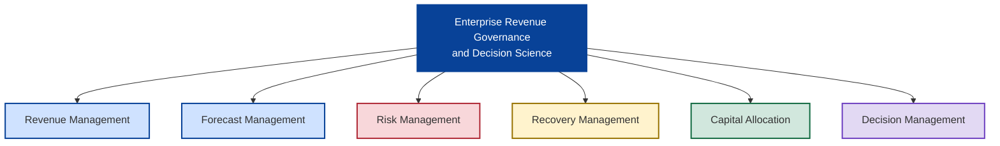
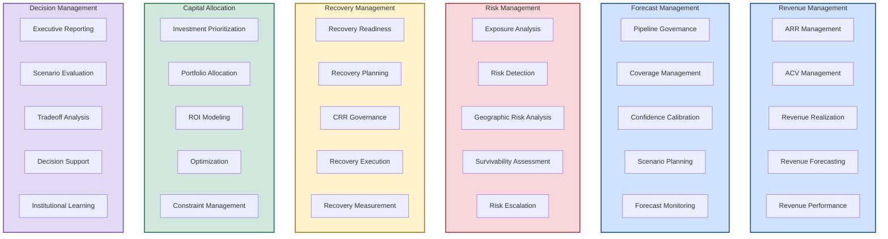

# 🏗️ Business Capability Model

## 🏛️ Enterprise Revenue Governance & Decision Science Capability Architecture

[⬅ Back to README](../README.md)

---

<p align="center">


</p>

---

# 📌 Executive Overview

Enterprise architecture begins with understanding what an organization must be capable of doing before considering how those capabilities are executed through processes, governance structures, analytics platforms, or technology solutions.

The purpose of a Business Capability Model is to define the stable business capabilities required to operate an enterprise regardless of organizational structure, reporting relationships, business processes, or technology implementations.

Unlike operating models, governance frameworks, solution architectures, or analytical platforms, business capabilities represent enduring organizational abilities that remain relatively stable over time.

The New Bridge Business Capability Model defines the core capabilities required to operate a modern SaaS organization focused on:

- Revenue Governance
- Forecast Governance
- Enterprise Risk Management
- Recovery Planning
- Capital Allocation
- Executive Decision Making

---

# 🎯 Architecture Objective

The Business Capability Model answers a single question:

> What capabilities must exist for an enterprise to govern revenue performance, forecast risk, recovery readiness, capital allocation, and executive decision-making?

---

# 🧠 Core Architecture Principle

The model is built around a foundational enterprise architecture principle:

> Capabilities are stable. Processes change. Technology changes.

Business capabilities provide the enduring structure connecting strategy, operating models, governance, analytics, and technology.

---

# 🏛️ Enterprise Capability Architecture

The New Bridge operating environment is built around six primary capability domains.

## Enterprise Capability Map



---

# 📊 Capability Domain Overview

| Capability Domain | Purpose |
|------------------|----------|
| Revenue Management | Govern recurring revenue performance |
| Forecast Management | Govern future revenue attainment |
| Risk Management | Identify and quantify enterprise exposure |
| Recovery Management | Restore forecast survivability |
| Capital Allocation | Optimize recovery investments |
| Decision Management | Support executive decision-making |

---

# 🧩 Capability Decomposition

The Level 2 decomposition identifies the major capabilities required within each business domain.

## Capability Decomposition Model



---

# 1️⃣ Revenue Management

## Purpose

Revenue Management governs how commercial activity translates into recurring revenue performance and financial outcomes.

### Core Capabilities

- ARR Management
- ACV Management
- Revenue Realization
- Revenue Forecasting
- Revenue Performance Management

### Strategic Outcome

Establish a trusted and governed understanding of enterprise revenue performance.

---

# 2️⃣ Forecast Management

## Purpose

Forecast Management governs how future business performance is evaluated, monitored, and communicated across the enterprise.

### Core Capabilities

- Pipeline Governance
- Coverage Management
- Confidence Calibration
- Scenario Planning
- Forecast Monitoring

### Strategic Outcome

Enable continuous visibility into future business performance and forecast attainability.

---

# 3️⃣ Risk Management

## Purpose

Risk Management governs the identification, assessment, and escalation of threats to enterprise fiscal performance.

### Core Capabilities

- Exposure Analysis
- Forecast Risk Detection
- Geographic Risk Analysis
- Survivability Assessment
- Risk Escalation

### Strategic Outcome

Provide early warning visibility into enterprise exposure.

---

# 4️⃣ Recovery Management

## Purpose

Recovery Management governs how the organization responds when forecast deterioration becomes material.

### Core Capabilities

- Recovery Readiness
- Recovery Planning
- CRR Governance
- Recovery Execution
- Recovery Measurement

### Strategic Outcome

Enable disciplined intervention and recovery execution.

---

# 5️⃣ Capital Allocation

## Purpose

Capital Allocation governs how limited enterprise resources are prioritized and invested.

### Core Capabilities

- Investment Prioritization
- Portfolio Allocation
- ROI Modeling
- Optimization
- Constraint Management

### Strategic Outcome

Maximize recovery effectiveness while preserving capital discipline.

---

# 6️⃣ Decision Management

## Purpose

Decision Management governs how enterprise intelligence is transformed into executive action.

### Core Capabilities

- Executive Reporting
- Scenario Evaluation
- Tradeoff Analysis
- Decision Support
- Institutional Learning

### Strategic Outcome

Transform enterprise intelligence into disciplined executive decision-making.

---

# 🔄 Capability Relationship Architecture

Although each capability domain is distinct, they operate as an integrated enterprise capability value chain.

## Enterprise Capability Value Chain

```mermaid
flowchart LR

A["Revenue Management"]

--> B["Forecast Management"]

--> C["Risk Management"]

--> D["Recovery Management"]

--> E["Capital Allocation"]

--> F["Decision Management"]

style A fill:#cfe2ff,stroke:#084298,stroke-width:2px
style B fill:#cfe2ff,stroke:#084298,stroke-width:2px

style C fill:#f8d7da,stroke:#b02a37,stroke-width:2px

style D fill:#fff3cd,stroke:#997404,stroke-width:2px

style E fill:#d1e7dd,stroke:#146c43,stroke-width:2px

style F fill:#e2d9f3,stroke:#6f42c1,stroke-width:2px
```



The capability chain demonstrates how enterprise value is progressively created:

```text
Revenue
    ↓
Forecast
    ↓
Risk
    ↓
Recovery
    ↓
Capital Allocation
    ↓
Executive Decision
```

---

# 📂 Repository Capability Mapping

| Repository Section | Primary Capability |
|-------------------|-------------------|
| SaaS Financial Model | Revenue Management |
| Pipeline Governance | Forecast Management |
| Forecast Risk Model | Risk Management |
| CRR Optimization | Recovery Management |
| Recovery Optimization | Capital Allocation |
| Investment Tradeoff Analysis | Decision Management |
| Executive Lessons Learned | Decision Management |
| Next Generation Operating Model | Cross-Capability Evolution |

---

# 🎯 Architecture Implications

This Business Capability Model serves as the architectural foundation for:

- Governance Frameworks
- Operating Models
- Information Architecture
- Solution Architecture
- Analytics Platforms
- Executive Decision Systems

The model intentionally separates:

| Architecture Layer | Purpose |
|-------------------|---------|
| Business Capability Model | What the organization must do |
| Operating Model | How the organization operates |
| Governance Framework | How behavior is governed |
| Information Architecture | How information flows |
| Solution Architecture | How capabilities are implemented |

---

# 🚀 Strategic Outcome

The Business Capability Model establishes the architectural backbone of the New Bridge operating system.

It defines the enduring business capabilities required to govern revenue performance, forecast survivability, enterprise risk, recovery readiness, capital allocation, and executive decision-making.

This model becomes the foundational architecture artifact upon which all other governance, analytical, and technology capabilities are built.

---

# 👤 Author

**Anil Jacob**  
Enterprise BI • RevOps Strategy • Executive Analytics • Forecast Governance

---

# 📜 Repository Context

All business capabilities, governance frameworks, operating models, analytical environments, and business scenarios presented throughout this repository are synthetic and intended exclusively for portfolio, educational, and strategic demonstration purposes.
