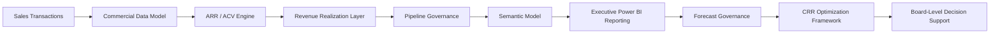
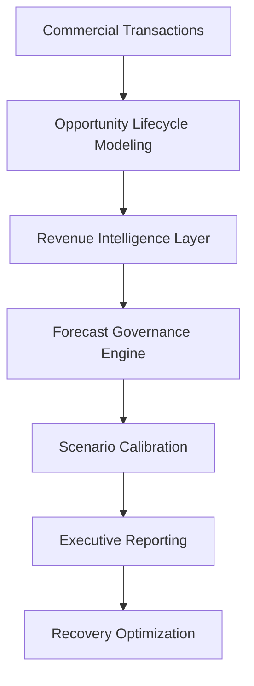
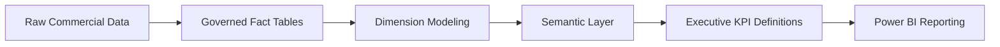
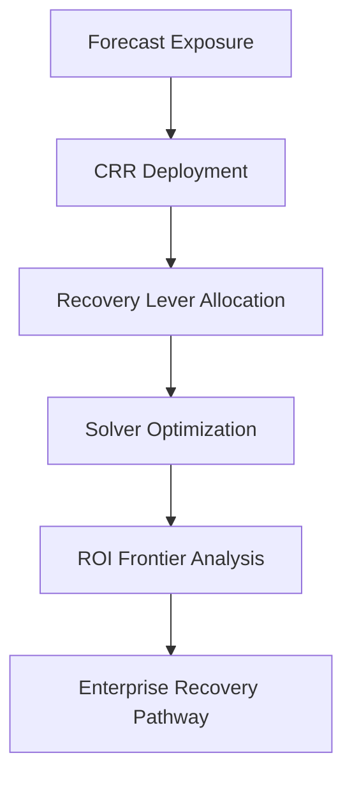

# 🏗️ Enterprise Architecture  
## 🏛️ Commercial Intelligence & Forecast Governance Operating System

[⬅ Back to README](../README.md) | [⬅ Executive Summary](../01_Executive_Summary/executive-summary.md)

---

---

# 📌 Executive Overview

The New Bridge platform was intentionally architected as a:

# 🏛️ Board-Level Commercial Intelligence Operating System

designed to unify:

- Enterprise Business Intelligence,
- Revenue Operations (RevOps),
- SaaS Financial Governance,
- Forecast Survivability Modeling,
- and Executive Decision Support

within a governed enterprise analytics architecture.

Unlike traditional dashboard-centric BI environments, the New Bridge architecture was designed to operationalize:

✅ forecast governance  
✅ revenue realization intelligence  
✅ pipeline survivability analysis  
✅ geography-level exposure management  
✅ recovery optimization orchestration  
✅ board-level commercial visibility  

---

# 🧠 Enterprise Architecture Philosophy

The platform architecture was intentionally built around a foundational principle:

> Enterprise analytics systems should govern commercial decision-making, not merely visualize operational activity.

The architecture therefore prioritizes:

- semantic governance,
- revenue intelligence,
- forecast survivability,
- and executive operating visibility

over traditional KPI reporting alone.

---

# 🏗️ Enterprise Operating Architecture

---

# 🌍 Enterprise Architecture Objectives

The architecture was designed to solve several enterprise governance challenges simultaneously.

---

## 📊 Strategic Objectives

| Objective | Enterprise Purpose |
|---|---|
| Revenue Intelligence | Govern ARR / ACV realization |
| Forecast Governance | Monitor survivability deterioration |
| Semantic Standardization | Align enterprise metrics |
| Pipeline Visibility | Expose confidence deterioration |
| Geography Governance | Calibrate regional exposure |
| Executive Reporting | Enable board-level visibility |
| Recovery Optimization | Support CRR investment decisions |

---

# 🧱 Commercial Data Architecture

The platform models a governed commercial intelligence layer built around SaaS operating mechanics.

---

## 📘 Core Data Domains

| Domain | Purpose |
|---|---|
| Sales Transactions | Commercial activity modeling |
| Opportunity Pipeline | Forecast orchestration |
| ARR / ACV Metrics | Revenue operating logic |
| Revenue Realization | Fiscal timing governance |
| Geography Performance | Portfolio exposure calibration |
| Forecast Scenarios | Survivability analysis |
| Recovery Modeling | CRR optimization support |

---

# 🏛️ Commercial Intelligence Flow

---

# 📊 Enterprise Semantic Modeling

A governed semantic modeling layer was implemented to ensure consistency across:

- financial metrics,
- forecast logic,
- pipeline survivability,
- geography reporting,
- and executive KPI governance.

This semantic layer became foundational for:

# 🧠 Enterprise Decision Consistency

---

## 📘 Semantic Governance Principles

| Principle | Purpose |
|---|---|
| Single Metric Definitions | Eliminate reporting inconsistency |
| Governed KPI Logic | Align executive reporting |
| Shared Forecast Semantics | Improve survivability visibility |
| Revenue Realization Standardization | Align Sales & Finance |
| Geography Harmonization | Consistent regional governance |

---

# 🧩 Semantic Model Architecture

---

# 📈 Forecast Governance Architecture

The architecture intentionally separates:

# 📜 Historical Reporting

from:

# 🔮 Forward-Looking Forecast Governance

This distinction became critical for exposing hidden enterprise forecast deterioration.

---

## 📊 Forecast Governance Layers

| Layer | Purpose |
|---|---|
| Historical Attainment | Reverse-looking performance |
| Full Pipe Coverage | Initial survivability view |
| Qualified Coverage | Confidence calibration |
| High-Confidence Coverage | Enterprise exposure visibility |
| Recovery Modeling | Mitigation orchestration |

---

# ⚠️ Enterprise Risk Escalation Logic

The architecture was intentionally designed to expose how:

- healthy operational dashboards,
- strong historical attainment,
- and positive commercial momentum

can still conceal severe:

# 📉 Forward-Looking Forecast Fragility

---

## 📊 Forecast Escalation Architecture

---

# 🌍 Geography-Level Governance

The architecture supports enterprise portfolio governance across multiple operating regions including:

- NA West
- NA East
- DACH
- UKI
- India
- ANZ
- Brazil
- Middle East

This enables:

✅ geography-aware survivability analysis  
✅ regional forecast calibration  
✅ portfolio exposure management  
✅ recovery investment prioritization  

---

# 🏦 CRR Optimization Integration

One of the most differentiated components of the architecture is the integration of:

# 🛡️ Central Risk Reserve (CRR)

optimization directly into the enterprise governance framework.

This transformed the platform from:

# 📊 Reporting Infrastructure

into:

# 🧠 Enterprise Recovery Operating System

---

# ⚙️ Recovery Optimization Architecture

---

# 📊 Executive Reporting Layer

The executive reporting environment was intentionally designed as a:

# 🏛️ Commercial Governance Experience

rather than a traditional dashboard collection.

The Power BI layer provides:

- forecast survivability visibility,
- geography-level exposure analysis,
- pipeline deterioration tracking,
- recovery scenario evaluation,
- and board-level operational oversight.

---

# 🧠 Executive Architecture Insight

The New Bridge platform demonstrates that modern enterprise analytics architectures must evolve beyond:

❌ dashboard aggregation  
❌ historical KPI reporting  
❌ isolated financial views  
❌ disconnected pipeline analytics  

toward:

✅ governed commercial intelligence  
✅ forecast survivability orchestration  
✅ semantic operating consistency  
✅ enterprise exposure management  
✅ recovery optimization enablement  

---

# 🚀 Strategic Outcome

The New Bridge architecture ultimately evolved into a:

# 🏛️ Board-Level Commercial Governance Platform

capable of:

- operationalizing enterprise revenue intelligence,
- governing forecast survivability,
- calibrating commercial exposure,
- and supporting executive recovery decision-making under deteriorating operating conditions.

The architecture intentionally bridges:

- Enterprise BI
- SaaS Finance
- RevOps
- Forecast Governance
- Executive Analytics
- Portfolio Optimization

within a unified enterprise operating framework.

---

# 👤 Author

**Anil Jacob**  
Enterprise BI • RevOps Strategy • Executive Analytics • Forecast Governance

---

# 📜 Repository Context

All enterprise architectures, semantic models, reporting frameworks, financial models, and commercial operating environments within this repository are simulated for portfolio and strategic demonstration purposes.
