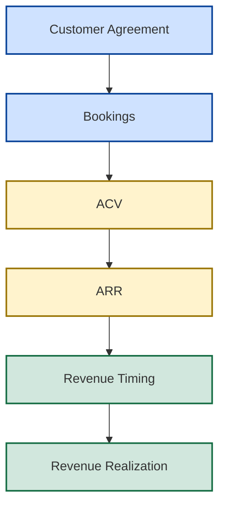

# 💰 Revenue Operating Foundations

## 📘 The Economic Engine of SaaS Revenue Creation

[⬅ Revenue Information Architecture](../03_Architecture/revenue-information-architecture.md)
|
[⬅ Revenue Operating Model](README.md)
|
[➡ Revenue Timing Framework](revenue-timing-framework.md)
|
[➡ Revenue Realization Framework](revenue-realization-framework.md)
|
[➡ Forecast Governance](../05_Pipeline_Governance/pipeline-risk-model.md)

---

---

## 📌 Executive Overview

Every SaaS organization generates revenue through a sequence of commercial events.

Understanding this sequence is critical because the terms **Bookings**, **ACV**, and **ARR** are frequently used interchangeably despite representing fundamentally different concepts.

The purpose of this framework is to establish the foundational mechanics that govern how commercial activity becomes recurring revenue.

These mechanics form the economic foundation upon which all subsequent revenue planning, forecasting, and governance activities depend.

---

## 🧠 Core Operating Principle

The most important principle in SaaS revenue operations is:

> A signed contract creates commercial value immediately, but recurring revenue emerges over time.

This distinction explains why organizations can generate strong sales performance while simultaneously misunderstanding the size and durability of their recurring revenue base.

Understanding the relationship between Bookings, ACV, and ARR is therefore essential for effective revenue operations.

---

## 📈 Revenue Operating Evolution

The first three stages establish commercial value.

The remaining stages determine how that value ultimately becomes fiscal performance.

This framework focuses specifically on the creation of commercial and recurring revenue value through Bookings, ACV, and ARR.

---

## 🏭 Running Example

Throughout this framework, we will follow a single customer transaction.

### Acme Manufacturing

| Attribute      | Value                         |
| -------------- | ----------------------------- |
| Customer       | Acme Manufacturing            |
| Product        | Enterprise Analytics Platform |
| Contract Term  | 12 Months                     |
| Contract Value | $1,200,000                    |
| Close Date     | January FY26                  |

This single transaction will be used to demonstrate how SaaS organizations interpret commercial value through different revenue lenses.

---

## 💰 Bookings

Bookings represent the value of executed customer agreements.

From a commercial perspective, bookings answer a simple question:

> How much business did we sell?

When Acme Manufacturing signs its agreement:

| Metric   | Value      |
| -------- | ---------- |
| Bookings | $1,200,000 |

At this moment:

✅ A customer agreement exists
✅ Commercial value has been created
✅ Sales quota attainment increases

However:

> Bookings do not automatically represent recurring revenue.

Bookings simply measure commercial activity.

---

## 📘 Annual Contract Value (ACV)

ACV converts contract value into a standardized annual measurement.

This allows organizations to compare performance consistently across:

* contract sizes
* customer segments
* sales teams
* geographies
* product portfolios

For Acme Manufacturing:

| Metric         | Value      |
| -------------- | ---------- |
| Contract Value | $1,200,000 |
| Contract Term  | 12 Months  |
| ACV            | $1,200,000 |

The primary purpose of ACV is commercial measurement.

ACV helps answer:

> How much annualized contract value did the sales organization generate?

---

### 📊 Why ACV Exists

Without ACV normalization:

| Deal   | Contract Value (TCV) | Contract Term      |
| ------ | -------------: | --------- |
| Deal A |          $1.2M | 12 Months |
| Deal B |          $3.6M | 36 Months |

The larger deal appears three times more valuable.

However:

| Deal   |   ACV |
| ------ | ----: |
| Deal A | $1.2M |
| Deal B | $1.2M |

ACV reveals that both deals generate the same annualized commercial value.

This creates a fair basis for performance measurement.

---

## 🔄 Annual Recurring Revenue (ARR)

ARR represents the recurring revenue base expected to persist across a twelve-month operating horizon.

Unlike ACV, ARR focuses on revenue durability rather than sales productivity.

For Acme Manufacturing:

| Metric           | Value      |
| ---------------- | ---------- |
| ARR Contribution | $1,200,000 |

The organization now owns an additional:

$1.2M of recurring revenue capacity

This becomes part of the broader recurring revenue foundation of the business.

---

### 📊 ARR Answers A Different Question

Although ACV and ARR may initially appear identical, they serve different purposes.

| Metric   | Question Answered                               |
| -------- | ----------------------------------------------- |
| Bookings | What did we sell?                               |
| ACV      | What annualized contract value did we generate? |
| ARR      | What recurring revenue base do we now own?      |

This distinction becomes increasingly important as subscription businesses scale.

---

## ⚠️ Why Bookings, ACV, and ARR Are Not The Same

Consider Acme Manufacturing again.

| Metric   | Value |
| -------- | ----: |
| Bookings | $1.2M |
| ACV      | $1.2M |
| ARR      | $1.2M |

The numbers happen to match.

However, the business meaning is completely different.

Bookings measure commercial activity.

ACV measures annualized contract productivity.

ARR measures recurring revenue ownership.

Confusing these concepts frequently leads to poor revenue conversations and weak operating discipline.

---

## 🌍 Strategic Operating Implications

Organizations that clearly distinguish between Bookings, ACV, and ARR typically achieve:

✅ stronger revenue visibility
✅ better commercial accountability
✅ improved recurring revenue management
✅ clearer executive decision support

Organizations that fail to make these distinctions often struggle to understand the true health of their subscription business.

---

### 🔗 Connection To Revenue Timing

At this stage, Acme Manufacturing has created:

* Commercial Value (Bookings)
* Annualized Contract Value (ACV)
* Recurring Revenue Capacity (ARR)

The next question becomes:

> When does this recurring revenue actually contribute toward fiscal performance?

Answering that question introduces the concept of revenue timing.

This is explored in the:

### ⏳ Revenue Timing Framework

which explains how identical ARR values can produce very different fiscal outcomes depending on timing and realization windows.

---

## 🎯 Strategic Conclusion

Every SaaS revenue organization depends upon a clear understanding of how commercial activity becomes recurring revenue.

Bookings establish commercial success.

ACV standardizes commercial value.

ARR establishes recurring revenue ownership.

Together, these concepts form the foundational economic engine of the Revenue Operating Model and provide the starting point for all subsequent revenue timing and realization analysis within New Bridge.

---

### 👤 Author

**Anil Jacob**
Enterprise BI • Revenue Operations • Executive Analytics • Forecast Governance

---

### 📜 Repository Context

All commercial metrics, operating models, forecasts, revenue frameworks, and business scenarios within this repository are simulated for portfolio and strategic demonstration purposes.
