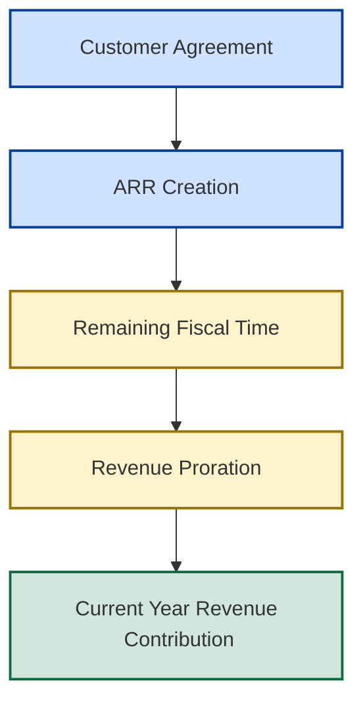

# ⏳ Revenue Timing Framework

## 📘 Revenue Proration & Fiscal Contribution Dynamics

[⬅ Revenue Information Architecture](../03_Architecture/revenue-information-architecture.md)
|
[⬅ Revenue Operating Model](README.md)
|
[⬅ Revenue Operating Foundations](revenue-operating-foundations.md)
|
[➡ Revenue Realization](revenue-realization.md)
|
[➡ Forecast Governance](../05_Pipeline_Governance)

---

<p align="center">


</p>

---

## 📌 Executive Overview

Revenue Operating Foundations established how recurring revenue is created through:

* Bookings
* Annual Contract Value (ACV)
* Annual Recurring Revenue (ARR)

However, recurring revenue ownership alone does not determine fiscal-year performance.

A second question must be answered:

> How much of newly created ARR can realistically contribute during the current fiscal year?

The answer depends on timing.

This framework introduces the concept of revenue timing and explains how contract execution dates influence current-year revenue realization through proration mechanics.

---

## 🧠 Core Operating Principle

The most important principle in revenue timing is:

> Revenue ownership and revenue contribution are not the same thing.

Two customers may generate identical ARR while contributing dramatically different amounts of revenue during the current fiscal year.

The difference is driven entirely by timing.

Understanding this relationship is critical for effective revenue operations and fiscal planning.

---

# 📈 Revenue Timing Evolution



Revenue ownership is created at contract execution.

Revenue contribution depends on how much fiscal time remains available for realization.

---

## 🏭 Reference Transactions

To illustrate timing effects, consider two customer agreements.

---

### Reference Transaction A

#### Acme Manufacturing

| Attribute      | Value                         |
| -------------- | ----------------------------- |
| Customer       | Acme Manufacturing            |
| Product        | Enterprise Analytics Platform |
| Contract Value | $1,200,000                    |
| Contract Term  | 12 Months                     |
| Close Date     | January FY26                  |
| ARR Created    | $1,200,000                    |

---

### Reference Transaction B

#### Global Retail Group

| Attribute      | Value                         |
| -------------- | ----------------------------- |
| Customer       | Global Retail Group           |
| Product        | Enterprise Analytics Platform |
| Contract Value | $1,200,000                    |
| Contract Term  | 12 Months                     |
| Close Date     | June FY26                     |
| ARR Created    | $1,200,000                    |

---

## 🤔 Executive Question

Both customers generated:

```text
ARR = $1.2M
```

Both customers purchased the same solution.

Both customers signed identical annual contracts.

So why do they contribute differently toward current-year revenue?

The answer lies in revenue timing.

---

## ⏳ Revenue Proration

Revenue realization is constrained by the amount of fiscal time remaining after contract execution.

The percentage of annual contract value that can contribute within the current fiscal year is commonly referred to as the:

## 📊 Proration Factor

```text
Proration Factor
=
Remaining Fiscal Months ÷ 12
```

This factor determines how much ARR can realistically contribute during the current fiscal year.

---

## 📘 In-Year Revenue Contribution (IYRC)

To quantify fiscal contribution, the Revenue Operating Model uses:

### ⏳ In-Year Revenue Contribution (IYRC)

```text
IYRC
=
ARR × Proration Factor
```

IYRC measures the portion of ARR expected to contribute toward current-year fiscal performance.

---

## 📊 Revenue Timing Comparison

Assume the fiscal year has six months remaining when Acme signs and one month remaining when Global Retail signs.

| Customer            |        ARR | Remaining Months | Proration |     IYRC |
| ------------------- | ---------: | ---------------: | --------: | -------: |
| Acme Manufacturing  | $1,200,000 |                6 |     50.0% | $600,000 |
| Global Retail Group | $1,200,000 |                1 |      8.3% | $100,000 |

---

## 💡 Executive Insight

Notice what happened.

Both customers created identical:

```text
ARR = $1.2M
```

However:

| Metric                    |  Acme | Global Retail |
| ------------------------- | ----: | ------------: |
| ARR                       | $1.2M |         $1.2M |
| Current-Year Contribution | $600K |         $100K |

The recurring revenue asset is identical.

The fiscal-year impact is not.

Timing created the difference.

---

## ⚠️ Why Revenue Timing Matters

Organizations frequently focus on:

* Bookings
* Contract Value
* ARR Growth

while underestimating the influence of timing.

This creates the illusion that identical ARR generation automatically produces identical fiscal outcomes.

In reality:

> Revenue timing determines how much ARR becomes accessible during the current fiscal year.

---

## 📊 Revenue Timing Efficiency

Revenue timing can materially influence fiscal performance even when ARR generation remains unchanged.

Consider two operating years.

---

### Scenario A

| Metric               |   Value |
| -------------------- | ------: |
| Deals Closed         |      10 |
| ARR Per Deal         |   $1.2M |
| Total ARR Generated  |    $12M |
| Average Close Timing | January |

---

### Scenario B

| Metric               | Value |
| -------------------- | ----: |
| Deals Closed         |    10 |
| ARR Per Deal         | $1.2M |
| Total ARR Generated  |  $12M |
| Average Close Timing |  June |

---

Both scenarios produce:

```text
ARR = $12M
```

However, Scenario A generates significantly greater current-year revenue contribution because the average realization window is substantially larger.

This demonstrates that:

> Revenue timing efficiency can materially influence fiscal performance even when ARR generation remains unchanged.

---

## 🚀 Strategic Timing Implications

Organizations seeking to maximize current-year revenue realization typically benefit from:

* accelerating contract execution
* reducing approval-cycle delays
* shortening legal review cycles
* improving implementation readiness
* increasing early-quarter deal conversion

Earlier contract execution increases the available realization window and therefore improves the proportion of ARR that contributes during the current fiscal year.

---

## 🌍 Strategic Operating Implications

Organizations that actively manage revenue timing typically achieve:

✅ improved fiscal visibility
✅ stronger revenue realization efficiency
✅ earlier attainment momentum
✅ reduced realization compression
✅ better executive planning accuracy

Organizations that ignore timing frequently overestimate the current-year impact of newly created ARR.

---

### 🔗 Connection To Revenue Realization

Revenue Operating Foundations established:

* how recurring revenue is created

This framework established:

* when recurring revenue contributes

The final question becomes:

> How do recurring revenue, timing, expansion, and churn combine to produce realized fiscal revenue?

This question is addressed in the:

### 📈 Revenue Realization Framework

which integrates recurring revenue foundations with revenue contribution dynamics to explain realized fiscal performance.

---

## 🎯 Strategic Conclusion

Bookings create commercial value.

ARR creates recurring revenue ownership.

Revenue timing determines revenue accessibility.

Proration determines fiscal contribution.

Together, these mechanisms explain why identical ARR outcomes can produce materially different fiscal-year results.

Understanding this distinction is essential for effective revenue operations and provides the bridge between recurring revenue creation and revenue realization within the New Bridge Revenue Operating Model.

---

### 👤 Author

**Anil Jacob**
Enterprise BI • Revenue Operations • Executive Analytics • Forecast Governance

---

### 📜 Repository Context

All commercial metrics, revenue models, operating frameworks, forecasts, and business scenarios contained within this repository are simulated for portfolio and strategic demonstration purposes.
