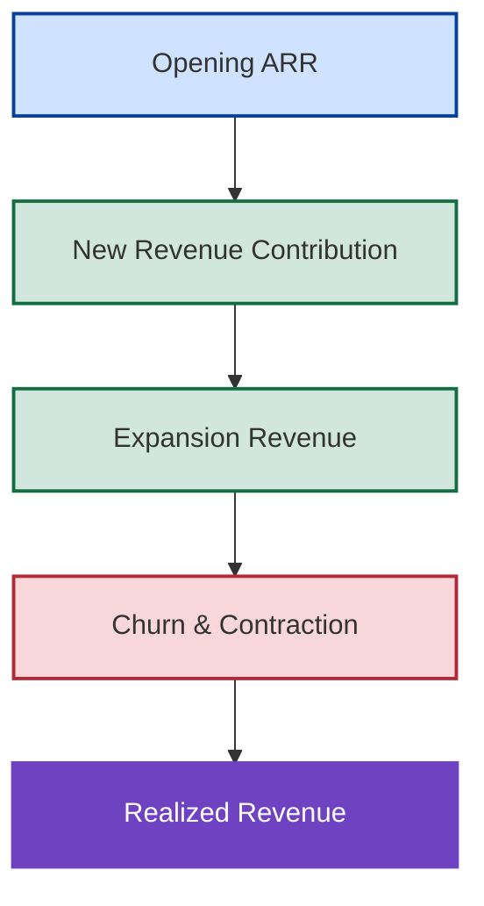

# 📈 Revenue Realization Framework
## 📘 How Recurring Revenue Becomes Fiscal Performance

[⬅ Revenue Information Architecture](../03_Architecture/revenue-information-architecture.md)
|
[⬅ Revenue Operating Model](README.md)
|
[⬅ Revenue Operating Foundations](revenue-operating-foundations.md)
|
[⬅ Revenue Timing Framework](revenue-timing-framework.md)
|
[➡ Forecast Governance](../05_Forecast_Governance/README.md)

---

<p align="center">


</p>

---

## 📌 Executive Overview

Revenue Operating Foundations established how recurring revenue is created.

Revenue Timing established when recurring revenue contributes.

The final question is:

> How does recurring revenue ultimately become fiscal performance?

The answer lies in Revenue Realization.

Revenue realization represents the combined effect of:

- Opening ARR
- New Revenue Contribution
- Expansion Revenue
- Churn and Contraction

Together these forces determine the realized revenue position of the business.

---

## 🧠 Core Operating Principle

The most important principle in revenue realization is:

> Revenue creation, revenue timing, and revenue realization are three different operating disciplines.

Organizations frequently focus on creating ARR.

Many understand timing.

Far fewer understand the operating mechanics that ultimately determine realized revenue performance.

Revenue realization bridges this gap.

---

## 📈 Revenue Realization Evolution



Revenue realization emerges from the interaction of multiple revenue forces operating simultaneously.

---

## 🏭 Continuing Our Reference Transactions

The previous framework introduced two customer agreements.

### Acme Manufacturing

| Metric | Value |
|----------|----------:|
| ARR Created | $1.2M |
| IYRC | $600K |

### Global Retail Group

| Metric | Value |
|----------|----------:|
| ARR Created | $1.2M |
| IYRC | $100K |

Combined:

| Metric | Value |
|----------|----------:|
| Total New ARR | $2.4M |
| Current-Year Revenue Contribution | $700K |

These transactions contribute toward revenue realization, but they do not determine revenue performance on their own.

---

# 🏛️ Opening ARR Foundation

Every fiscal year begins with an existing recurring revenue base.

This is referred to as:

# 💰 Opening ARR

Opening ARR represents revenue already under contract before any new selling activity occurs.

---

## Example

| Metric | Value |
|----------|----------:|
| Opening ARR | $50M |

This existing revenue foundation typically represents the largest contributor to fiscal performance.

For most mature SaaS organizations:

> Revenue stability begins with Opening ARR.

---

# 📈 New Revenue Contribution

New customer agreements generate additional recurring revenue.

However, only the portion that can be realized during the fiscal period contributes toward current-year performance.

From our examples:

| Customer | Contribution |
|----------|----------:|
| Acme Manufacturing | $600K |
| Global Retail Group | $100K |

Total:

```text
New Revenue Contribution = $700K
```

---

## 🚀 Expansion Revenue

Existing customers frequently generate additional value through:

- Upsell
- Cross-Sell
- Contract Expansion
- Additional Product Adoption

Expansion revenue increases realized revenue without requiring entirely new customer acquisition.

---

### Example

| Metric | Value |
|----------|----------:|
| Expansion Revenue | $3M |

Expansion often represents one of the most efficient growth mechanisms available to subscription businesses.

---

## 📉 Churn & Contraction

Not all recurring revenue survives.

Revenue can be lost through:

- Customer churn
- Contract downgrades
- Reduced consumption
- Competitive displacement

These forces reduce realized revenue.

---

### Example

| Metric | Value |
|----------|----------:|
| Churn & Contraction | -$2M |

Even strong new sales performance can be offset by excessive churn.

---

## 📊 Revenue Realization Equation

Combining all components:

```text
Realized Revenue
=
Opening ARR
+ New Revenue Contribution
+ Expansion Revenue
- Churn & Contraction
```

Using our example:

```text
Realized Revenue
=
50.0M
+0.7M
+3.0M
-2.0M
```

```text
Realized Revenue
=
51.7M
```

This represents the actual revenue position generated by the operating model.

---

## ⚠️ Why ARR Growth Does Not Guarantee Revenue Growth

One of the most common misconceptions in subscription businesses is:

> Strong ARR creation automatically produces strong revenue performance.

This is not always true.

---

### Scenario A

| Metric | Value |
|----------|----------:|
| Opening ARR | $50M |
| Expansion Revenue | $5M |
| Churn | -$1M |

Result:

```text
Strong Revenue Realization
```

---

### Scenario B

| Metric | Value |
|----------|----------:|
| Opening ARR | $50M |
| Expansion Revenue | $1M |
| Churn | -$5M |

Result:

```text
Weak Revenue Realization
```

Both organizations may report similar booking activity.

Both may report similar ARR generation.

Yet realized revenue outcomes differ materially.

Revenue realization depends on the entire operating system.

---

## 🌍 Strategic Operating Implications

Organizations that actively manage revenue realization typically achieve:

✅ stronger revenue predictability

✅ improved recurring revenue durability

✅ healthier customer economics

✅ greater executive visibility

✅ more stable fiscal performance

Organizations that focus exclusively on bookings often overlook the broader drivers of realized revenue.

---

### 💡 Executive Insight

Revenue creation establishes opportunity.

Revenue timing establishes accessibility.

Revenue realization establishes performance.

These are distinct but interconnected operating disciplines.

Understanding their relationship provides a more complete view of subscription business performance.

---

### 🔗 Connection To Forecast Governance

Revenue Operating Foundations explained:

- how recurring revenue is created

Revenue Timing explained:

- when recurring revenue contributes

Revenue Realization explained:

- how recurring revenue becomes fiscal performance

The next challenge is determining whether realized revenue will achieve planned fiscal outcomes.

This introduces:

## 📊 Forecast Governance

which establishes the operating processes used to evaluate revenue expectations against fiscal targets.

---

## 🎯 Strategic Conclusion

Recurring revenue businesses succeed not merely by generating contracts, but by converting recurring revenue into realized fiscal performance.

Opening ARR provides stability.

New revenue contribution provides growth.

Expansion accelerates performance.

Churn creates erosion.

Together these forces determine the realized revenue position of the enterprise and complete the Revenue Operating Model within New Bridge.

---

### 👤 Author

**Anil Jacob**  
Enterprise BI • Revenue Operations • Executive Analytics • Forecast Governance

---

### 📜 Repository Context

All commercial metrics, revenue models, operating frameworks, forecasts, and business scenarios contained within this repository are simulated for portfolio and strategic demonstration purposes.