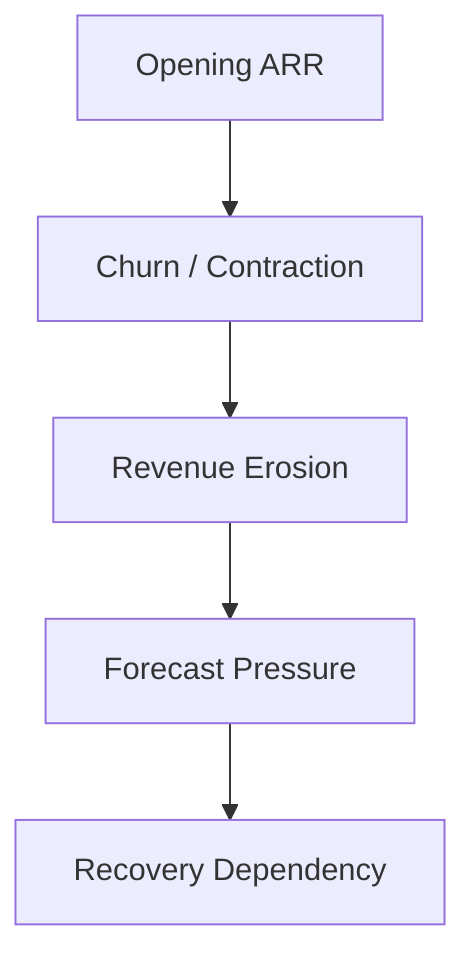

# 📈 Revenue Realization Governance  
## 🏛️ Forecast Survivability & Fiscal Attainment Framework

[⬅ Back to README](../README.md) | [⬅ IYRC Revenue Timing Framework](iyrc-model.md)

---

<p align="center">


</p>

---

# 📌 Executive Overview

The New Bridge operating model was intentionally designed to govern not only:

# 💰 Bookings Performance

but also:

# 📈 Revenue Realization Survivability

This distinction is critical because enterprise SaaS organizations frequently generate strong commercial activity while still failing to achieve fiscal revenue commitments.

The framework therefore models how:

- recurring revenue,
- new bookings,
- churn,
- expansion,
- and timing realization

collectively determine enterprise forecast survivability.

---

# 🧠 Core Operating Principle

The framework is built around a foundational governance principle:

> Bookings do not automatically translate into fiscal attainment.

Enterprise revenue realization depends on:

- timing realism,
- recurring revenue durability,
- expansion execution,
- churn containment,
- and forecast conversion quality.

This creates the operational bridge between:

# 📊 Commercial Performance
and
# 🏛️ Financial Governance

---

# 🏗️ Revenue Realization Architecture


---

# 📘 Revenue Realization Components

The New Bridge framework models enterprise revenue realization through multiple interacting operating layers.

---

## 📊 Revenue Governance Structure

| Component | Strategic Purpose |
|---|---|
| Opening ARR | Baseline recurring revenue foundation |
| New Bookings | Growth generation |
| IYRC Realization | Timing-adjusted revenue contribution |
| Expansion Revenue | Upsell & cross-sell growth |
| Churn / Contraction | Revenue erosion |
| Net Revenue Position | Fiscal survivability outcome |

---

# 💰 Opening ARR Foundation

Opening ARR represents the recurring revenue base already under contract at the start of the fiscal period.

This serves as the organization’s:

# 🏛️ Revenue Stability Layer

---

## 📊 Opening ARR Characteristics

| Characteristic | Strategic Impact |
|---|---|
| Recurring | Predictable revenue base |
| Durable | Supports fiscal stability |
| Renewable | Enables long-term survivability |
| Expansion-capable | Drives scalable growth |

Organizations with stronger Opening ARR foundations generally demonstrate:

✅ higher forecast resilience  
✅ lower recovery dependency  
✅ improved fiscal stability  
✅ reduced pipeline fragility  

---

# 📉 Churn & Contraction Risk

Revenue erosion through:

- customer loss,
- contraction,
- downgrades,
- or delayed renewals

creates structural pressure on enterprise survivability.

---

## ⚠️ Churn Impact Dynamics



---

# 📈 Expansion Revenue

Expansion revenue represents:

- upsell,
- cross-sell,
- and contract expansion

generated from the existing installed customer base.

Expansion typically produces:

✅ higher conversion efficiency  
✅ lower acquisition cost  
✅ stronger timing predictability  
✅ improved survivability quality  

This became highly important during:

# 🏦 Central Risk Reserve (CRR)

recovery optimization scenarios.

---

# ⏳ Revenue Timing Realization

Revenue survivability is heavily influenced by:

- booking timing,
- fiscal realization windows,
- and IYRC contribution mechanics.

This creates significant forecast sensitivity during late-quarter operating periods.

---

## 📊 Revenue Timing Logic

| Close Timing | Revenue Realization Potential |
|---|---:|
| Early Fiscal Year | High |
| Mid Fiscal Year | Moderate |
| Late Fiscal Year | Reduced |
| Fiscal Close Window | Minimal |

As realization windows compress:

- fiscal optionality narrows,
- recovery efficiency declines,
- and enterprise exposure increases.

---

# ⚠️ Forecast Conversion Risk

The New Bridge simulation intentionally demonstrates how forecast conversion quality deteriorates under increasingly aggressive pipeline assumptions.

---

## 📊 Conversion Quality Progression

| Scenario | Survivability Quality |
|---|---|
| Full Pipeline | Moderate |
| Qualified Pipeline | Reduced |
| High-Confidence Pipeline | Severe exposure visibility |

This progression explains why:

# 📉 Historical Success
does not necessarily imply:
# 📈 Forward Forecast Survivability

---

# 🧱 Revenue Bridge Logic

The enterprise revenue bridge was intentionally modeled using:

```text
Revenue Position
=
Opening ARR
+ IYRC Contribution
+ Expansion Revenue
− Churn / Contraction
```

This framework creates:

✅ financial accountability  
✅ forecast transparency  
✅ survivability calibration  
✅ executive visibility  
✅ governance realism  

---

# 🌍 Enterprise Governance Implication

The distinction between:

- bookings,
- revenue realization,
- and survivability timing

became one of the most important governance insights within the New Bridge simulation.

Organizations that fail to govern this distinction frequently:

❌ overestimate fiscal resilience  
❌ misjudge pipeline survivability  
❌ delay recovery intervention  
❌ underestimate enterprise exposure  

---

# 🧠 Strategic Executive Insight

The New Bridge framework demonstrates that:

> Enterprise SaaS forecasting is fundamentally a revenue realization governance problem rather than a pipeline reporting problem.

The objective of modern commercial governance is therefore not merely to maximize bookings visibility, but rather to:

✅ preserve forecast survivability  
✅ govern timing realism  
✅ optimize recurring revenue durability  
✅ reduce recovery dependency  
✅ maintain enterprise fiscal credibility  

---

# 🚀 Transition Into Forecast Governance & Recovery

Once revenue realization survivability began deteriorating materially, the organization required:

- confidence-aware forecasting,
- enterprise exposure calibration,
- recovery investment optimization,
- and structured commercial intervention governance.

This directly triggered the creation of the:

# 🏦 Central Risk Reserve (CRR)

which became the institutional recovery mechanism for mitigating forecast deterioration across the global commercial portfolio.

---

# 📈 Strategic Outcome

The New Bridge Revenue Realization Framework ultimately evolved beyond traditional revenue reporting into:

# 🏛️ Enterprise Forecast Survivability Governance

demonstrating how SaaS organizations must govern:

- recurring revenue durability,
- timing realism,
- recovery dependency,
- and fiscal resilience

through institutionally disciplined commercial operating systems.

---

# 👤 Author

**Anil Jacob**  
Enterprise BI • RevOps Strategy • Executive Analytics • Forecast Governance

---

# 📜 Repository Context

All financial models, revenue frameworks, forecasts, and commercial operating environments within this repository are simulated for portfolio and strategic demonstration purposes.
