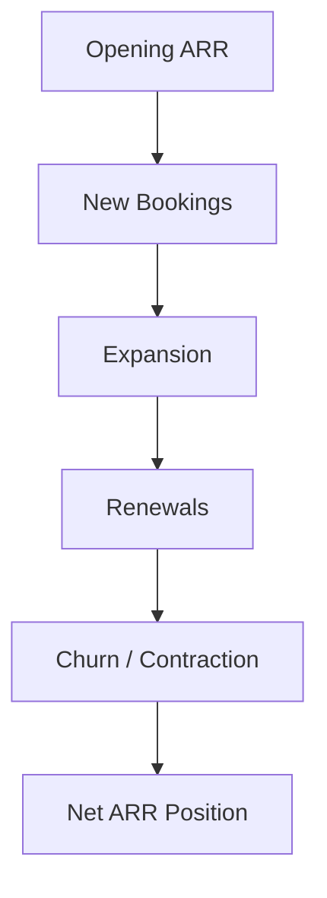

# 💰 ARR & ACV Framework  
## 📘 SaaS Commercial Mechanics & Revenue Operating Foundations

[⬅ Back to README](../README.md) | [⬅ Business Excellence Operating Model](bookings-revenue-realization-framework.md)

---

---

# 📌 Executive Overview

The New Bridge SaaS operating model was intentionally designed around governed recurring revenue mechanics to ensure alignment between:

- Sales execution,
- Revenue realization,
- Forecast governance,
- and Executive financial accountability.

At the center of this operating framework are two foundational SaaS metrics:

# 💰 ARR (Annual Recurring Revenue)
and
# 📘 ACV (Annual Contract Value)

These metrics govern how commercial performance translates into fiscal outcomes inside subscription-based operating environments.

---

# 🧠 Core Commercial Principle

The framework is built around a foundational SaaS principle:

> Bookings volume alone does not determine enterprise value.

Instead, enterprise health depends on:

- recurring revenue durability,
- revenue timing,
- contract realization,
- expansion scalability,
- and forecast survivability.

---

# 📘 ACV vs ARR

Although frequently used interchangeably in SaaS organizations, ACV and ARR serve different operational purposes.

---

## 📊 Commercial Metric Definitions

| Metric | Purpose | Operating Role |
|---|---|---|
| ACV | Annualized contract booking value | Sales performance measurement |
| ARR | Recurring revenue run-rate | Enterprise revenue base |
| TCV | Total multi-year contract value | Long-term contract valuation |
| IYRC | In-Year realized revenue | Fiscal revenue realization |

---

# 🏛️ SaaS Revenue Operating Flow

---

# 💰 Annual Contract Value (ACV)

ACV represents the annualized value of newly closed subscription contracts.

It is primarily used for:

- quota attainment,
- sales productivity,
- pipeline measurement,
- and commercial performance tracking.

---

## 📊 ACV Characteristics

| Characteristic | Description |
|---|---|
| Sales-oriented | Measures booking productivity |
| Annualized | Standardizes multi-term contracts |
| Pipeline-driven | Supports forecast planning |
| Timing-sensitive | Fiscal realization varies by close date |

---

# 📈 Annual Recurring Revenue (ARR)

ARR represents the recurring subscription revenue base expected to persist annually.

It is primarily used for:

- enterprise valuation,
- recurring revenue planning,
- growth measurement,
- and operating stability assessment.

---

## 📊 ARR Characteristics

| Characteristic | Description |
|---|---|
| Finance-oriented | Supports revenue planning |
| Recurring | Measures durable revenue base |
| Expansion-sensitive | Influenced by upsell/cross-sell |
| Churn-sensitive | Reduced through contraction |

---

# ⚠️ Why ACV Alone Is Dangerous

Organizations that govern performance primarily through ACV often create structural forecast distortions.

---

## 🚫 ACV-Only Forecast Risks

| Risk | Enterprise Impact |
|---|---|
| Ignores revenue timing | Misaligned fiscal forecasts |
| Overstates near-term realization | False confidence |
| Hides survivability deterioration | Weak governance visibility |
| Encourages late-quarter dependency | Operational fragility |

This creates a disconnect between:

- commercial optimism,
- and fiscal reality.

---

# 📊 ARR Expansion Dynamics

ARR growth is influenced by multiple operating factors simultaneously.

---

# 🌍 Enterprise Governance Implication

The distinction between:

- ACV,
- ARR,
- revenue realization,
- and timing sensitivity

is critical for:

✅ forecast governance  
✅ fiscal planning  
✅ pipeline calibration  
✅ survivability analysis  
✅ board-level financial visibility  

Without this alignment, organizations frequently overestimate enterprise resilience during deteriorating pipeline conditions.

---

# 🧠 Strategic Insight

The New Bridge operating framework intentionally separates:

| Commercial Layer | Financial Layer |
|---|---|
| Bookings productivity | Revenue realization |
| ACV performance | ARR durability |
| Pipeline volume | Forecast survivability |
| Commercial momentum | Fiscal attainment |

This separation became essential for exposing the hidden forecast deterioration modeled throughout the repository.

---

# 🚀 Transition Into Revenue Timing Science

While ARR and ACV establish the commercial operating foundation, fiscal survivability ultimately depends on:

# ⏳ Revenue Timing Realization

This introduces the need for:

- In-Year Revenue Contribution (IYRC),
- proration mechanics,
- timing sensitivity,
- and revenue realization governance.

These concepts are explored in:

# 📘 IYRC Revenue Timing Framework

---

# 👤 Author

**Anil Jacob**  
Enterprise BI • RevOps Strategy • Executive Analytics • Forecast Governance

---

# 📜 Repository Context

All financial models, forecasts, commercial metrics, and operating environments within this repository are simulated for portfolio and strategic demonstration purposes.
