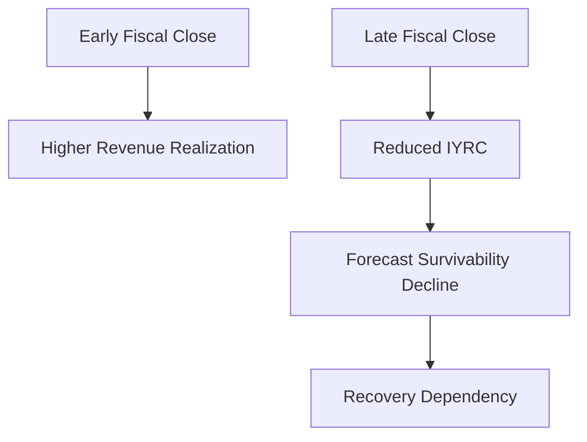

# ⏳ IYRC Revenue Timing Framework  
## 📘 In-Year Revenue Contribution & Forecast Realization Science

[⬅ Back to README](../README.md) | [⬅ ARR & ACV Framework](arr-acv-framework.md)

---

<p align="center">


</p>

---

# 📌 Executive Overview

One of the most misunderstood dynamics inside SaaS forecasting environments is the relationship between:

# 💰 Bookings
and
# 📈 Revenue Realization

The New Bridge operating framework intentionally models this distinction through:

# ⏳ In-Year Revenue Contribution (IYRC)

which governs how much booked contract value can realistically materialize as recognized fiscal revenue within a given financial year.

This framework became foundational for:

- forecast survivability analysis,
- pipeline calibration,
- timing-sensitive forecasting,
- and enterprise recovery governance.

---

# 🧠 Core Operating Principle

The framework is built around a fundamental SaaS principle:

> The timing of a booking is often more important than the size of the booking itself.

Two deals with identical ACV can produce materially different fiscal outcomes depending on:

- close timing,
- remaining fiscal duration,
- and revenue realization windows.

This creates significant forecast sensitivity during late-quarter operating environments.

---

# 📊 IYRC Definition

IYRC represents the portion of Annual Contract Value (ACV) that can realistically contribute toward fiscal revenue attainment within the current operating year.

---

## 📘 IYRC Formula

```text
IYRC = ACV × (Remaining Fiscal Months ÷ 12)
```

---

# 🏛️ Revenue Timing Realization Flow


---

# 📊 Timing Sensitivity Example

The framework intentionally demonstrates how identical ACV values can produce radically different fiscal outcomes.

---

## 📘 IYRC Timing Illustration

| Deal | ACV | Close Month | Remaining Months | IYRC |
|---|---:|---|---:|---:|
| Deal A | 120K | Jan | 6 | 60K |
| Deal B | 120K | Apr | 3 | 30K |
| Deal C | 120K | Jun | 1 | 10K |

---

# ⚠️ Strategic Insight

Although all three deals generate identical:

# 💰 ACV

their fiscal contribution toward:

# 📈 Revenue Attainment

is dramatically different.

This creates one of the most important governance realities inside SaaS forecasting environments:

> Late-quarter bookings often contribute far less fiscal recovery value than executive pipeline dashboards imply.

---

# 📉 Forecast Timing Deterioration

As fiscal periods advance, revenue realization potential compresses rapidly.

---

## ⏳ Revenue Timing Compression



---

# 🗓️ Fiscal Timing Sensitivity

| Close Timing | Approximate Revenue Contribution |
|---|---:|
| Q1 Close | High |
| Q2 Close | Moderate |
| Q3 Close | Reduced |
| Q4 Close | Minimal |

This timing sensitivity becomes increasingly dangerous during deteriorating forecast environments.

---

# ⚠️ Why Traditional Forecasting Fails

Traditional SaaS forecasting environments frequently overestimate forecast survivability because they focus primarily on:

- pipeline ACV,
- aggregate bookings,
- and weighted opportunity value.

However, these approaches frequently ignore:

❌ timing realism  
❌ revenue realization compression  
❌ fiscal survivability  
❌ late-quarter degradation  
❌ operational recovery windows  

This creates false executive confidence.

---

# 🧱 IYRC & Forecast Survivability

The New Bridge framework intentionally treats:

# 📘 Revenue Realization

as a constrained operating system rather than an optimistic pipeline assumption.

This approach enables:

✅ timing-aware forecasting  
✅ survivability governance  
✅ recovery realism  
✅ executive visibility  
✅ confidence calibration  

---

# 🌍 Enterprise Governance Implication

The IYRC framework directly explains why:

- Full Pipeline Coverage,
- Qualified Coverage,
- and High-Confidence Coverage

deteriorate progressively across the enterprise forecast model.

As fiscal timing compresses:

- lower-confidence opportunities lose survivability value,
- recovery optionality narrows,
- and enterprise exposure escalates rapidly.

This became one of the foundational drivers behind the:

# 🏦 Central Risk Reserve (CRR)

recovery framework.

---

# 📊 Forecast Survivability Mechanics


---

# 🚨 Q4 Dependency Risk

One of the most important governance insights identified in the simulation was excessive enterprise dependency on:

# ⚠️ Late-Quarter Recovery Execution

As organizations approach fiscal close:

- realization windows shrink,
- IYRC contribution weakens,
- and recovery efficiency declines sharply.

This creates structural operational fragility.

---

# 🧠 Executive-Level Insight

The New Bridge framework demonstrates that:

> Enterprise SaaS forecasting is fundamentally a timing-governance problem, not merely a pipeline-volume problem.

Organizations that fail to govern timing sensitivity often:

- overestimate survivability,
- delay recovery intervention,
- and misjudge enterprise exposure until fiscal recovery becomes operationally constrained.

---

# 🚀 Transition Into Revenue Realization Governance

While IYRC governs timing-sensitive fiscal realization, enterprise survivability ultimately depends on:

- opening ARR durability,
- churn management,
- expansion realization,
- and forecast conversion governance.

These concepts are explored in:

# 📘 Revenue Realization Governance Framework

---

# 👤 Author

**Anil Jacob**  
Enterprise BI • RevOps Strategy • Executive Analytics • Forecast Governance

---

# 📜 Repository Context

All financial models, forecasts, timing frameworks, and commercial operating environments within this repository are simulated for portfolio and strategic demonstration purposes.
