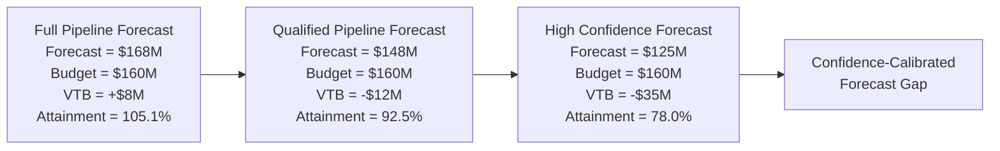
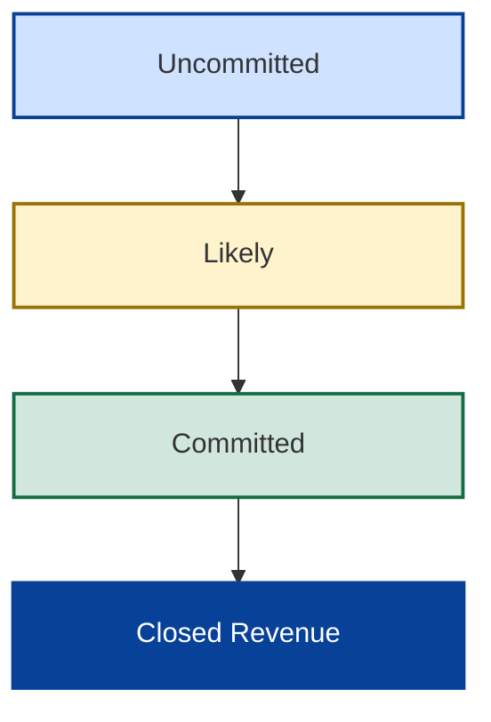

# 📊 Forecast Confidence
## 📘 Pipeline Coverage & Forecast Survivability Analysis

[⬅ Revenue Operating Model](../04_Revenue_Operating_Model/README.md)
|
[⬅ Revenue Realization](../04_Revenue_Operating_Model/revenue-realization.md)
|
[⬅ Pipeline Governance](README.md)
|
[➡ Forecast Exposure](forecast-exposure.md)
|
[➡ Forecast Risk](../06_Forecast_Risk/forecast-risk.md)

---

<p align="center">


</p>

---

## 📌 Executive Overview

Revenue Operating Models explain how revenue is created, timed, and realized.

Pipeline Governance introduces a new challenge:

> How much confidence should leadership place in the forecast?

This framework evaluates how forecast confidence changes when increasingly uncertain opportunity pools are removed from the year-end forecast.

The objective is not to evaluate pipeline volume.

The objective is to evaluate forecast confidence.

---

## 🗓️ Operating Context

This analysis is performed at the conclusion of Q3.

At this point:

- Q1–Q3 actual performance is known.
- The remaining fiscal outcome depends on Q4 execution.
- Leadership must assess whether the remaining opportunity portfolio can realistically achieve the full-year target.

The forecast therefore combines:

```text
Q1–Q3 Actual Performance
+
Q4 Remaining Opportunity Portfolio
=
FY26 Forecast
```

All forecast values shown within this framework represent projected full-year outcomes evaluated from a Q3 operating position.

This distinction is important because the framework evaluates confidence in year-end attainment rather than current-quarter performance.

---

## 🧠 Core Governance Principle

The most important principle in Pipeline Governance is:

> Pipeline volume does not determine forecast confidence.

Forecast confidence depends on:

- opportunity quality
- qualification rigor
- execution confidence
- timing realism
- revenue concentration

As confidence assumptions become stricter, forecast survivability frequently deteriorates.

---

## 📉 Forecast Confidence Evolution



The budget remains unchanged throughout the analysis.

Only forecast confidence changes.

This reveals the true level of forecast survivability.

---

## 💡 Executive Insight

> The forecast does not deteriorate because the budget changes.
>
> The forecast deteriorates because confidence changes.

This distinction forms the foundation of the Forecast Confidence methodology.

---

## 🎭 The Confidence Illusion

At the conclusion of Q3, the remaining opportunity portfolio appeared substantial.

### Opportunity Portfolio Snapshot

| Metric | Value |
|----------|----------:|
| Total Pipeline | $28M |
| Open Pipeline | $28M |
| Committed | $4M |
| Likely | $2M |
| At Risk | $1M |
| Uncommitted | $21M |

At first glance:

```text
Pipeline = $28M
```

appears sufficient to support year-end attainment.

However, confidence calibration reveals a different reality.

---

## 📊 Opportunity Distribution by Risk-levels

| Opportunity State | ARR | % of Pipeline |
|----------|----------:|----------:|
| Committed | $4M | 14% |
| Likely | $2M | 7% |
| At Risk | $1M | 4% |
| Uncommitted | $21M | 75% |
| Total Pipeline | $28M | 100% |

Although the enterprise reported $28M of remaining pipeline, only $6M existed within Committed and Likely opportunity states.

The remaining opportunity portfolio depended heavily on opportunities with materially lower confidence characteristics.

---

## ⚠️ The Confidence Illusion

This reveals an important governance reality:

> Large pipeline volume does not necessarily imply strong forecast confidence.

A significant proportion of enterprise forecast survivability depended on opportunities that had not yet achieved sufficient qualification or commitment levels.

This creates a structural gap between:

```text
Reported Pipeline
```

and

```text
Forecast Confidence
```

---

## 🏛️ Forecast Confidence Classification

Forecast confidence is established through opportunity qualification rather than simple probability weighting.

---

### Confidence States

| State | ARR | Interpretation |
|----------|----------:|----------|
| Committed | $4M | High-confidence execution path |
| Likely | $2M | Achievable but dependent on successful execution |
| At Risk | $1M | Known obstacles impacting closure confidence |
| Uncommitted | $21M | Insufficient qualification for forecast reliance |

---

### Confidence Progression



Forecast confidence improves as opportunities progress through qualification and commitment stages.

This progression forms the basis of confidence-calibrated forecasting.

---

## 🚫 Why Weighted Pipeline Fails

Traditional weighted-pipeline approaches frequently create artificial confidence.

---

### Common Forecast Anti-Patterns

| Anti-Pattern | Governance Risk |
|----------|----------|
| Weighted pipeline assumptions | Confidence inflation |
| Aggregate pipeline reporting | Hides qualification weakness |
| Probability-based optimism | Delays exposure visibility |
| Revenue-blind pipeline analysis | Ignores fiscal contribution |
| Qualification inconsistency | Weakens forecast credibility |

These approaches often make deteriorating forecasts appear healthier than they actually are.

---

## 🌍 Geographic Forecast Concentration

Forecast deterioration was not evenly distributed across the enterprise.

Instead, confidence deterioration concentrated within a small number of major revenue-producing geographies.


---

## 📊 Regional Confidence Calibration

The confidence calibration process revealed that enterprise outcomes were heavily influenced by a small number of large revenue-producing regions.

| Region | Full Pipeline | Qualified Pipeline | High Confidence |
|----------|----------:|----------:|----------:|
| NA West | 105.2% | 87.2% | 66.8% |
| NA East | 109.8% | 90.6% | 68.1% |
| DACH | 101.6% | 95.0% | 87.6% |
| UKI | 102.6% | 96.5% | 90.7% |

While every geography experienced some deterioration, the largest reductions occurred within NA West and NA East.

---

## ⚠️ Forecast Concentration Risk

This reveals a second governance reality:

> Not all forecast variance is created equally.

A modest deterioration within a small geography may have limited enterprise impact.

The same deterioration within a major revenue-producing geography can materially alter full-year attainment.

Enterprise outcomes therefore depend not only on confidence levels but also on revenue concentration.

---

## 🧭 Regional Resilience Assessment

### Resilient Regions

```text
UKI
DACH
```

These regions maintained comparatively strong attainment levels under increasingly strict confidence assumptions.

---

### Vulnerable Regions

```text
India
ANZ
Middle East
```

These regions demonstrated moderate confidence deterioration during calibration.

---

### Critical Regions

```text
NA West
NA East
```

These regions combined:

- significant revenue concentration
- substantial confidence deterioration

and therefore exerted disproportionate influence on enterprise forecast outcomes.

---

## 🧠 Executive Governance Insight

The objective of Pipeline Governance is not to maximize reported pipeline.

The objective is to determine:

> How much of the forecast remains credible under increasingly strict confidence assumptions?

Confidence calibration provides leadership with a more realistic understanding of forecast survivability than aggregate pipeline reporting alone.

---

## 🔗 Transition To Forecast Exposure

Forecast confidence establishes whether the forecast is believable.

The next question becomes:

> If confidence-adjusted forecasts reveal a gap, how large is the gap?

This introduces:

## 📉 Forecast Exposure

which quantifies the remaining variance between confidence-adjusted forecasts and fiscal targets.

---

## 🎯 Strategic Conclusion

Forecast confidence depends on qualification quality rather than pipeline volume alone.

As confidence assumptions become more rigorous:

- forecast survivability declines
- exposure becomes visible
- concentration risk emerges
- executive decision-making improves

This transforms Pipeline Governance from simple pipeline reporting into confidence-calibrated leadership analysis.

---

### 👤 Author

**Anil Jacob**  
Enterprise BI • Revenue Operations • Executive Analytics • Forecast Governance

---

### 📜 Repository Context

All forecasts, opportunity portfolios, regional performance metrics, pipeline scenarios, and commercial operating environments contained within this repository are simulated for portfolio and strategic demonstration purposes.