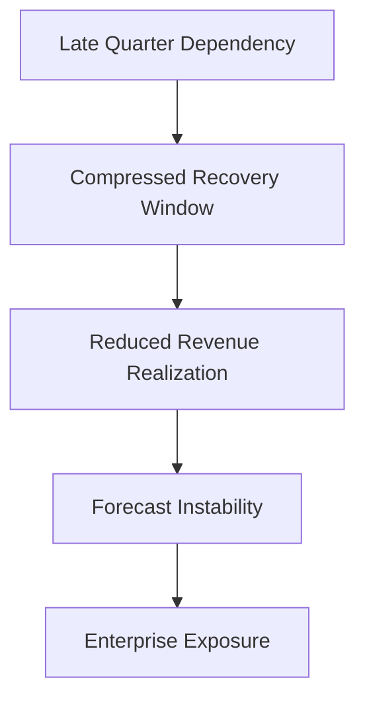

# ⚠️ Pipeline Risk Model  
## 📉 Forecast Survivability & Confidence Calibration Framework

[⬅ Back to README](../README.md) | [⬅ Executive Summary](../01_Executive_Summary/executive-summary.md)

---

---

# 📌 Pipeline Governance Overview

The New Bridge pipeline governance framework was intentionally designed to model how enterprise SaaS forecast survivability deteriorates as pipeline confidence weakens.

Traditional SaaS reporting environments frequently overestimate forecast stability because they rely heavily on:

- aggregate pipeline volume,
- weighted probability assumptions,
- and reverse-looking dashboard optics.

However, these approaches often fail to measure:

❌ forecast survivability  
❌ confidence deterioration  
❌ recovery dependency  
❌ geography-level exposure  
❌ timing-sensitive realization risk  

The New Bridge framework instead models forecast governance through:

# 🏛️ Confidence-Calibrated Pipeline Survivability

---

# 🧠 Core Governance Principle

The framework is built around a fundamental operating principle:

> Pipeline volume alone does not determine forecast health.

Instead, enterprise survivability depends on:

- pipeline quality,
- timing realism,
- conversion confidence,
- geographic concentration,
- and recovery capacity.

This distinction becomes increasingly critical during late-quarter forecasting environments.

---

# 📉 Forecast Deterioration Framework

The project intentionally demonstrates how forecast survivability weakens under progressively stricter confidence assumptions.

---

## 📊 Enterprise Coverage Escalation

| Forecast Scenario | Coverage | Strategic Interpretation |
|---|---:|---|
| Full Pipeline | 105.0% | Operationally survivable |
| Qualified Pipeline | 92.5% | Material forecast deterioration |
| High-Confidence Pipeline | 78.0% | Severe enterprise exposure |

---

# 📊 Forecast Survivability Progression

---

# ⚠️ Why Weighted Pipeline Fails

Traditional weighted-pipeline models frequently create false forecast confidence.

---

## 🚫 Common Forecast Anti-Patterns

| Anti-Pattern | Enterprise Risk |
|---|---|
| Weighted pipeline assumptions | Artificial confidence inflation |
| ACV-only forecasting | Ignores revenue timing |
| Aggregate pipeline focus | Hides confidence deterioration |
| No risk-state governance | Weak visibility into survivability |
| Q4 dependency normalization | Structural recovery fragility |

These approaches often delay executive recognition of deteriorating forecast conditions until recovery windows become operationally compressed.

---

# 🧱 Pipeline Risk-State Governance

The New Bridge framework models pipeline survivability through explicit risk-state classification rather than probability weighting.

---

## 📊 Risk-State Model

| Deal State | Risk Level | Forecast Treatment |
|---|---|---|
| Committed | Low | Included |
| Likely | Medium | Qualified inclusion |
| Uncommitted | High | Excluded from survivability |
| At Risk | Very High | Escalated governance |
| Pushed | Extreme | Removed from forecast |

This approach intentionally prioritizes:

✅ governance realism  
✅ survivability accuracy  
✅ confidence transparency  
✅ executive accountability  

over artificial forecast optimism.

---

# 🌍 Geography-Level Exposure

Forecast deterioration was intentionally modeled across global operating regions including:

- NA West
- NA East
- DACH
- UKI
- India
- ANZ
- Brazil
- Middle East

The framework demonstrates how enterprise forecast risk becomes unevenly distributed under stricter confidence calibration.

Some regions remained operationally resilient while others experienced severe survivability deterioration.

---

# 🗓️ Q4 Dependency Risk

One of the most critical governance risks identified in the simulation was excessive enterprise dependency on late-quarter recovery execution.

---

## ⏳ Timing Sensitivity

---

# ⚠️ Why Timing Matters

As fiscal close windows narrow:

- IYRC realization declines,
- recovery optionality compresses,
- and forecast survivability deteriorates rapidly.

This creates increasing enterprise reliance on:

- aggressive acceleration,
- pricing intervention,
- and recovery execution under operational pressure.

---

# 📊 Pipeline Confidence Calibration

The widening gap between:

- Full Pipeline Coverage,
- Qualified Pipeline Coverage,
- and High-Confidence Coverage

revealed that a substantial portion of forecast survivability depended on increasingly uncertain commercial opportunities.

This exposed a structural governance weakness inside the operating model.

---

# 🏛️ Executive Governance Implication

The key strategic insight from this analysis was:

> Enterprise SaaS forecasting must govern survivability, not merely pipeline volume.

The objective of modern forecast governance is therefore not simply to:

- maximize reported pipeline,
- or inflate weighted probabilities,

but rather to:

✅ quantify survivability  
✅ calibrate confidence realism  
✅ expose hidden forecast deterioration  
✅ prioritize recovery readiness  
✅ preserve enterprise credibility  

---

# 🚀 Transition Into Recovery Governance

Once enterprise forecast survivability deteriorated materially, the organization required a structured recovery framework capable of:

- mitigating forecast exposure,
- preserving fiscal commitments,
- and optimizing recovery investments across global portfolios.

This directly triggered the creation of the:

# 🏦 Central Risk Reserve (CRR)

which became the foundation for:

- recovery optimization,
- Solver-based scenario analysis,
- and enterprise recovery frontier modeling.

---

# 📈 Strategic Outcome

The New Bridge Pipeline Governance Framework ultimately evolved from:

# 📊 Pipeline Reporting

into:

# 🧠 Institutional Forecast Survivability Governance

demonstrating how enterprise SaaS organizations must transition beyond traditional reporting environments toward:

- confidence-aware forecasting,
- risk-calibrated governance,
- and board-level commercial exposure management.

---

# 👤 Author

**Anil Jacob**  
Enterprise BI • RevOps Strategy • Executive Analytics • Forecast Governance

---

# 📜 Repository Context

All business entities, forecasts, pipeline scenarios, and commercial operating environments within this repository are simulated for portfolio and strategic demonstration purposes.
