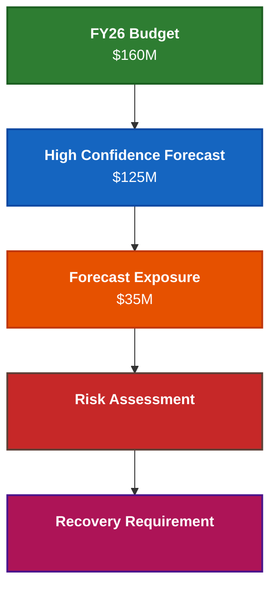
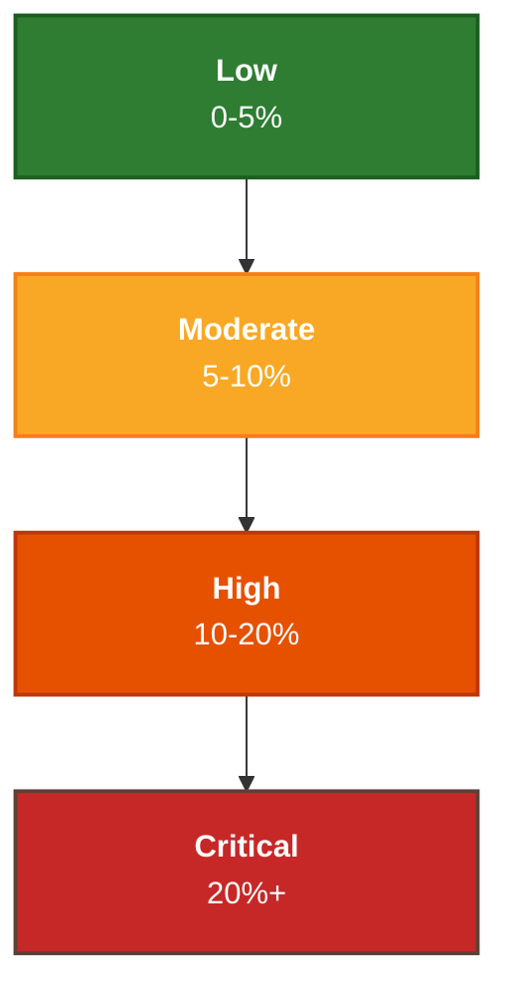
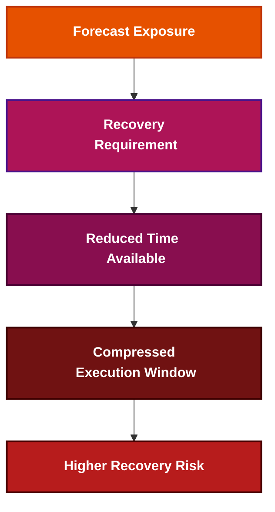

# ⚠️ Forecast Risk
## 📘 Exposure Severity & Recovery Requirement Analysis

[⬅ Pipeline Governance](../05_Pipeline_Governance/README.md)
|
[⬅ Forecast Confidence](../05_Pipeline_Governance/forecast-confidence.md)
|
[⬅ Forecast Exposure](../05_Pipeline_Governance/forecast-exposure.md)
|
[➡ Central Risk Reserve](../08_Central_Risk_Reserve/README.md)
|
[➡ Recovery Optimization](../09_Recovery_Optimization/README.md)

---

<p align="center">


</p>

---

## 📌 Executive Overview

Forecast Confidence established whether the forecast could be trusted.

Forecast Risk evaluates the consequences of that forecast.

The objective is no longer to determine confidence.

The objective is to quantify:

- exposure magnitude
- exposure severity
- concentration risk
- recovery requirements

This transforms forecasting from a confidence discussion into a risk governance discipline.

---

## 🧠 Core Governance Principle

The most important principle in Forecast Risk is:

> Forecast confidence identifies potential failure.
>
> Forecast risk quantifies the consequences of failure.

Confidence explains whether a forecast is believable.

Risk explains what happens when the forecast misses its target.

---

## 🗓️ Operating Context

This analysis is performed at the conclusion of Q3.

At this point:

- Q1–Q3 actual performance is known.
- Q4 execution remains uncertain.
- Forecast confidence calibration has already been completed.

The organization now understands that the confidence-adjusted forecast differs materially from the fiscal target.

The next question becomes:

> How severe is the remaining exposure?

---

## 📉 Forecast Risk Evolution



Forecast Risk begins when confidence-adjusted forecasting reveals a gap between expected performance and fiscal commitments.

---

## 📊 Exposure Calculation

Using the confidence-adjusted forecast:

| Metric | Value |
|----------|----------:|
| FY26 Budget | $160M |
| High Confidence Forecast | $125M |
| Forecast Exposure | $35M |

---

## Exposure Formula

```text
Forecast Exposure
=
Budget
-
High Confidence Forecast
```

```text
Forecast Exposure
=
160M
-
125M
```

```text
Forecast Exposure
=
35M
```

The enterprise is therefore exposed to a potential year-end shortfall of $35M.

---

## 📉 Exposure Escalation

Forecast Confidence established how forecast survivability deteriorated under increasingly strict confidence assumptions.

Forecast Risk translates that deterioration into measurable exposure.

| Scenario | Forecast | Exposure |
|----------|----------:|----------:|
| Full Pipeline | $168M | $0M |
| Qualified Pipeline | $148M | $12M |
| High Confidence | $125M | $35M |

---

### Executive Insight

Confidence calibration transformed what initially appeared to be a forecast surplus into a critical exposure position.

```text
Full Pipeline
VTB = +$8M
```

became:

```text
High Confidence
VTB = -$35M
```

This transition marks the point at which confidence concerns become enterprise risk concerns.

---

## ⚠️ Exposure Severity

Exposure magnitude alone does not fully describe risk.

Risk must be evaluated relative to enterprise commitments.

---

### Exposure Severity Scale

| Exposure % | Classification |
|----------:|----------|
| 0–5% | Low |
| 5–10% | Moderate |
| 10–20% | High |
| >20% | Critical |

---

### Enterprise Exposure Profile

| Metric | Value |
|----------|----------:|
| FY26 Budget | $160M |
| High Confidence Forecast | $125M |
| Exposure | $35M |
| Exposure Severity | 21.9% |
| Classification | Critical |

---

### Executive Interpretation

More than one-fifth of planned fiscal attainment is unsupported under high-confidence assumptions.

This places the enterprise within a critical exposure zone requiring executive attention.

---

## 📈 Risk Escalation Curve



As exposure increases, recovery flexibility declines and intervention requirements become more severe.

---

## 🌍 Exposure Concentration Analysis

Forecast risk is rarely distributed evenly across the enterprise.

Instead, exposure typically concentrates within a small number of high-revenue operating regions.


---

## 📊 Geographic Exposure Concentration

Forecast confidence calibration revealed that enterprise exposure was concentrated within a small number of major revenue-producing geographies.

| Region | Full Pipeline | Qualified Pipeline | High Confidence |
|----------|----------:|----------:|----------:|
| NA West | 105.2% | 87.2% | 66.8% |
| NA East | 109.8% | 90.6% | 68.1% |
| DACH | 101.6% | 95.0% | 87.6% |
| UKI | 102.6% | 96.5% | 90.7% |

The largest forecast deterioration occurred within:

```text
NA East
NA West
```

where attainment declined materially under high-confidence assumptions.

Because these regions represent a significant proportion of enterprise revenue, their deterioration contributes disproportionately to overall forecast risk.

---

## ⚠️ Concentration Risk

This reveals a second governance reality:

> Not all forecast variance is created equally.

A modest deterioration within a low-revenue geography may have limited fiscal impact.

The same deterioration within a major revenue-producing geography can materially alter enterprise outcomes.

Enterprise risk therefore depends on:

- confidence deterioration
- revenue concentration
- exposure magnitude

rather than forecast variance alone.

---

## 🧭 Regional Risk Assessment

### Resilient Regions

```text
UKI
DACH
```

These regions maintained comparatively strong attainment levels under confidence calibration.

---

### Vulnerable Regions

```text
India
ANZ
Middle East
```

These regions demonstrated moderate deterioration under increasingly strict confidence assumptions.

---

### Critical Regions

```text
NA East
NA West
```

These regions combine:

- significant revenue concentration
- material confidence deterioration
- elevated exposure contribution

making them the largest contributors to enterprise risk.

---

## ⏳ Recovery Window Compression

Exposure severity is amplified by limited recovery time.

At the conclusion of Q3:

```text
Actual Performance = Known

Remaining Fiscal Time = One Quarter

Forecast Exposure = $35M
```

The enterprise must therefore offset a $35M exposure using only the remaining Q4 execution window.

---

### Recovery Compression Evolution



Risk severity increases not only because exposure exists, but because recovery time continuously declines.

---

## 📊 Recovery Burden Assessment

The forecast exposure creates a measurable recovery requirement.

| Metric | Value |
|----------|----------:|
| Forecast Exposure | $35M |
| Remaining Quarter | Q4 |
| Monthly Recovery Requirement | ~$11.7M |

---

## Executive Interpretation

Maintaining fiscal commitments would require the organization to generate approximately:

```text
$11.7M
```

of incremental attainment per remaining month.

This illustrates the scale of intervention required to preserve year-end commitments.

---

## 🧠 Executive Risk Profile

Forecast risk is determined by the interaction of multiple factors.

| Risk Driver | Observation |
|-------------|-------------|
| Magnitude | $35M exposure |
| Concentration | Exposure concentrated in NA East and NA West |
| Timing | Single quarter remaining |
| Confidence | High-confidence forecast at 78% attainment |

---

### Executive Insight

Individually these factors may be manageable.

Combined they create a critical enterprise risk profile requiring structured intervention.

Forecast risk is therefore created by the combination of:

- exposure magnitude
- concentration
- timing constraints
- recovery feasibility

rather than missed targets alone.

---

## 🔗 Transition To Central Risk Reserve

Forecast Confidence established whether the forecast could be trusted.

Forecast Risk quantified the consequences of forecast failure.

The next challenge becomes:

> How should the organization respond?

This introduces:

### 🛡️ Central Risk Reserve (CRR)

which provides the institutional recovery mechanism used to mitigate forecast exposure and preserve fiscal commitments.

---

## 🎯 Strategic Conclusion

Forecast confidence reveals forecast survivability.

Forecast risk reveals exposure severity.

Together they provide leadership with a structured understanding of enterprise vulnerability.

By quantifying:

- exposure magnitude
- concentration risk
- timing pressure
- recovery requirements

organizations can transition from reactive forecasting toward proactive risk governance.

Forecast Risk therefore serves as the bridge between forecast governance and enterprise recovery planning within the New Bridge operating model.

---

### 👤 Author

**Anil Jacob**  
Enterprise BI • Revenue Operations • Executive Analytics • Forecast Governance

---

### 📜 Repository Context

All forecasts, exposure assessments, risk classifications, recovery scenarios, and governance environments contained within this repository are simulated for portfolio and strategic demonstration purposes.