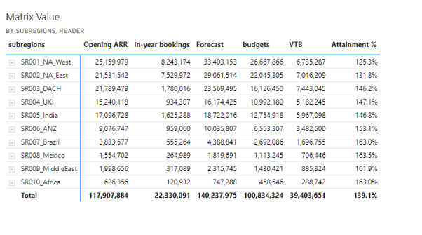
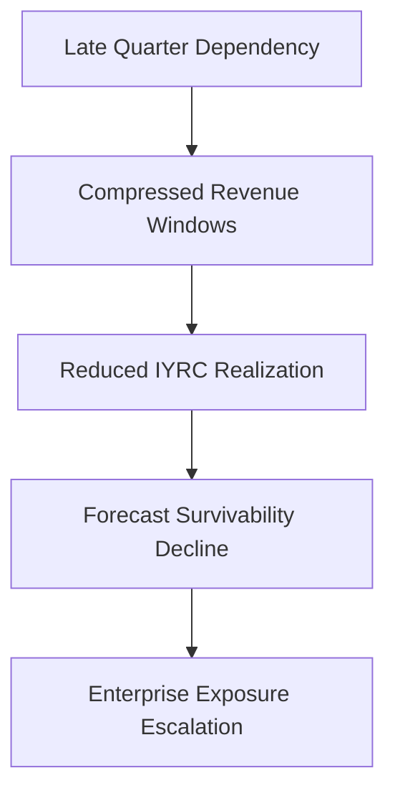

# 📉 Forecast Risk Model  
## ⚠️ Enterprise Forecast Deterioration & Survivability Escalation Analysis

[⬅ Back to README](../README.md) | [⬅ Executive Summary](../01_Executive_Summary/executive-summary.md)

---

---

# 📌 Executive Overview

The New Bridge Forecast Risk Model was intentionally designed to simulate how enterprise SaaS organizations can appear operationally healthy while simultaneously accumulating severe forward-looking forecast exposure beneath the surface.

The framework models the progressive deterioration of enterprise survivability across multiple pipeline confidence states, revealing how:

- historical success,
- pipeline optimism,
- and dashboard-level performance

can conceal material structural fragility within the operating forecast model.

---

# 🧠 Core Governance Principle

The framework is built around a foundational enterprise forecasting principle:

> Historical attainment does not guarantee forward-looking survivability.

The objective of the model is therefore not merely to measure:

- operational activity,
- or aggregate pipeline volume,

but rather to evaluate:

# 🏛️ Enterprise Forecast Survivability

under progressively stricter confidence assumptions.

---

# 📊 Forecast Escalation Sequence

The New Bridge simulation intentionally models forecast deterioration through four progressively restrictive operating perspectives.

---

# 1️⃣ Q3 YTD Historical Performance

  

> Historical operating performance indicates strong enterprise execution across all major geographies with overall attainment reaching 139%.

---

# 2️⃣ Full Pipeline Coverage

  

> Forward-looking survivability begins weakening as enterprise attainment becomes increasingly dependent on total pipeline assumptions.

---

# 3️⃣ Qualified Pipeline Coverage

  

> Forecast resilience deteriorates materially once pipeline confidence calibration is introduced across the commercial portfolio.

---

# 4️⃣ High-Confidence Pipeline Coverage

  

> Enterprise forecast exposure becomes structurally severe once only high-confidence survivability assumptions are applied.

---

# 📉 Enterprise Deterioration Curve

---

# 📊 Enterprise Forecast Coverage Summary

| Scenario | Enterprise Coverage | Strategic Interpretation |
|---|---:|---|
| Historical Q3 YTD | 139% | Strong operational performance |
| Full Pipeline Coverage | 105% | Marginal survivability |
| Qualified Coverage | 92.5% | Material deterioration |
| High-Confidence Coverage | 78% | Severe forecast exposure |

---

# ⚠️ Structural Governance Failure

The most important insight from the New Bridge simulation was that:

# 📈 Historical Success
can coexist with:
# 📉 Forward-Looking Fragility

The organization’s apparent strength was increasingly dependent on:

- lower-confidence pipeline,
- late-quarter recovery execution,
- aggressive conversion assumptions,
- and geographically uneven survivability.

This created a hidden enterprise governance problem beneath otherwise healthy operational reporting.

---

# 🌍 Geography-Level Exposure

The framework intentionally demonstrates how forecast deterioration becomes unevenly distributed across global commercial portfolios.

The simulation models exposure across:

- NA West
- NA East
- DACH
- UKI
- India
- ANZ
- Brazil
- Middle East

revealing that some regions remained operationally resilient while others experienced severe survivability deterioration under stricter forecast calibration.

---

# 🧩 Pipeline Confidence Calibration

One of the core architectural concepts of the model is:

# 🏛️ Confidence-Aware Forecast Governance

The framework intentionally separates:

| Pipeline State | Governance Interpretation |
|---|---|
| Full Pipeline | Optimistic survivability view |
| Qualified Pipeline | Calibrated survivability |
| High-Confidence Pipeline | Realistic enterprise exposure |

This separation exposes hidden forecast fragility that traditional weighted-pipeline models frequently conceal.

---

# ⏳ Q4 Recovery Dependency Risk

As forecast survivability deteriorated, the enterprise became increasingly dependent on:

- Q4 recovery acceleration,
- compressed realization windows,
- pricing intervention,
- and tactical pipeline expansion.

This materially increased operational fragility and reduced recovery optionality.

---

# 📊 Forecast Timing Compression

---

# 🏦 Transition Into Recovery Governance

Once enterprise survivability deteriorated materially under:

- Qualified Pipeline Coverage,
- and High-Confidence Coverage,

the organization required a structured recovery mechanism capable of:

✅ mitigating forecast exposure  
✅ preserving fiscal commitments  
✅ optimizing recovery investments  
✅ prioritizing geographic interventions  
✅ governing enterprise survivability  

This directly triggered the introduction of the:

# 🛡️ Central Risk Reserve (CRR)

framework.

---

# ⚙️ CRR Recovery Escalation

---

# 📈 Strategic Executive Insight

The New Bridge Forecast Risk Model demonstrates that:

> Enterprise SaaS organizations rarely fail because dashboards are inaccurate.

They fail because:

- forecast survivability deteriorates,
- pipeline confidence weakens,
- recovery dependency escalates,
- and governance systems fail to expose enterprise fragility early enough.

This transforms forecasting from:

# 📊 Pipeline Reporting

into:

# 🏛️ Board-Level Commercial Risk Governance

---

# 🚀 Strategic Outcome

The Forecast Risk Model ultimately became the institutional trigger for:

✅ Central Risk Reserve (CRR) deployment  
✅ Solver-based recovery optimization  
✅ recovery frontier analysis  
✅ geography-level intervention planning  
✅ survivability governance  
✅ executive commercial escalation management  

The framework demonstrates how modern SaaS organizations must evolve beyond traditional dashboard reporting toward:

# 🧠 Enterprise Forecast Survivability Governance

---

# 👤 Author

**Anil Jacob**  
Enterprise BI • RevOps Strategy • Executive Analytics • Forecast Governance

---

# 📜 Repository Context

All forecasts, pipeline scenarios, geographic operating models, recovery frameworks, and enterprise governance environments within this repository are simulated for portfolio and strategic demonstration purposes.
