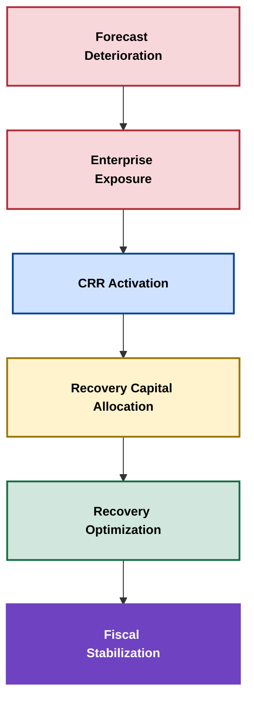
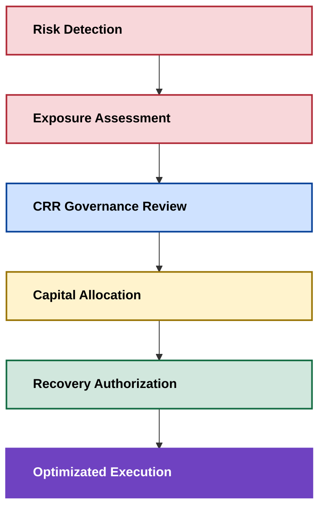
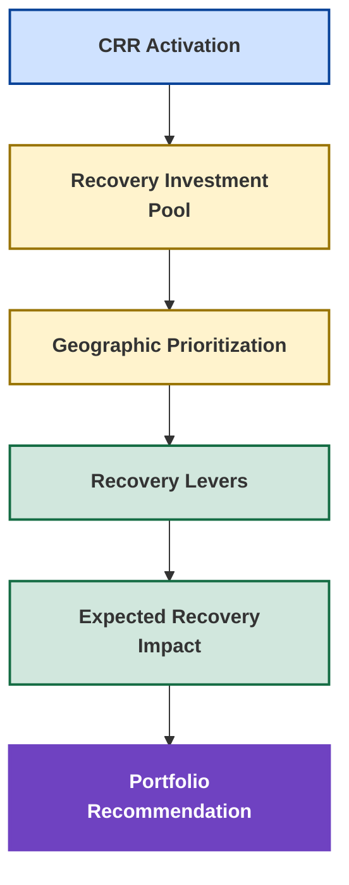
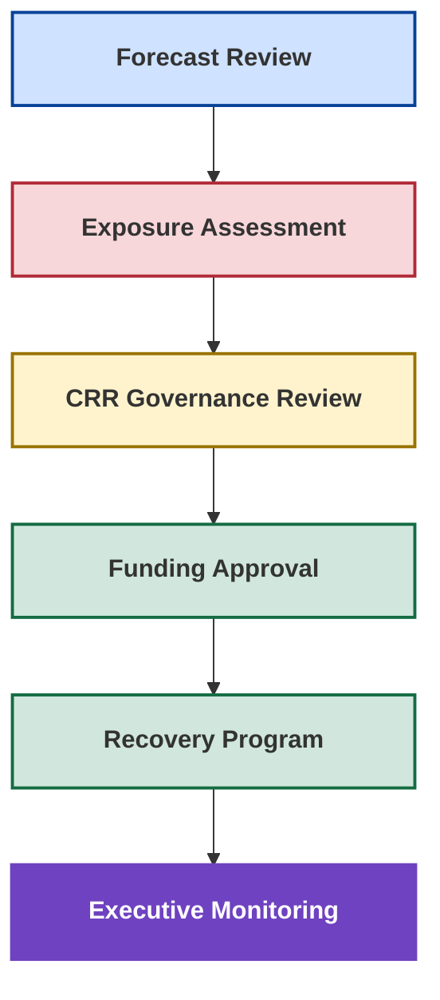

# 🛡️ Central Risk Reserve (CRR)

## 🏛️ Enterprise Recovery Governance & Capital Allocation Framework

<p align="center">

🏠 [Repository Home](../README.md)

📉 [Forecast Risk Model](../06_Forecast_Risk_Model/forecast-risk-model.md)

📈 [Recovery Optimization](../09_Recovery_Optimization/recovery-optimization.md)

</p>

---

<p align="center">


</p>

---

## 📌 Executive Overview

Most organizations can identify forecast deterioration.

Far fewer organizations possess a governed mechanism for determining:

* When intervention becomes necessary
* How much intervention is justified
* Where recovery resources should be deployed
* Which recovery strategy creates the highest probability of fiscal-year attainment

The Central Risk Reserve (CRR) was introduced within the New Bridge operating system to address this challenge.

CRR is not a budgeting construct.

CRR is a governance mechanism designed to formalize how organizations prioritize, fund, and govern recovery interventions when forecast deterioration creates material fiscal exposure.

The framework serves as the bridge between:

### ⚠️ Enterprise Risk Detection

and

### 🛡️ Enterprise Recovery Intervention

transforming forecast deterioration into a structured decision-making process rather than an ad hoc reaction.

---

## 🎯 The Intervention Problem

Traditional forecast governance often follows a predictable pattern.

```text
Forecast Gap Identified
        ↓
Executive Escalation
        ↓
Reactive Spending
        ↓
Localized Recovery Actions
        ↓
Uncertain Outcomes
```

Recovery actions are frequently driven by urgency rather than governance.

The result is inconsistent intervention quality, fragmented investment decisions, and limited visibility into recovery effectiveness.

The New Bridge framework introduces an alternative approach.

```text
Forecast Deterioration
        ↓
Enterprise Exposure
        ↓
CRR Activation
        ↓
Recovery Capital Allocation
        ↓
Recovery Optimization
        ↓
Fiscal Stabilization
```

The objective is not to maximize spending.

The objective is to maximize survivability.

---

## 🧠 Core Governance Principle

The framework is built around a foundational principle:

> Not all forecast deterioration states justify institutional intervention.

Organizations should intervene only when:

* Forecast survivability materially weakens
* Enterprise exposure becomes measurable
* Fiscal commitments become vulnerable
* Recovery investments are economically justified

This creates a governed escalation pathway between:

### 📊 Forecast Visibility

and

### 🏛️ Enterprise Recovery Governance

---

## 🏛️ Why CRR Exists

### Recovery Governance Value Chain



The CRR framework formalizes the transition from risk identification to recovery intervention.

Rather than treating forecast deterioration as a reporting exercise, the framework converts exposure into governed recovery decisions.

---

## 📊 CRR Governance Model



The governance model ensures intervention decisions remain transparent, auditable, and economically justified.

---

## 📉 Enterprise Forecast Escalation States

The New Bridge simulation intentionally models three progressively calibrated forecast confidence states at the end of Fiscal Q3 FY26.

| Scenario                    | Coverage | Governance State  | CRR Response              |
| --------------------------- | -------: | ----------------- | ------------------------- |
| Full Pipeline Coverage      |   105.1% | Early Warning     | Monitor                   |
| Qualified Pipeline Coverage |    92.5% | Moderate Exposure | Controlled CRR Activation |
| High Confidence Coverage    |    78.0% | Severe Exposure   | Aggressive CRR Activation |

The objective of the escalation model is not to predict outcomes.

The objective is to determine when enterprise intervention becomes justified.

---

## 🚦 CRR Decision Matrix

The governance framework defines intervention thresholds based on exposure severity.

| Exposure State |   Coverage | Governance Response   |
| -------------- | ---------: | --------------------- |
| Green          | Above 100% | Monitor               |
| Yellow         | 90% - 100% | Controlled Activation |
| Orange         |  80% - 90% | Moderate Activation   |
| Red            |  Below 80% | Aggressive Activation |

The decision matrix establishes consistency in intervention decisions and reduces subjective escalation behavior.

---

## 💰 Recovery Capital Allocation Framework

Recovery resources are finite.

Not all recovery opportunities create equal fiscal impact.

CRR provides a governance mechanism for prioritizing limited recovery investments.



The framework ensures that capital is directed toward the highest-value recovery opportunities rather than distributed reactively.

---

## 🌍 Recovery Prioritization Philosophy

Recovery funding should not be distributed uniformly.

CRR prioritizes opportunities based on:

* Revenue impact potential
* Probability of recovery success
* Time-to-recovery
* Geographic exposure
* Strategic importance
* Investment efficiency

The objective is to maximize fiscal-year recovery per unit of capital deployed.

---

## 🛡️ Governance Escalation Pathways



This governance pathway formalizes the movement from exposure visibility to funded recovery intervention.

---

## 🔄 Relationship To Recovery Optimization

CRR and Recovery Optimization serve different but complementary purposes.

| Capability                  | CRR Framework | Recovery Optimization |
| --------------------------- | ------------- | --------------------- |
| Detect Exposure             | ✓             |                       |
| Forecast Escalation         | ✓             |                       |
| Governance Review           | ✓             |                       |
| Capital Allocation          | ✓             |                       |
| Intervention Approval       | ✓             |                       |
| Solver Optimization         |               | ✓                     |
| Recovery Frontier Analysis  |               | ✓                     |
| Investment Mix Optimization |               | ✓                     |
| Portfolio Recommendation    |               | ✓                     |

The CRR framework determines whether intervention is justified.

Recovery Optimization determines how intervention should be executed.

Together they create a complete governance-to-execution model.

---

## 🏗️ Position Within The New Bridge Operating System

CRR occupies a unique position within the overall architecture.

```text
Forecast Risk Model
        ↓
Central Risk Reserve
        ↓
Recovery Optimization
```

The Forecast Risk Model identifies exposure.

The Central Risk Reserve governs intervention.

Recovery Optimization determines execution strategy.

Together they create an end-to-end decision intelligence workflow.

---

## 🎯 Strategic Outcomes

The Central Risk Reserve transforms forecast deterioration from a reporting problem into a governed intervention process.

The framework enables organizations to:

✅ Quantify enterprise exposure

✅ Establish intervention thresholds

✅ Govern recovery funding decisions

✅ Prioritize scarce resources

✅ Improve recovery readiness

✅ Strengthen executive decision quality

✅ Improve fiscal-year survivability

✅ Connect risk detection to optimization

CRR serves as the decision bridge between enterprise risk detection and recovery optimization.

---

## 🏆 Key Takeaways

### Traditional Model

```text
Forecast Gap
    ↓
Executive Escalation
    ↓
Reactive Spending
    ↓
Uncertain Outcomes
```

### CRR Governance Model

```text
Forecast Deterioration
    ↓
Exposure Assessment
    ↓
CRR Activation
    ↓
Capital Allocation
    ↓
Recovery Optimization
    ↓
Fiscal Stabilization
```

The Central Risk Reserve introduces a structured governance mechanism for determining when intervention is justified, how recovery capital should be allocated, and how organizations can improve fiscal-year survivability under conditions of uncertainty.

---

### 👤 Author

**Anil Jacob**

Enterprise BI • Revenue Operations Strategy • Forecast Governance • Decision Intelligence

---

### 📜 Repository Context

All datasets, forecasts, recovery scenarios, optimization models, governance frameworks, and capital allocation mechanisms contained within this repository are synthetic and intended exclusively for portfolio, educational, and strategic demonstration purposes.

The Central Risk Reserve (CRR) is a New Bridge governance construct designed to illustrate how organizations can formalize recovery intervention decisions, prioritize limited recovery resources, and connect enterprise risk management to recovery optimization through structured governance.
