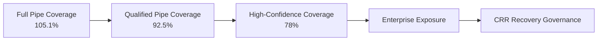
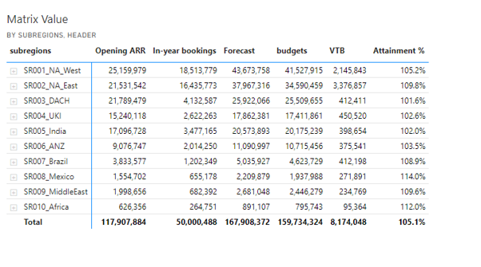
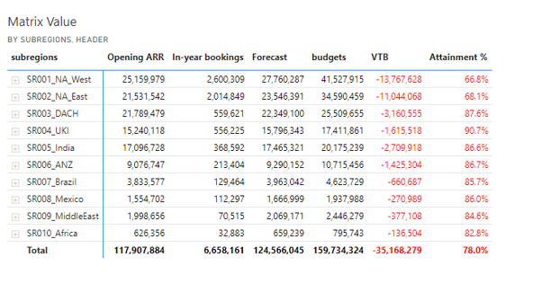
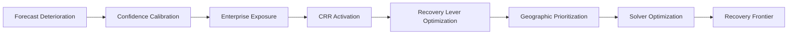

# 🛡️ Forecast Recovery Governance

## 🏛️ Central Risk Reserve (CRR) & Enterprise Survivability Optimization

[⬅ Back to README](../README.md) | [⬅ Forecast Risk Model](../06_Forecast_Risk_Model/forecast-risk-model.md)

---

---

# 📌 Executive Overview

The New Bridge Forecast Recovery Governance framework was intentionally designed to model how enterprise SaaS organizations respond once forward-looking forecast survivability deteriorates beneath acceptable fiscal thresholds.

Unlike traditional forecasting environments that rely heavily on weighted pipeline optimism, the New Bridge framework introduces:

# 🏛️ Confidence-Calibrated Recovery Governance

where intervention intensity escalates progressively based on forecast survivability quality.

The framework intentionally distinguishes between:

* operational survivability,
* moderate forecast deterioration,
* and severe enterprise exposure

to determine when institutional recovery intervention becomes economically justified.

---

# 🧠 Core Governance Principle

The framework is built around a foundational enterprise operating principle:

> Not all forecast deterioration states require institutional intervention.

Instead, recovery governance should activate only when:

* survivability materially weakens,
* confidence calibration deteriorates,
* and enterprise fiscal commitments become operationally vulnerable.

This creates a governed escalation pathway between:

# 📊 Forecast Visibility

and

# 🛡️ Enterprise Recovery Intervention

---

# 📊 Forecast Survivability States

The New Bridge simulation intentionally models three progressively calibrated forecast confidence states at the end of Fiscal Q3 FY26.

---

## 🏛️ Enterprise Forecast Escalation States

| Scenario                | Coverage | Confidence State    | Governance Interpretation            | Recovery Action     |
| ----------------------- | -------: | ------------------- | ------------------------------------ | ------------------- |
| Full Pipe Coverage      |   105.1% | Low Confidence      | Operationally survivable but fragile | Monitor             |
| Qualified Pipe Coverage |    92.5% | Moderate Confidence | Material forecast deterioration      | CRR Required        |
| High Pipe Coverage      |    78.0% | High Confidence     | Severe enterprise exposure           | Aggressive Recovery |

---

# 📉 Forecast Escalation Progression

---

# 🟦 1️⃣ Full Pipe Coverage

## 📊 Operationally Survivable but Structurally Fragile

  

### 📌 Executive Interpretation

The Full Pipe scenario represents the broadest and least restrictive survivability view across the enterprise commercial portfolio.

This scenario includes:

* Opening ARR balance,
* In-Year Revenue Contribution (IYRC),
* and all available Q4 pipeline opportunities including low-confidence opportunities.

The resulting:

# 📈 105.1% Budget Attainment

suggests that fiscal commitments remain technically achievable.

However, survivability quality remains structurally weak because enterprise attainment is highly dependent on:

* lower-confidence opportunities,
* aggressive pipeline assumptions,
* and late-quarter conversion execution.

---

## ⚠️ Strategic Governance Insight

Although the enterprise remained above fiscal budget thresholds:

# 🛡️ CRR Intervention Was NOT Activated

because:

* enterprise survivability remained technically achievable,
* operational recovery windows still existed,
* and severe institutional intervention was not yet economically justified.

Instead, this scenario functioned as:

# ⚠️ Early Warning Governance State

---

# 🟧 2️⃣ Qualified Pipe Coverage

## 📉 Moderate Forecast Deterioration (-12M VTB)

  

### 📌 Executive Interpretation

The Qualified Pipe scenario introduces confidence calibration by restricting Q4 pipeline contribution to opportunities with:

* 60%,
* 80%,
* and 100%

probability confidence states.

Once lower-confidence opportunities are removed from the survivability model, enterprise coverage deteriorates materially to:

# 📉 92.5% Budget Attainment

creating approximately:

# 🔻 -12M Variance to Budget (VTB)

This represents the first institutional forecast deterioration state requiring:

# 🛡️ Central Risk Reserve (CRR) Activation

---

# ⚙️ Qualified Pipe Recovery Optimization

The Qualified Pipe recovery problem was intentionally modeled as:

# 🧠 Controlled Enterprise Recovery Optimization

focused on:

* calibrated investment allocation,
* targeted recovery acceleration,
* and economically efficient intervention pathways.

---

## 📊 Qualified Pipe Solver Optimization

  

---

## 📌 Recovery Levers

The Solver optimization framework evaluated multiple enterprise intervention levers including:

| Recovery Lever            | Strategic Purpose                 |
| ------------------------- | --------------------------------- |
| RAF Investments           | Pipeline acceleration support     |
| Renewals Recovery         | Installed-base stabilization      |
| Tactical Discounts        | Conversion acceleration           |
| Geographic Prioritization | Focused survivability improvement |

---

## 🧠 Strategic Insight

The Qualified Pipe scenario demonstrates how:

# 🎯 Moderate Recovery Investments

can materially improve enterprise survivability when intervention occurs early enough within the fiscal operating cycle.

---

# 🟥 3️⃣ High-Confidence Coverage

## 🚨 Severe Enterprise Exposure (-35M VTB)

  

### 📌 Executive Interpretation

The High-Confidence scenario represents the strictest and most realistic survivability calibration state within the enterprise operating model.

This scenario restricts pipeline realization to:

* 60%,
* and 80%

high-confidence opportunities only.

The resulting:

# 📉 78.0% Budget Attainment

creates approximately:

# 🔻 -35M Variance to Budget (VTB)

revealing severe enterprise exposure across multiple operating geographies.

This became the:

# 🚨 Institutional Recovery Escalation State

---

# ⚙️ High-Confidence Recovery Optimization

The High-Confidence recovery problem was modeled as:

# 🏛️ Enterprise Recovery War-Room Governance

requiring:

* aggressive recovery intervention,
* constrained investment allocation,
* portfolio prioritization,
* and optimized survivability tradeoffs.

---

## 📊 High-Confidence Solver Optimization

  

---

# 📌 Severe Recovery Conditions

The High-Confidence recovery state introduced:

| Recovery Challenge                   | Enterprise Impact                  |
| ------------------------------------ | ---------------------------------- |
| Large fiscal exposure                | Severe survivability deterioration |
| Compressed realization windows       | Reduced recovery optionality       |
| Geographic weakness                  | Uneven portfolio fragility         |
| Limited high-confidence pipeline     | Recovery constraints               |
| Aggressive intervention requirements | Increased investment pressure      |

---

# 🌍 Geography-Level Recovery Prioritization

The CRR framework intentionally optimized intervention allocation across multiple global operating regions including:

* NA West
* NA East
* DACH
* UKI
* India
* ANZ
* Brazil
* Middle East

This enabled:

✅ geography-aware recovery governance
✅ targeted survivability improvement
✅ constrained investment prioritization
✅ portfolio-level recovery optimization

---

# 📊 Scenario Comparison Framework

| Dimension           | Qualified Pipe | High-Confidence Pipe |
| ------------------- | -------------- | -------------------- |
| Coverage            | 92.5%          | 78.0%                |
| Variance to Budget  | -12M           | -35M                 |
| Risk Severity       | Moderate       | Severe               |
| Recovery Intensity  | Calibrated     | Aggressive           |
| Intervention Scope  | Targeted       | Enterprise-wide      |
| Solver Complexity   | Moderate       | High                 |
| Geographic Exposure | Concentrated   | Broad                |
| CRR Requirement     | Controlled     | Significant          |

---

# 🧠 Recovery Optimization Philosophy

The New Bridge framework intentionally positions:

# 🛡️ CRR

not as a budgeting exercise,

but as:

# 🏛️ Enterprise Recovery Governance Mechanism

designed to optimize:

* survivability restoration,
* constrained capital allocation,
* recovery efficiency,
* and fiscal attainment stabilization

under deteriorating enterprise conditions.

---

# ⚙️ Recovery Governance Flow

---

# 🚀 Strategic Outcome

The Forecast Recovery Governance framework ultimately transformed the New Bridge operating model from:

# 📊 Forecast Reporting

into:

# 🏛️ Institutional Commercial Recovery Governance

demonstrating how enterprise SaaS organizations must evolve beyond:

* weighted pipeline optimism,
* isolated forecasting,
* and reactive recovery execution

toward:

✅ survivability-aware governance
✅ optimization-driven intervention
✅ portfolio-level recovery orchestration
✅ board-level commercial decision science

---

# 👤 Author

**Anil Jacob**
Enterprise BI • RevOps Strategy • Executive Analytics • Forecast Governance

---

# 📜 Repository Context

All forecasts, recovery frameworks, Solver models, optimization scenarios, and enterprise operating environments within this repository are synthetic and designed exclusively for portfolio and strategic demonstration purposes.
