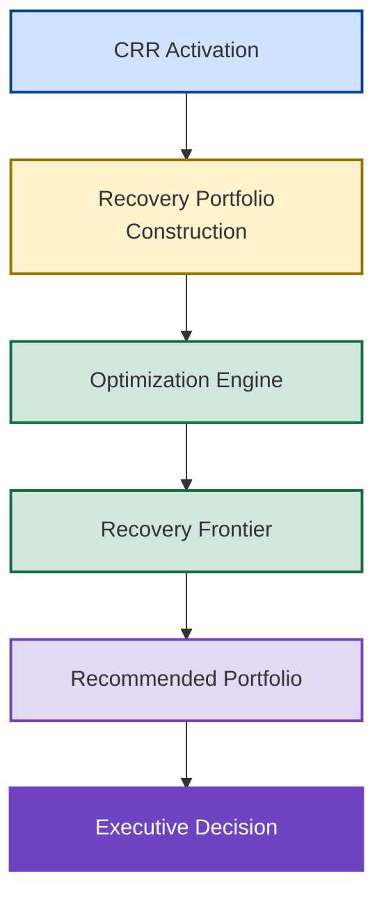
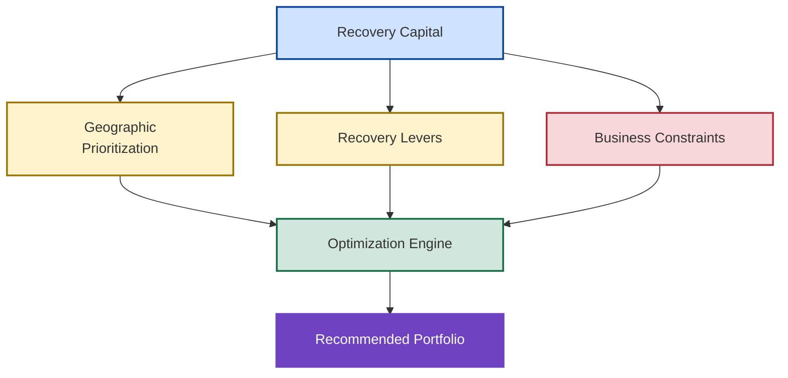
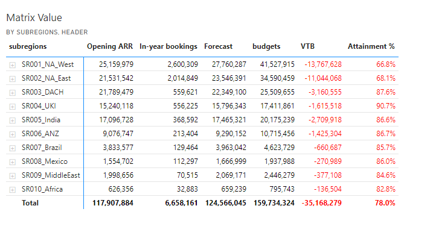
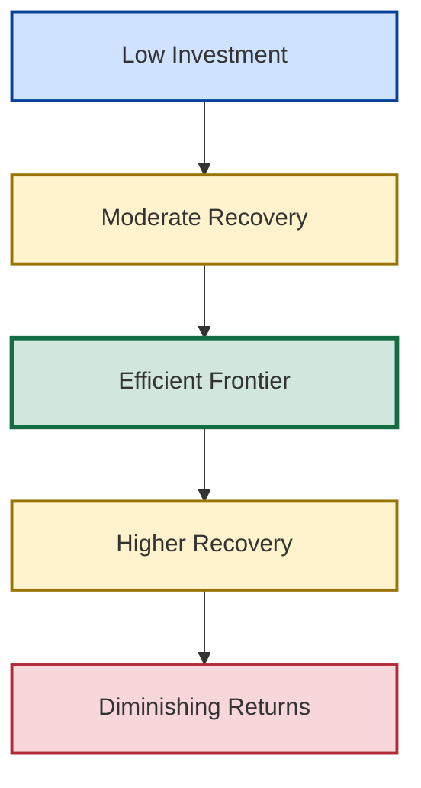

# 🎯 Recovery Optimization

## 🏛️ Enterprise Intervention Strategy & Portfolio Optimization Framework

<p align="center">

🏠 [Repository Home](../README.md)

🛡️ [Central Risk Reserve](../08_CRR_Optimization/central-risk-reserve.md)

📊 [Investment Tradeoff Analysis](../10_Investment_Tradeoff_Analysis/investment-tradeoff-analysis.md)

</p>

---

<p align="center">


</p>

---

## 📌 Executive Overview

Once intervention has been approved through the Central Risk Reserve (CRR) governance process, executive leadership faces a second challenge:

> How should limited recovery capital be deployed?

Recovery Optimization addresses this challenge by identifying the portfolio of interventions that maximizes forecast uplift while respecting real-world business constraints.

The framework transforms recovery planning from a reactive funding exercise into a disciplined portfolio optimization process.

Rather than asking:

> How much should we spend?

the framework asks:

> What is the minimum efficient intervention required to maximize fiscal-year survivability?

---

## 📊 New Bridge Recovery Challenge

The Recovery Optimization process begins only after Forecast Risk and Central Risk Reserve governance have completed.

The New Bridge simulation established the following position at the conclusion of Q3 FY26.

| Metric | Value |
|----------|----------:|
| FY26 Budget | $160M |
| High Confidence Forecast | $125M |
| Forecast Exposure | $35M |
| Exposure Severity | 21.9% |
| Risk Classification | Critical |
| CRR Status | Activated |

Forecast Confidence established that the forecast was vulnerable.

Forecast Risk quantified the exposure.

CRR authorized intervention.

Recovery Optimization now answers the next question:

> What combination of recovery actions provides the highest forecast uplift while respecting real-world business constraints?

---

## 🎯 The Portfolio Allocation Problem

Recovery capacity is finite.

Funding is only one constraint.

Organizations must also manage execution capacity, geographic deployment limitations, and fiscal timing realities..

Execution capacity is constrained.

Time is limited.

Not all investments create equal recovery value.

Organizations must therefore determine:

- Which geographies should be prioritized
- Which recovery levers should be activated
- How recovery funding should be allocated
- Which portfolio generates the greatest forecast uplift
- When additional investment becomes economically inefficient

These questions define the portfolio allocation problem.

---

## 🧠 Recovery Optimization Value Chain



Recovery Optimization converts governance decisions into executable investment portfolios.

---

## 🏛️ Optimization Philosophy

The framework is built on three principles.

## Principle 1 — Big Fish First

Capital should be concentrated where marginal recovery impact is highest.

The objective is not equal distribution.

The objective is maximum enterprise impact.

---

### Principle 2 — Near-Term ROI Dominates

Traditional investment programs optimize:

- Multi-year growth
- Market expansion
- Strategic positioning

Recovery Optimization focuses on:

#### 90-Day Revenue Recovery

because only one fiscal quarter remains available for intervention.

---

### Principle 3 — Minimum Efficient Intervention

The objective is not maximum spending.

The objective is:

> Maximum forecast recovery with minimum efficient investment.

---

## 🧩 Optimization Inputs

Recovery Optimization combines four categories of information.

| Input Category | Examples |
|----------|----------|
| Geography | NA East, NA West, DACH, UKI |
| Recovery Levers | RAF Programs, Renewals, Discount Programs |
| Constraints | Budget, Capacity, Timing, Deployment Limits |
| Objective Function | Maximize Forecast Uplift |

The optimization engine evaluates these inputs simultaneously to identify the most efficient recovery portfolio.

Unlike traditional recovery planning, intervention decisions are evaluated collectively rather than independently.

---

## 🌍 Recovery Portfolio Construction

Recovery portfolios are constructed from four primary dimensions.



Portfolio construction integrates geography, intervention levers, and operational constraints into a unified optimization model.

---

## 📊 Recovery Intelligence Layer

### ROI Coefficient Matrix

Historical investment outcomes were analyzed to estimate forecast uplift potential across:

- RAF Programs
- Renewal Programs
- Discount Programs

for each targeted geography.

<p align="center">
  
</p>

#### Executive Insight

The ROI matrix serves as the intelligence foundation for all portfolio optimization decisions.

---

## ⚙️ Constraint Framework

Optimization occurs within real-world business limitations.

### Representative Constraints

- Limited recovery funding
- Limited execution capacity
- Geographic deployment limits
- Lever-specific funding limits
- Fiscal year timing constraints

#### Executive Insight

Recovery Optimization is fundamentally a constrained portfolio allocation problem.

The solver identifies the highest-value solution within those constraints.

---

## 🌤️ Scenario A — Qualified Pipe Recovery

### Balanced Intervention Portfolio

#### Starting Position

| Metric | Value |
|----------|---------:|
| Coverage | 92.5% |
| Gap to Budget | -12M |
| Governance Posture | Balanced Intervention |

---

### Geographic Prioritization

<p align="center">
  
</p>

---

### Portfolio Allocation Matrix

<p align="center">
  
</p>

---

### Forecast Uplift Matrix

<p align="center">
  
</p>

---

### Recovery Efficiency Curve

<p align="center">
  
</p>

#### Executive Insight

The Qualified Pipe scenario demonstrates how modest intervention levels can materially improve forecast survivability while preserving attractive recovery economics.

### Governance Interpretation

Because the Qualified Pipeline scenario begins from 92.5% attainment, relatively modest intervention levels can materially improve fiscal survivability.

Recovery Optimization therefore focuses on efficient uplift rather than large-scale recovery programs.

---

### Scenario Summary

<p align="center">
  
</p>

---

## 🚨 Scenario B — High Confidence Recovery

### Aggressive Intervention Portfolio

#### Starting Position

| Metric | Value |
|----------|---------:|
| Coverage | 78.0% |
| Gap to Budget | -35M |
| Governance Posture | Aggressive Intervention |

---

### Portfolio Allocation Matrix

<p align="center">
  
</p>

---

### Forecast Uplift Matrix

<p align="center">
  
</p>

---

### Recovery Efficiency Curve

<p align="center">
  
</p>

#### Executive Insight

This scenario assumes only the strongest opportunities materialize and therefore requires significantly greater intervention capacity.

### Governance Interpretation

The High Confidence scenario begins from a significantly larger exposure position.

As a result, optimization prioritizes recovery scale and achievable uplift over incremental efficiency gains.

This scenario represents the upper boundary of intervention requirements within the New Bridge operating model.

---

### Scenario Summary

<p align="center">
  
</p>

---

## 📈 Recovery Frontier Analysis

### Executive Interpretation

The Recovery Frontier represents the practical limit of recoverable performance.

As intervention levels increase:

- forecast uplift initially improves rapidly
- recovery efficiency remains attractive
- diminishing returns eventually emerge

Beyond a certain point, additional intervention produces progressively smaller improvements in fiscal outcomes.

The frontier therefore identifies the boundary between efficient and inefficient recovery.

### The Efficient Recovery Frontier

The Recovery Frontier represents the set of efficient intervention portfolios that deliver the highest forecast uplift for a given level of recovery investment.



The frontier identifies the point at which additional spending produces progressively smaller recovery benefits.

---

## 🧠 Portfolio Optimization Insights

Several observations emerged consistently across optimization scenarios.

#### Observation 1

Across both Qualified Pipeline and High Confidence recovery scenarios, optimization consistently concentrated resources within a limited number of high-return geographies rather than distributing intervention evenly.

This suggests that targeted recovery strategies frequently outperform broad enterprise-wide deployment.

#### Observation 2

High-ROI opportunities saturated quickly.

#### Observation 3

Recovery efficiency declined beyond certain investment thresholds.

#### Observation 4

Additional spending eventually generated diminishing marginal returns.

---

## 🔄 Relationship To Investment Tradeoff Analysis

Recovery Optimization identifies efficient portfolios.

Investment Tradeoff Analysis evaluates alternative executive choices among those portfolios.

| Capability | Recovery Optimization | Investment Tradeoff Analysis |
|------------|----------------------|-----------------------------|
| Portfolio Construction | ✓ | |
| Solver Optimization | ✓ | |
| Recovery Frontier Analysis | ✓ | |
| Efficient Portfolio Identification | ✓ | |
| Strategic Scenario Comparison | | ✓ |
| Executive Portfolio Selection | | ✓ |
| Tradeoff Evaluation | | ✓ |
| Decision Recommendation | | ✓ |

### Executive Boundary

Recovery Optimization identifies what recovery outcomes are achievable.

Investment Tradeoff Analysis evaluates which achievable outcome should be selected.

Together these capabilities separate analytical optimization from executive decision-making.

---

## 🎯 Strategic Outcomes

The Recovery Optimization framework demonstrates how organizations can:

✅ Convert governance decisions into executable portfolios

✅ Allocate capital more efficiently

✅ Improve recovery readiness

✅ Quantify intervention economics

✅ Identify efficient recovery frontiers

✅ Maximize forecast uplift

✅ Improve fiscal-year survivability

✅ Support executive decision-making

---

## 🏆 Key Takeaways

### Traditional Recovery Model

```text
Forecast Gap
    ↓
Recovery Funding
    ↓
Reactive Spending
    ↓
Uncertain Results
```

### Optimized Recovery Model

```text
Forecast Risk
    ↓
CRR Activation
    ↓
Recovery Optimization
    ↓
Recovery Frontier
    ↓
Investment Tradeoff Analysis
    ↓
Executive Decision
```

Recovery Optimization transforms intervention planning into a disciplined portfolio optimization capability.

The framework provides the analytical foundation required to convert recovery governance into executable recovery strategy.

---

### 👤 Author

**Anil Jacob**

Enterprise BI • Revenue Operations Strategy • Decision Intelligence • Executive Analytics

---

### 📜 Repository Context

All forecasts, optimization models, recovery scenarios, portfolio allocations, investment strategies, and business environments contained within this repository are synthetic and intended exclusively for portfolio, educational, and strategic demonstration purposes.

The Recovery Optimization framework demonstrates how organizations can apply optimization science, portfolio allocation principles, and executive decision support techniques to improve fiscal-year survivability under conditions of uncertainty.