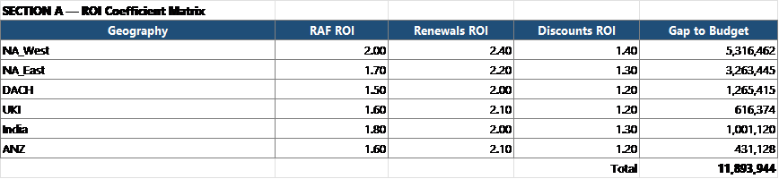
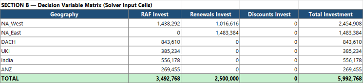
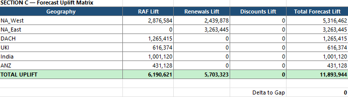
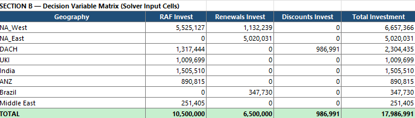
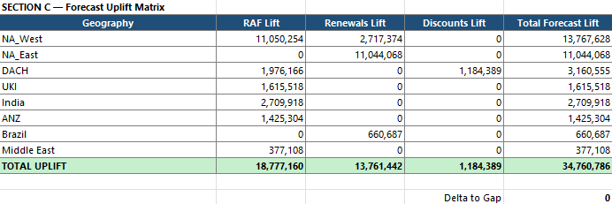
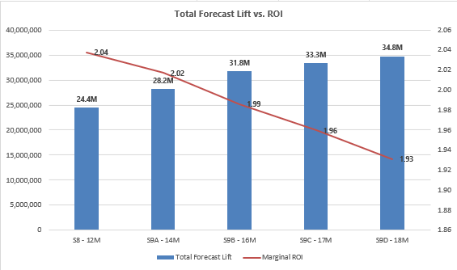
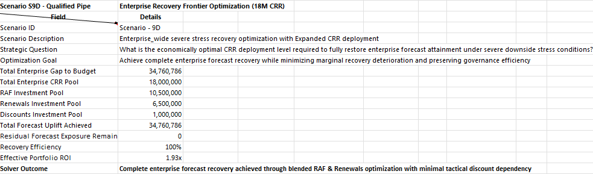

# 🎯 Recovery Optimization

## 🏛️ Capital Allocation, Forecast Recovery & Enterprise Survivability

[⬅ Back to README](../README.md) | [⬅ Forecast Recovery Governance](../08_CRR_Optimization/forecast-recovery-governance.md)

---

---

# 📌 Executive Overview

Following the Q3 FY26 reporting cycle, enterprise forecast survivability deteriorated materially under confidence-calibrated forecasting scenarios.

While Full Pipe Coverage remained above budget thresholds at 105.1%, two alternative recovery scenarios emerged:

| Scenario                 | Coverage | Gap to Budget |
| ------------------------ | -------: | ------------: |
| Qualified Pipe Coverage  |    92.5% |          -12M |
| High Confidence Coverage |    78.0% |          -35M |

These scenarios represented two distinct planning philosophies available to executive leadership.

The objective was not simply to maximize spending.

The objective was to identify the minimum efficient intervention required to restore fiscal survivability.

---

# 🧠 Recovery Design Principles

## Principle 1 — Big Fish First

Enterprise recovery capital should be concentrated where marginal impact is highest.

Rather than distributing investment uniformly across all regions, recovery planning focused on the largest deficit geographies where intervention could generate the greatest forecast uplift.

  

### Executive Insight

The top six deficit geographies represented the majority of enterprise exposure and therefore became the primary focus of CRR deployment.

Smaller deficit regions remained under executive sponsorship and operational monitoring rather than direct funding intervention.

---

## Principle 2 — Near-Term ROI Matters More Than Long-Term ROI

Traditional investment programs optimize:

* 3-year growth,
* 5-year value creation,
* market expansion.

The CRR framework optimized:

# 90-Day Revenue Recovery

because only one fiscal quarter remained available for intervention.

This fundamentally changes investment priorities and recovery economics.

---

# 📊 Recovery Intelligence Layer

## ROI Coefficient Matrix

Historical investment outcomes were analyzed to estimate forecast uplift potential across:

* RAF Programs
* Renewals Programs
* Discount Programs

for each targeted geography.

  

### Executive Insight

The ROI matrix became the intelligence foundation that guided all subsequent capital allocation decisions.

---

# 🏛️ Capital Allocation Framework

The Capital Allocation Framework determines how limited recovery capital is distributed across:

* Geographies
* RAF Investments
* Renewal Investments
* Discount Investments

while balancing:

* forecast uplift,
* recovery efficiency,
* operational capacity,
* and fiscal constraints.

  

### Executive Insight

This framework transforms recovery planning from subjective decision-making into governed capital allocation.

---

# ⚙️ Optimization Constraints

Recovery planning occurred within real-world business limitations.

### Representative Constraints

* Limited CRR funding
* Limited execution capacity
* Geographic deployment limits
* Lever-specific funding limits
* Fiscal year timing constraints

### Executive Insight

Recovery optimization is fundamentally a constrained resource allocation problem.

Success depends on deploying scarce capital where recovery efficiency is highest.

---

# 🌤️ Scenario A — Qualified Pipe Recovery

## Balanced Recovery Strategy

### Starting Position

| Metric             |             Value |
| ------------------ | ----------------: |
| Coverage           |             92.5% |
| Gap to Budget      |              -12M |
| Governance Posture | Balanced Recovery |

---

## Capital Allocation Framework

  

---

## Forecast Uplift Matrix

  

---

## Recovery Efficiency Curve

  

### Executive Insight

Progressive CRR deployment generated increasing forecast uplift while preserving attractive recovery economics.

---

## Qualified Pipe Recovery Summary

  

---

# 🚨 Scenario B — High Confidence Recovery

## Recovery War Room Strategy

### Starting Position

| Metric             |             Value |
| ------------------ | ----------------: |
| Coverage           |             78.0% |
| Gap to Budget      |              -35M |
| Governance Posture | Recovery War Room |

---

## Capital Allocation Framework

  

---

## Forecast Uplift Matrix

  

---

## Recovery Efficiency Curve

  

### Executive Insight

This scenario assumes only the strongest opportunities materialize and therefore requires materially larger intervention capacity.

---

## High Confidence Recovery Summary

  

---

# 🔒 Binding & Non-Binding Constraints

Not all constraints influence the final solution equally.

### Binding Constraints

Constraints that were fully utilized and directly limited further recovery potential.

Examples include:

* maximum funding allocations,
* geography investment caps,
* lever-specific deployment limits.

### Non-Binding Constraints

Constraints that remained available but were not economically attractive to utilize further.

### Executive Insight

The distinction between binding and non-binding constraints provides visibility into where recovery capacity becomes exhausted and where incremental spending becomes inefficient.

---

# 🎯 Why Optimization Converged

Optimization did not stop because funding was exhausted.

Optimization stopped because:

* forecast recovery targets were achieved,
* high-ROI opportunities were saturated,
* marginal returns declined,
* additional spending became economically inefficient.

### Executive Insight

The objective was not maximum spending.

The objective was minimum efficient intervention.

---

# 🏛️ Strategic Outcome

The Recovery Optimization framework demonstrates how executive leadership can evaluate multiple forecast realities and deploy capital accordingly.

Rather than relying on intuition, the framework provides a governed approach to:

* forecast recovery,
* capital allocation,
* portfolio prioritization,
* survivability planning,
* and fiscal risk mitigation.

This transformed CRR from a budgeting exercise into a disciplined enterprise recovery governance capability.

---

# 👤 Author

**Anil Jacob**
Enterprise BI • RevOps Strategy • Executive Analytics • Forecast Governance

---

# 📜 Repository Context

All forecasts, recovery models, optimization frameworks, investment scenarios, and operating environments within this repository are synthetic and designed exclusively for portfolio and strategic demonstration purposes.
