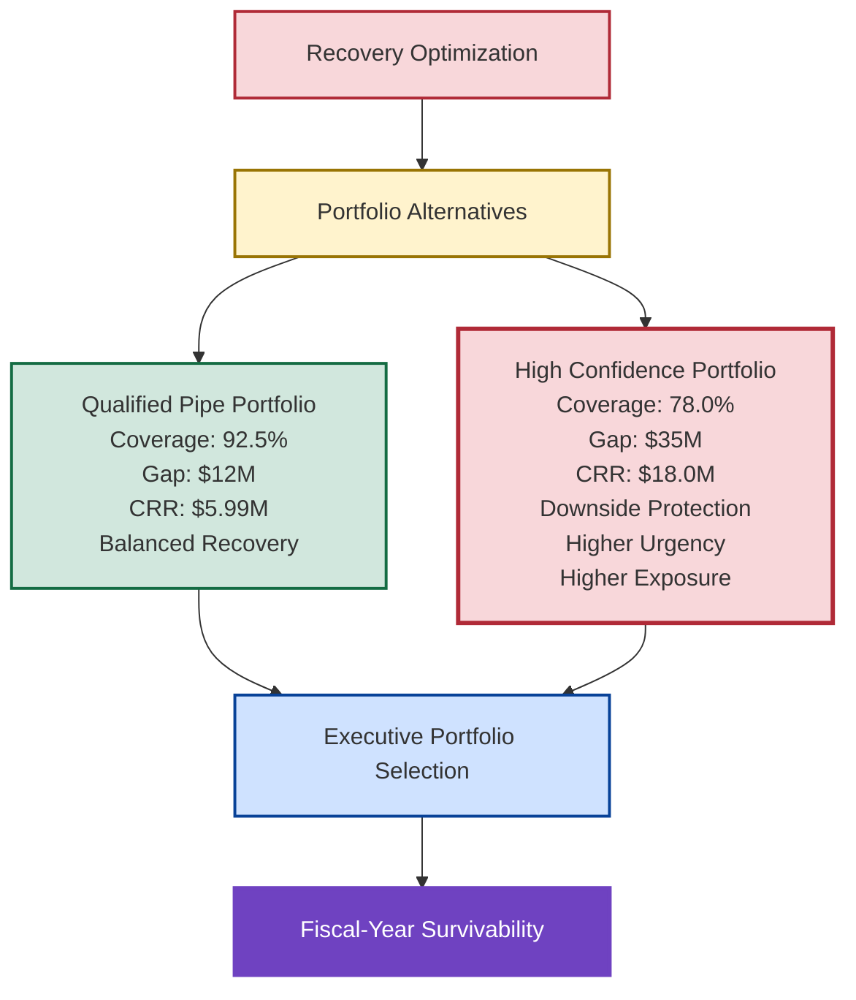
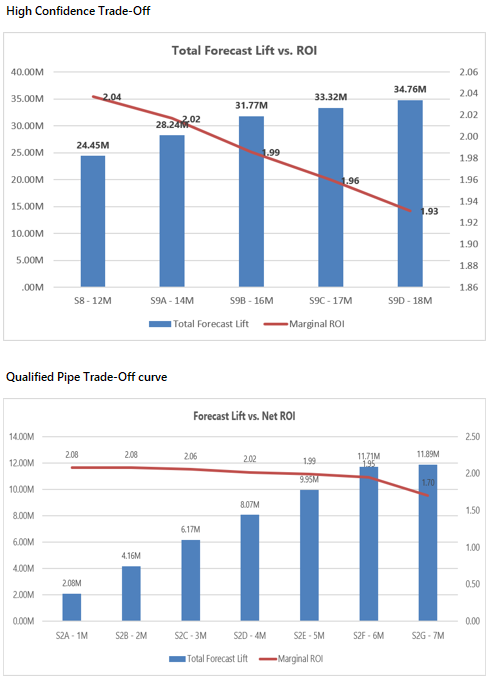

# 💰 Investment Tradeoff Analysis

## 🏛️ Executive Portfolio Selection & Decision Framework

🏠 [Repository Home](../README.md)

🎯 [Recovery Optimization](../09_Recovery_Optimization/recovery-optimization.md)

🛡️ [Central Risk Reserve](../08_CRR_Optimization/central-risk-reserve.md)

---

---

## 📌 Executive Overview

| Metric | Qualified Pipe | High Confidence |
|----------|----------:|----------:|
| Coverage | 92.5% | 78.0% |
| Exposure | $12M | $35M |
| CRR Investment | $5.99M | $18.0M |
| Recovery Outcome | 100% | 100% |

The Central Risk Reserve framework determines whether intervention is justified.

Recovery Optimization determines how intervention should be executed.

Investment Tradeoff Analysis addresses the final executive question:

> Which recovery strategy should leadership fund?

By the time this stage is reached, optimization has already identified efficient recovery portfolios capable of restoring fiscal-year attainment. The challenge is no longer analytical. The challenge is managerial.

Executive leadership must determine which portfolio best aligns with organizational priorities, available capital, forecast confidence, and enterprise risk tolerance.

This document evaluates the strategic tradeoffs between alternative recovery portfolios and provides a decision framework for selecting the most appropriate course of action under conditions of uncertainty.

---

## 🎯 The Executive Decision Problem

Recovery Optimization demonstrated that multiple intervention portfolios could restore fiscal-year attainment.

However, efficient portfolios are not necessarily equivalent portfolios.

Some portfolios require less capital but depend upon more optimistic planning assumptions.

Others require materially greater investment but provide stronger protection against downside risk.

The executive challenge is therefore not simply to identify a portfolio capable of delivering recovery. The challenge is to determine which portfolio best balances capital efficiency, forecast confidence, execution risk, and fiscal-year survivability.

This distinction transforms the discussion from optimization science into executive decision-making.

---

## 🧠 Executive Recovery Decision Framework

The framework highlights a key insight from the New Bridge simulation. Leadership is not choosing between two optimization models. Leadership is choosing between two fundamentally different planning assumptions and the recovery strategies required to support them.

---

## 📊 Portfolio Decision Context

The analysis compares two recovery portfolios generated through the Recovery Optimization framework.

### Portfolio A

**Qualified Pipe Portfolio**

A balanced recovery strategy based on the assumption that qualified opportunities continue converting at expected rates.

### Portfolio B

**High Confidence Portfolio**

A downside protection strategy based on the assumption that only the strongest opportunities materialize and therefore requires significantly greater intervention capacity.

Both portfolios achieve full recovery.

The difference lies in the level of exposure being managed, the amount of capital deployed, and the degree of protection provided against downside outcomes.

---

## ⚖️ Executive Portfolio Comparison

| Decision Dimension     | Qualified Pipe (Balanced Recovery) | High Confidence (Downside Protection) |
| ---------------------- | ---------------------------------: | ------------------------------------: |
| Starting Coverage      |                              92.5% |                                 78.0% |
| Budget Gap             |                             $12.0M |                                $35.0M |
| Forecast Lift Achieved |                            $11.89M |                               $34.76M |
| CRR Investment         |                             $5.99M |                                $18.0M |
| Portfolio ROI          |                              1.70x |                                 1.93x |
| Recovery Outcome       |                               100% |                                  100% |
| Capital Intensity      |                              Lower |                                Higher |
| Risk Protection        |                           Moderate |                                Strong |
| Planning Posture       |                           Balanced |                          Conservative |
| Executive Priority     |                         Efficiency |                         Survivability |

Although both portfolios achieve fiscal-year recovery, they reflect materially different operating assumptions and leadership priorities.

---

## 📈 Portfolio Tradeoff Curve

The tradeoff curve illustrates the relationship between recovery investment and forecast uplift across alternative intervention strategies.

  

### Executive Interpretation

The tradeoff curve demonstrates that both recovery portfolios are capable of restoring fiscal-year attainment.

The decision is therefore not whether recovery is possible.

The decision is whether additional downside protection justifies the additional recovery investment required.

---

## 🌤️ Portfolio A — Qualified Pipe (Balanced Recovery)

### Executive Interpretation

The Qualified Pipe portfolio is appropriate when leadership believes qualified opportunities remain achievable and forecast deterioration remains manageable.

Under this scenario, the organization maintains confidence in the broader pipeline and focuses on targeted intervention rather than broad-based recovery spending. The strategy prioritizes capital efficiency while still restoring fiscal-year attainment.

Because exposure levels remain relatively moderate, recovery efforts can be concentrated on the highest-return opportunities without requiring large-scale deployment of recovery capital.

### Strategic Characteristics

* Lower intervention cost
* Higher capital efficiency
* Moderate downside protection
* Strong recovery economics
* Suitable for stable operating environments

---

## 🚨 Portfolio B — High Confidence (Downside Protection)

### Executive Interpretation

The High Confidence portfolio is appropriate when leadership believes only the strongest opportunities are likely to materialize and downside exposure must be actively managed.

Under this scenario, the organization adopts a more conservative planning posture and assumes that forecast deterioration is more severe than indicated by the broader qualified pipeline. Recovery efforts therefore require significantly greater intervention capacity and a larger deployment of recovery capital.

Although this portfolio demands substantially greater investment, it also provides stronger protection against fiscal-year underperformance and creates a more resilient path to budget attainment.

### Strategic Characteristics

* Higher intervention cost
* Greater downside protection
* Stronger survivability profile
* Conservative planning assumptions
* Suitable for uncertain operating environments

---

## 🏛️ Executive Decision Criteria

Leadership typically evaluates recovery portfolios across five dimensions.

| Dimension                 | Executive Question                                                                |
| ------------------------- | --------------------------------------------------------------------------------- |
| Capital Efficiency        | Which portfolio generates the greatest recovery per dollar invested?              |
| Risk Protection           | Which portfolio best protects against downside outcomes?                          |
| Forecast Confidence       | Which planning assumption is most realistic?                                      |
| Execution Complexity      | Which portfolio is most practical to implement?                                   |
| Fiscal-Year Survivability | Which portfolio provides the highest probability of achieving budget commitments? |

The relative importance of these criteria will vary by organization, operating environment, and executive risk appetite.

---

## 📋 Strategic Decision Matrix

| Executive Objective           | Recommended Portfolio |
| ----------------------------- | --------------------- |
| Minimize Capital Deployment   | Qualified Pipe        |
| Maximize Recovery Efficiency  | Qualified Pipe        |
| Protect Against Downside Risk | High Confidence       |
| Improve Forecast Resilience   | High Confidence       |
| Conservative Planning         | High Confidence       |
| Aggressive Efficiency         | Qualified Pipe        |
| Fiscal-Year Survivability     | High Confidence       |
| Balanced Risk/Reward          | Qualified Pipe        |

This matrix provides a practical guide for aligning portfolio selection with enterprise objectives.

---

## 🔄 Relationship To Recovery Optimization

Recovery Optimization and Investment Tradeoff Analysis serve complementary but distinct purposes.

| Capability                         | Recovery Optimization | Investment Tradeoff Analysis |
| ---------------------------------- | --------------------- | ---------------------------- |
| Portfolio Construction             | ✓                     |                              |
| Solver Optimization                | ✓                     |                              |
| Recovery Frontier Analysis         | ✓                     |                              |
| Efficient Portfolio Identification | ✓                     |                              |
| Strategic Scenario Comparison      |                       | ✓                            |
| Executive Portfolio Selection      |                       | ✓                            |
| Tradeoff Evaluation                |                       | ✓                            |
| Decision Recommendation            |                       | ✓                            |

Recovery Optimization determines which portfolios are efficient.

Investment Tradeoff Analysis determines which efficient portfolio leadership should choose.

---

## 🎯 Strategic Conclusion

Recovery Optimization demonstrated that both Qualified Pipe and High Confidence portfolios could restore fiscal-year attainment under their respective planning assumptions.

Investment Tradeoff Analysis revealed that the choice between these portfolios is not an optimization problem but a leadership decision.

The Qualified Pipe portfolio prioritizes capital efficiency and assumes a broader portion of the qualified opportunity portfolio will successfully convert. The High Confidence portfolio prioritizes downside protection and fiscal-year survivability by assuming a more conservative operating environment and deploying significantly greater recovery capacity.

Neither portfolio is inherently superior.

Each reflects a different balance between efficiency, confidence, risk, and recovery investment.

The objective of Investment Tradeoff Analysis is therefore not to identify the correct portfolio. The objective is to make tradeoffs explicit so that leadership can select the recovery strategy most consistent with enterprise priorities and risk tolerance.

Within the New Bridge operating system, Forecast Risk quantifies exposure, the Central Risk Reserve authorizes intervention, Recovery Optimization identifies efficient recovery portfolios, and Investment Tradeoff Analysis enables executive portfolio selection.

The result is a structured decision framework that transforms recovery planning from a reactive exercise into a deliberate and governable leadership process.

---

## 🏆 Key Takeaways

* Multiple recovery portfolios can achieve fiscal-year attainment, but they do so through different planning assumptions and intervention strategies.
* The Qualified Pipe portfolio prioritizes capital efficiency and targeted recovery investment.
* The High Confidence portfolio prioritizes downside protection, forecast resilience, and fiscal-year survivability.
* Recovery Optimization identifies efficient portfolios, while Investment Tradeoff Analysis determines which portfolio best aligns with executive priorities.
* The final decision is not purely analytical; it is a leadership decision informed by risk tolerance, capital availability, and confidence in future performance.

## 🏆Executive Insight 

The objective of Investment Tradeoff Analysis is not to identify the correct portfolio.

The objective is to make tradeoffs explicit.

Qualified Pipe prioritizes efficiency.

High Confidence prioritizes survivability.

Leadership determines which objective matters most.

---

### 👤 Author

**Anil Jacob**

Enterprise BI • Revenue Operations Strategy • Decision Intelligence • Executive Analytics

---

### 📜 Repository Context

All forecasts, optimization models, portfolio allocations, recovery strategies, investment scenarios, and business environments contained within this repository are synthetic and intended exclusively for portfolio, educational, and strategic demonstration purposes.

The Investment Tradeoff Analysis framework demonstrates how organizations can translate optimization outputs into executive decisions by evaluating alternative recovery strategies against enterprise objectives, capital constraints, and risk considerations.
