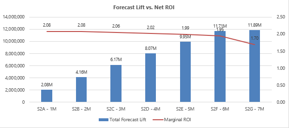
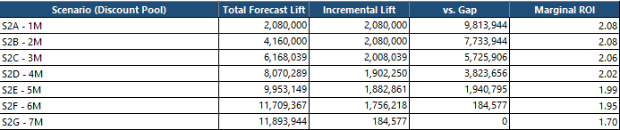
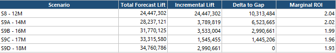

# 💰 Investment Tradeoff Analysis
## 🏛️ Executive Recovery Decision Framework

[⬅ Back to README](../README.md) | [⬅ Recovery Optimization](../09_Recovery_Optimization/recovery-optimization.md)

---

---

# 📌 Executive Overview

Recovery Optimization determines:

> How should capital be allocated?

Investment Tradeoff Analysis determines:

> Which recovery strategy should leadership fund?

At the end of Q3 FY26, leadership faced two viable recovery pathways:

| Scenario | Coverage | Gap to Budget | Planning Philosophy |
|-----------|-----------:|-----------:|-----------|
| Qualified Pipe Recovery | 92.5% | -12.0M | Balanced Recovery |
| High Confidence Recovery | 78.0% | -35.0M | Conservative Recovery |

Both scenarios ultimately achieved full recovery through optimized CRR deployment.

The strategic question was not whether recovery was possible.

The strategic question was:

# Which forecast reality should leadership choose to fund?

---

# 🧠 Investment Decision Philosophy

Enterprise recovery decisions should not be driven solely by forecast gaps.

Leadership must evaluate:

- required capital deployment,
- forecast uplift potential,
- marginal recovery efficiency,
- enterprise risk appetite,
- and confidence in underlying forecast assumptions.

This transforms recovery planning from an optimization exercise into an executive capital allocation decision.

---

# 🌤️ Scenario A — Qualified Pipe Recovery
## Balanced Recovery Strategy

### Executive Context

This scenario assumes that:

- qualified opportunities remain achievable,
- moderate forecast deterioration exists,
- targeted intervention is sufficient,
- and enterprise recovery can be achieved through efficient CRR deployment.

---

## Recovery Economics

  

### Executive Insight

The recovery curve demonstrates progressively increasing forecast lift while maintaining attractive portfolio returns.

However, marginal ROI gradually declines as investment levels increase, illustrating classic diminishing returns behavior.

---

## Recovery Progression

  

---

## Final Recovery Outcome

  

### Key Results

| Metric | Value |
|----------|----------:|
| Starting Coverage | 92.5% |
| Gap to Budget | -12.0M |
| Forecast Lift Achieved | 11.89M |
| CRR Utilized | 5.99M |
| Effective Portfolio ROI | 1.70x |
| Recovery Status | 100% Gap Closure |

### Executive Interpretation

Recovery was achieved through targeted capital deployment focused on high-ROI geographies and lever combinations.

Notably, complete recovery was achieved without fully utilizing available CRR capacity.

This represents a highly efficient recovery outcome.

---

# 🚨 Scenario B — High Confidence Recovery
## Recovery War Room Strategy

### Executive Context

This scenario assumes:

- only the strongest opportunities materialize,
- downside protection becomes paramount,
- forecast exposure is severe,
- and leadership adopts a conservative planning posture.

---

## Recovery Economics

  

### Executive Insight

The recovery challenge is materially larger than the Qualified Pipe scenario and therefore requires significantly greater capital intensity.

This scenario prioritizes survivability and downside protection over capital efficiency.

---

## Recovery Progression

  

---

## Final Recovery Outcome

  

### Key Results

| Metric | Value |
|----------|----------:|
| Starting Coverage | 78.0% |
| Gap to Budget | -35.0M |
| Forecast Lift Achieved | 34.76M |
| CRR Pool | 18.0M |
| Effective Portfolio ROI | 1.93x |
| Recovery Status | 100% Gap Closure |

### Executive Interpretation

The High Confidence scenario represents a deliberate downside-protection strategy.

While requiring materially larger intervention, it provides a more conservative recovery posture aligned with highly risk-sensitive operating environments.

---

# ⚖️ Executive Decision Framework

The choice between recovery strategies ultimately depends on leadership's view of forecast confidence and enterprise risk tolerance.

| Leadership Philosophy | Preferred Strategy |
|-----------|-----------|
| Moderate Risk Appetite | Qualified Pipe Recovery |
| Balanced Governance | Qualified Pipe Recovery |
| Capital Efficiency Focus | Qualified Pipe Recovery |
| Conservative Planning | High Confidence Recovery |
| Downside Protection | High Confidence Recovery |
| Board-Level Risk Mitigation | High Confidence Recovery |
| PE-Backed Governance Environment | High Confidence Recovery |

---

# 📊 Comparative Recovery Economics

| Metric | Qualified Pipe | High Confidence |
|-----------|-----------:|-----------:|
| Coverage | 92.5% | 78.0% |
| Gap to Budget | -12.0M | -35.0M |
| Recovery Philosophy | Balanced | Conservative |
| Recovery Posture | Targeted | War Room |
| Forecast Lift Achieved | 11.89M | 34.76M |
| Portfolio ROI | 1.70x | 1.93x |
| Recovery Outcome | Full Recovery | Full Recovery |

---

# 🎯 Strategic Conclusion

The objective of CRR governance is not to maximize spending.

The objective is to identify the minimum efficient intervention required to restore enterprise survivability while preserving capital discipline.

The New Bridge framework demonstrates how organizations can evaluate multiple forecast realities, quantify recovery economics, and make informed investment decisions under uncertainty.

This transforms recovery planning from reactive forecast management into a disciplined executive decision-making capability.

---

# 👤 Author

**Anil Jacob**  
Enterprise BI • RevOps Strategy • Executive Analytics • Forecast Governance

---

# 📜 Repository Context

All forecasts, optimization models, recovery frameworks, investment scenarios, and operating environments within this repository are synthetic and designed exclusively for portfolio and strategic demonstration purposes.