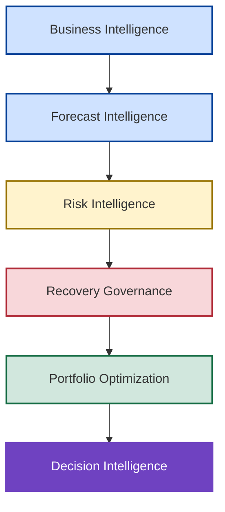

# 🎓 Institutional Lessons & Strategic Insights

## 🏛️ Learning From Revenue Governance, Recovery Optimization & Decision Intelligence

🏠 [Repository Home](../README.md)

💰 [Investment Tradeoff Analysis](../10_Investment_Tradeoff_Analysis/investment-tradeoff-analysis.md)

🚀 [Next Generation Operating Model](../12_Next_Generation_Operating_Model/next-generation-operating-model.md)

---

---

## 📌 Executive Reflection

New Bridge began as an analytics and reporting initiative designed to improve visibility into SaaS revenue performance. As the project evolved, the focus expanded beyond reporting into forecast governance, risk detection, recovery planning, capital allocation, portfolio optimization, and executive decision-making.

While the technical outputs of the program included forecasting models, governance frameworks, optimization engines, and investment scenarios, the most enduring outcomes were the institutional lessons that emerged throughout the process. These lessons were not derived from theory alone. They emerged directly from the decisions, tradeoffs, and outcomes observed within the New Bridge operating environment.

---

## 🧠 Evolution Of Enterprise Decision Intelligence

The progression illustrated above became one of the defining observations of the New Bridge program. The highest value of analytics was not achieved through reporting alone, but through the organization's ability to convert information into better decisions under conditions of uncertainty.

---

## 📊 Forecast Governance Insights

### Forecast Governance Must Begin Before Recovery Is Required

By the end of Q3 FY26, New Bridge had already achieved 139% budget attainment, creating the appearance of strong fiscal-year health. However, confidence-calibrated forecasting revealed that forecast coverage could decline to 92.5% or even 78.0% depending on pipeline assumptions. Although the exposure was ultimately recoverable, only one fiscal quarter remained available for corrective action.

The lesson was not simply that forecasting matters. The lesson was that governance timelines matter. Organizations that wait until late in the fiscal year to evaluate recoverability reduce their strategic options and increase their dependence on recovery interventions.

---

### Historical Success Can Conceal Future Risk

Historical performance suggested the business was operating well ahead of plan.

| Scenario                 | Coverage |
| ------------------------ | -------: |
| Full Pipe Coverage       |   105.1% |
| Qualified Pipe Coverage  |    92.5% |
| High Confidence Coverage |    78.0% |

The analysis demonstrated that strong historical attainment does not necessarily imply strong future performance. The same organization that appeared highly successful under historical reporting could simultaneously be carrying material future exposure when viewed through a forecast confidence lens.

The lesson was that backward-looking success should never be mistaken for forward-looking certainty.

---

### Forecast Confidence Is More Important Than Forecast Accuracy

One of the most significant findings of the simulation was that forecast outcomes changed dramatically as confidence assumptions became more restrictive. Coverage declined from 105.1% under Full Pipe assumptions to 92.5% under Qualified Pipe assumptions and ultimately to 78.0% under High Confidence assumptions, despite the underlying opportunity universe remaining unchanged.

The lesson was that forecast discussions should focus not only on expected outcomes but also on the confidence associated with those outcomes. Confidence calibration often provides a more realistic view of enterprise exposure than forecast accuracy alone.

---

### Scenario Planning Creates Better Decisions Than Point Forecasting

Traditional operating reviews often focus on a single forecast number. New Bridge instead evaluated multiple forecast realities simultaneously through Full Pipe, Qualified Pipe, and High Confidence scenarios.

This approach created a more realistic view of enterprise risk and enabled leadership to evaluate alternative recovery pathways before intervention became necessary. Rather than debating which forecast was correct, leadership could evaluate the consequences of multiple plausible outcomes.

The lesson was that managing uncertainty is often more valuable than attempting to eliminate it.

---

### Governance Creates Optionality

One of the most important observations from the New Bridge simulation was that early visibility created strategic flexibility.

Forecast Confidence identified exposure before fiscal commitments were missed.

Forecast Risk quantified the potential consequences of that exposure.

The Central Risk Reserve established a governed mechanism for intervention, while Recovery Optimization and Investment Tradeoff Analysis expanded the range of available response options.

The lesson was that governance does more than improve visibility.

Governance increases optionality.

Organizations that identify risk early possess more strategic choices than organizations that identify risk late. As available time declines, decision flexibility declines with it.

The objective of governance is therefore not simply to improve reporting. The objective is to preserve decision-making capacity while meaningful intervention remains possible.

---

## 🛡️ Recovery Capital Should Follow Material Exposure

The High Confidence scenario identified approximately **$34.76M of forecast exposure**, but the impact was heavily concentrated within a small number of geographies. Several Middle East & Africa subregions contributed a combined exposure of only **$513K**, representing a negligible share of the overall recovery requirement.

As a result, these regions were intentionally excluded from the CRR investment program. The expected recovery benefit did not justify the capital deployment, execution effort, or management attention required to pursue intervention. Recovery investments were instead concentrated on geographies capable of materially influencing fiscal-year outcomes.

The lesson was that recovery capital should follow material exposure, not geographic coverage. Effective governance is demonstrated not by funding every visible gap, but by directing resources toward the areas where intervention can create meaningful enterprise impact.

---

## Recovery Economics Differ From Growth Economics

The High Confidence scenario created a forecast exposure of approximately **$35M** with only one fiscal quarter remaining in the planning horizon. Under these conditions, traditional investment criteria such as market expansion, long-term customer growth, or strategic capability development became secondary considerations. The immediate objective was to restore fiscal-year attainment through interventions capable of generating measurable revenue impact within a 90-day window.

This shift fundamentally changed the economics of investment decision-making. Recovery programs were evaluated based on their ability to reduce near-term exposure rather than their long-term strategic value, leading to the prioritization of high-impact recovery levers that would not necessarily qualify under conventional investment frameworks.

The lesson was that investment logic must align with the business problem being solved. Recovery environments reward speed, impact, and survivability, whereas growth environments reward scale, expansion, and long-term value creation.

---

## Capital Allocation Is A Governance Capability

The High Confidence scenario created approximately **$35M of forecast exposure** and triggered the deployment of nearly **$18M in recovery capital** through the Central Risk Reserve framework. Although the recovery objective was enterprise-wide, the investment strategy was highly selective. Recovery funding was concentrated on a relatively small number of geographies capable of generating material forecast uplift, while lower-impact regions were intentionally excluded from the program.

This demonstrated that the most important capital allocation decisions were not related to the size of the investment pool, but rather to how recovery capital was prioritized. The CRR framework evolved beyond a funding mechanism and became a governance process for determining where intervention was justified, where capital should be withheld, and how limited resources could generate the greatest enterprise impact.

The lesson was that capital allocation is not simply a finance activity. It is a governance capability that determines how organizations translate risk exposure into targeted intervention.

---

## 🎯 Decision Intelligence Insights

### Optimization Improves Decisions But Does Not Replace Leadership

Recovery Optimization successfully identified intervention portfolios capable of restoring fiscal-year attainment under both the Qualified Pipe and High Confidence scenarios. However, the optimization engine could not determine which planning assumption leadership should trust, nor could it determine how much downside risk the organization was willing to accept.

The model identified efficient portfolios. Leadership still had to choose between a capital-efficient recovery strategy requiring approximately $5.99M of intervention and a more conservative recovery strategy requiring approximately $18.0M of intervention.

The lesson was that analytics can improve decision quality, but accountability for decisions remains a leadership responsibility.

---

### Recovery Should Be Measured By Efficiency, Not Spending

Both recovery portfolios ultimately achieved fiscal-year attainment, yet they did so with materially different levels of investment. The Qualified Pipe portfolio generated approximately $11.89M of forecast uplift from $5.99M of intervention, while the High Confidence portfolio generated approximately $34.76M of forecast uplift from $18.0M of intervention.

The analysis demonstrated that recovery success should not be evaluated by the amount of capital deployed. Recovery success should be evaluated by the efficiency with which exposure is reduced and fiscal commitments are protected.

The lesson was that effective recovery is defined by efficiency of outcome rather than magnitude of spending.

---

### Revenue Intelligence Is Not The Same As Decision Intelligence

New Bridge began as a revenue intelligence initiative focused on bookings, ARR performance, pipeline coverage, and forecast visibility.

As the program evolved, it became clear that understanding performance was only one part of the challenge.

Revenue intelligence explained what was happening.

Forecast intelligence quantified uncertainty.

Risk intelligence evaluated potential consequences.

Recovery optimization identified achievable response strategies.

Investment Tradeoff Analysis evaluated alternative courses of action.

The lesson was that decision intelligence sits above all of these capabilities.

Its purpose is not simply to generate insights, forecasts, or recommendations. Its purpose is to help leadership determine which actions should ultimately be funded when uncertainty, capital constraints, competing priorities, and organizational risk tolerance must be balanced.

The highest value of analytics is therefore not created by reporting performance.

It is created by improving the quality of decisions made under uncertainty.

---

## 🎯 Strategic Conclusion

New Bridge demonstrated that revenue governance, forecast confidence, risk assessment, recovery planning, optimization, and executive decision-making are not independent capabilities.

They form a connected operating system.

Throughout the simulation, each capability built upon the previous one. Forecast confidence exposed uncertainty. Risk assessment quantified exposure. Governance authorized intervention. Optimization identified efficient recovery strategies. Executive decision-making ultimately determined which strategy should be pursued.

The most important lesson was not that organizations should forecast more accurately.

The most important lesson was that organizations should make better decisions under uncertainty.

Viewed collectively, the New Bridge operating model illustrates how information can be transformed into action, risk into intervention, and uncertainty into governed decision-making.

The result is not simply a forecasting framework or recovery methodology.

It is a decision intelligence operating system designed to improve organizational resilience, resource allocation, and fiscal-year survivability under conditions of uncertainty.

---

### 👤 Author

**Anil Jacob**

Enterprise BI • Revenue Operations Strategy • Decision Intelligence • Executive Analytics

---

### 📜 Repository Context

All forecasts, operating environments, optimization models, governance frameworks, recovery strategies, portfolio allocations, and business scenarios contained within this repository are synthetic and intended exclusively for portfolio, educational, and strategic demonstration purposes.

The lessons and insights documented herein are derived from the New Bridge simulation and are intended to illustrate how organizations can improve revenue governance, decision quality, and enterprise resilience through a more integrated decision intelligence operating model.
