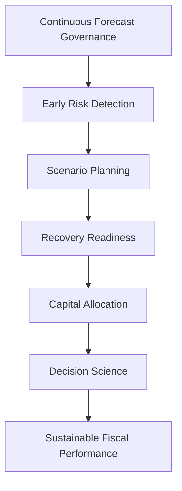

# 🚀 Next Generation Operating Model

## 🏛️ From Reactive Recovery To Proactive Commercial Governance

[⬅ Back to README](../README.md) | [⬅ Executive Lessons Learned](../11_Executive_Lessons_Learned/executive-lessons-learned.md)

---

<p align="center">


</p>

---

## 📌 Executive Overview

The New Bridge recovery program successfully demonstrated how forecast deterioration can be identified, quantified, and mitigated through disciplined governance, recovery optimization, and capital allocation.

However, the ultimate objective of enterprise leadership is not simply to recover from risk.

The objective is to build an operating model where:

* risks are identified earlier,
* intervention options are broader,
* recovery economics are stronger,
* and enterprise survivability is continuously monitored.

The lessons learned throughout the New Bridge journey form the foundation for a Next Generation Operating Model built around proactive commercial governance rather than reactive recovery execution.

---

## 🎯 Future State Vision

The operating model evolves from:

### Current State

```text
Historical Reporting
        ↓
Q3 Risk Discovery
        ↓
CRR Activation
        ↓
Recovery Program
        ↓
Budget Protection
```

To:

### Future State

```text
Continuous Forecast Governance
        ↓
Early Risk Detection
        ↓
Scenario-Based Planning
        ↓
Recovery Readiness
        ↓
Capital Optimization
        ↓
Sustainable Fiscal Performance
```

---

## 🏛️ Operating Model Transformation


---

## 1️⃣ Early Risk Detection Creates Recovery Optionality

The single most important lesson from the New Bridge experience is that recovery effectiveness improves dramatically when risk is identified earlier in the fiscal cycle.

Consider two alternative operating environments:

| Detection Timing | Available Recovery Window |
| ---------------- | ------------------------- |
| End of Q1        | ~9 Months                 |
| End of Q3        | ~3 Months                 |
| Q4               | Limited Remaining Time    |

Earlier detection creates:

✅ longer realization windows
✅ greater forecast visibility
✅ higher intervention effectiveness
✅ improved recovery economics
✅ reduced execution pressure

### Executive Insight

> Recovery effectiveness is driven as much by timing as by investment magnitude.

---

## 2️⃣ Early Risk Detection Expands Available Recovery Levers

When risk is identified late in the fiscal year, organizations are limited to short-cycle interventions such as:

* RAF Programs
* Renewals Programs
* Discount Programs
* Deal Acceleration Initiatives

These interventions remain valuable but are inherently constrained by time.

When risk is identified early, leadership gains access to a much broader recovery portfolio.

### Late Detection Environment

```text
RAF
Renewals
Discounts
```

### Early Detection Environment

```text
RAF
Renewals
Discounts

Lead Generation
Pipeline Creation
Partner Enablement
Cross-Sell Programs
Expansion Campaigns
Customer Success Initiatives
Marketing Investments
Business Development Programs
```

### Executive Insight

> Early risk detection does not simply improve recovery outcomes. It fundamentally expands what recovery strategies are available.

---

## 3️⃣ Continuous Confidence-Calibrated Forecasting

The New Bridge operating model introduces continuous forecast calibration throughout the fiscal year.

Instead of managing a single forecast view, leadership continuously monitors:

| Forecast View            | Purpose                      |
| ------------------------ | ---------------------------- |
| Full Pipe Coverage       | Opportunity Visibility       |
| Qualified Pipe Coverage  | Moderate Confidence Planning |
| High Confidence Coverage | Conservative Planning        |

This approach enables earlier detection of forecast deterioration and reduces end-of-year surprises.

### Executive Insight

> Multiple forecast realities provide better governance than a single forecast assumption.

---

## 4️⃣ Standing Recovery Readiness

Recovery planning should not begin when recovery becomes necessary.

The organization should maintain permanent recovery readiness capabilities including:

* CRR governance frameworks
* ROI intelligence models
* Recovery playbooks
* Intervention prioritization frameworks
* Investment allocation methodologies

### Executive Insight

> Recovery readiness should become an institutional capability rather than an emergency response.

---

## 5️⃣ Institutional Capital Allocation

The ROI intelligence developed through New Bridge should evolve into a standing business capability.

This includes maintaining:

* ROI coefficient matrices
* Forecast uplift models
* Recovery efficiency benchmarks
* Geography investment profiles
* Lever effectiveness measurements

These assets should be refreshed continuously rather than rebuilt during periods of crisis.

### Executive Insight

> Capital allocation intelligence compounds in value when treated as a strategic asset.

---

## 6️⃣ Scenario-Based Commercial Governance

Future operating reviews should evaluate multiple scenarios simultaneously.

```text
Base Case
      ↓
Moderate Case
      ↓
Conservative Case
```

This ensures leadership maintains visibility into both upside opportunities and downside risks.

Scenario planning becomes a standard component of enterprise governance rather than an occasional exercise.

### Executive Insight

> Scenario planning should be embedded into the operating cadence, not reserved for periods of uncertainty.

---

## 7️⃣ Analytics As Decision Science

The ultimate evolution of the New Bridge operating model is the transformation of analytics from reporting into decision science.

```text
Reporting
      ↓
Forecasting
      ↓
Risk Detection
      ↓
Recovery Optimization
      ↓
Capital Allocation
      ↓
Decision Science
```

This progression reflects the increasing strategic value of analytics within modern enterprises.

### Executive Insight

> The highest value of analytics is not visibility. It is better decision-making.

---

## 📊 Future State Operating Framework



---

## 🎯 Strategic Outcome

The Next Generation Operating Model transforms New Bridge from an organization that reacts to forecast deterioration into one that continuously anticipates, monitors, and manages commercial risk.

The model institutionalizes:

* proactive forecast governance,
* confidence-calibrated planning,
* recovery readiness,
* capital allocation discipline,
* and executive decision science.

The result is a more resilient, more predictable, and more governable commercial operating environment.

---

## 🏁 Final Reflection

The New Bridge case study began as a SaaS reporting and analytics initiative.

It evolved into a broader demonstration of:

* commercial governance,
* enterprise risk management,
* recovery optimization,
* capital allocation,
* and strategic decision-making.

Ultimately, the most important outcome was not recovering a forecast.

It was learning how to build a better business.

---

# 👤 Author

**Anil Jacob**
Enterprise BI • RevOps Strategy • Executive Analytics • Forecast Governance

---

# 📜 Repository Context

All forecasts, operating models, governance frameworks, recovery strategies, optimization models, and business scenarios within this repository are synthetic and designed exclusively for portfolio and strategic demonstration purposes.
