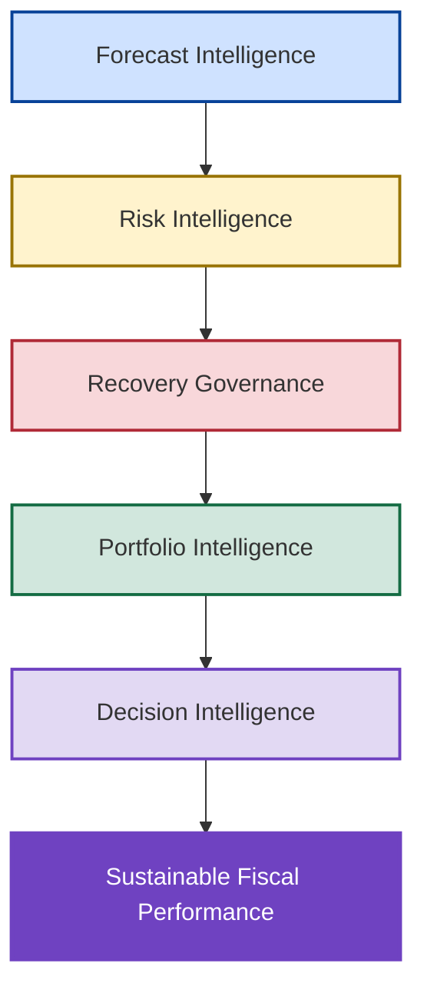
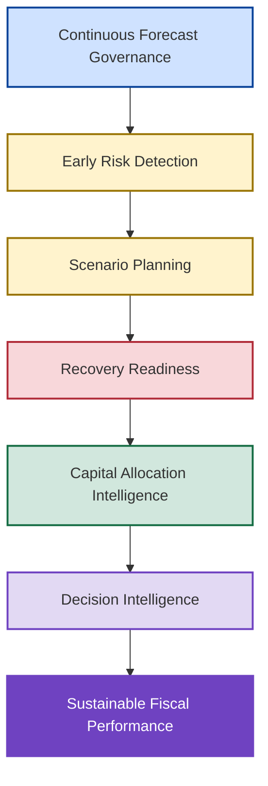

# 🚀 Next Generation Revenue Operating Model

## 🏛️ From Reactive Recovery To Proactive Commercial Governance

<p align="center">

🏠 [Repository Home](../README.md)

🎓 [Institutional Lessons & Strategic Insights](../11_Institutional_Lessons/institutional-lessons-and-strategic-insights.md)

</p>

---

<p align="center">


</p>

---

## 📌 Executive Overview

The New Bridge simulation demonstrated that forecast coverage could deteriorate from **105.1% under Full Pipe assumptions** to **78.0% under High Confidence assumptions**, creating a potential **$35M forecast exposure** despite strong historical attainment. Recovery Optimization subsequently demonstrated that fiscal-year attainment could be restored through intervention portfolios requiring between **$5.99M and $18.0M** of recovery capital.

While these capabilities successfully addressed the immediate recovery challenge, they also exposed a larger opportunity. The same forecasting, governance, optimization, and decision frameworks used to recover performance could be deployed much earlier in the fiscal cycle, reducing exposure before recovery becomes necessary.

The purpose of the Next Generation Revenue Operating Model is therefore not to improve recovery execution. The purpose is to reduce reliance on recovery programs altogether by institutionalizing the capabilities that New Bridge proved were valuable.

---

## 🏛️ Future-State Revenue Operating Model



The future-state model institutionalizes the capabilities developed throughout New Bridge and embeds them into the operating rhythm of the organization.

---

## 🎯 Future State Vision

The operating model evolves from:

### Current State

```text
Historical Reporting
        ↓
Q3 Risk Discovery
        ↓
CRR Activation
        ↓
Recovery Program
        ↓
Budget Protection
```

To:

### Future State

```text
Continuous Forecast Governance
        ↓
Early Risk Detection
        ↓
Scenario-Based Planning
        ↓
Recovery Readiness
        ↓
Capital Optimization
        ↓
Sustainable Fiscal Performance
```

---

## 🔄 Operating Model Transformation


This progression reflects the evolution observed throughout the New Bridge journey and provides the foundation for a more mature commercial operating model.

---

## 1️⃣ Early Risk Detection Creates Recovery Optionality

The New Bridge simulation identified material forecast deterioration during Q3 FY26, leaving approximately one fiscal quarter available for corrective action. Although recovery was ultimately achieved through CRR activation and targeted intervention programs, the compressed timeline significantly constrained available recovery options.

The future-state operating model seeks to identify deterioration much earlier in the fiscal cycle, increasing the number of available recovery levers while reducing dependence on late-stage intervention programs.

| Detection Timing | Available Recovery Window |
| ---------------- | ------------------------: |
| End of Q1        |                 ~9 Months |
| End of Q2        |                 ~6 Months |
| End of Q3        |                 ~3 Months |
| Q4               |    Limited Remaining Time |

Earlier detection creates:

✅ Longer realization windows

✅ Greater forecast visibility

✅ Higher intervention effectiveness

✅ Improved recovery economics

✅ Reduced execution pressure

### Executive Insight

Recovery effectiveness is driven as much by timing as by investment magnitude.

---

## 2️⃣ Early Risk Detection Expands Available Recovery Levers

The High Confidence scenario created approximately **$35M of forecast exposure** with only one fiscal quarter remaining. Under these conditions, recovery efforts were necessarily concentrated on short-cycle interventions such as RAF programs, renewals acceleration, discount programs, and deal acceleration initiatives.

Earlier detection fundamentally changes the recovery toolkit available to leadership by creating sufficient time for growth-oriented interventions that are unavailable during late-stage recovery environments.

### Late Detection Environment

```text
RAF Programs
Renewal Programs
Discount Programs
Deal Acceleration
```

### Early Detection Environment

```text
RAF Programs
Renewal Programs
Discount Programs
Deal Acceleration

Lead Generation
Pipeline Creation
Partner Enablement
Cross-Sell Programs
Expansion Campaigns
Customer Success Initiatives
Marketing Investments
Business Development Programs
```

### Executive Insight

Early risk detection does not simply improve recovery outcomes. It expands the range of strategic options available to leadership.

---

## 3️⃣ Continuous Confidence-Calibrated Forecasting

One of the defining insights from New Bridge was that materially different levels of enterprise exposure emerged from the same underlying opportunity base depending on confidence assumptions.

| Forecast View   | Coverage |
| --------------- | -------: |
| Full Pipe       |   105.1% |
| Qualified Pipe  |    92.5% |
| High Confidence |    78.0% |

The future-state operating model institutionalizes continuous confidence-calibrated forecasting rather than relying on a single forecast view. Leadership continuously evaluates multiple forecast realities and monitors deterioration trends before exposure becomes material.

### Executive Insight

Multiple forecast realities provide stronger governance than a single forecast assumption.

---

## 4️⃣ Standing Recovery Readiness

New Bridge required the creation of CRR governance frameworks, ROI coefficient matrices, geography prioritization methodologies, and recovery optimization models under active recovery conditions.

The future-state model institutionalizes these capabilities as standing business assets, ensuring that recovery readiness exists before forecast deterioration occurs.

Core capabilities include:

* CRR governance frameworks
* ROI intelligence models
* Recovery playbooks
* Geography prioritization frameworks
* Intervention allocation methodologies
* Recovery optimization models

### Executive Insight

Recovery readiness should become an institutional capability rather than an emergency response.

---

## 5️⃣ Institutional Capital Allocation Intelligence

The High Confidence scenario demonstrated that approximately **$18M of recovery capital** could be concentrated within a relatively small number of geographies to address nearly **$35M of forecast exposure**. The effectiveness of this approach depended upon ROI intelligence, forecast uplift potential, and geography-specific recovery economics.

The future-state operating model institutionalizes these capabilities so that capital allocation decisions are continuously informed by objective recovery economics rather than developed during periods of crisis.

Core capabilities include:

* ROI coefficient matrices
* Forecast uplift models
* Recovery efficiency benchmarks
* Geography investment profiles
* Lever effectiveness measurements

### Executive Insight

Capital allocation intelligence compounds in value when treated as a strategic enterprise asset.

---

## 6️⃣ Scenario-Based Commercial Governance

The Full Pipe, Qualified Pipe, and High Confidence forecasting views developed during New Bridge demonstrated how materially different planning assumptions can produce vastly different estimates of enterprise exposure.

The future-state model embeds scenario planning directly into the governance cadence, ensuring that leadership continuously evaluates both upside opportunities and downside risks.

```text
Full Pipe
      ↓
Qualified Pipe
      ↓
High Confidence
```

This approach shifts scenario planning from an occasional analytical exercise to a permanent governance capability.

### Executive Insight

Scenario planning should become part of the operating cadence rather than an activity reserved for periods of uncertainty.

---

## 7️⃣ Analytics As Decision Intelligence

New Bridge began with reporting, forecasting, and revenue visibility. As forecast confidence deteriorated and exposure increased, the focus shifted toward intervention governance, capital allocation, recovery optimization, and executive portfolio selection.

This progression transformed analytics from a reporting capability into a decision intelligence capability capable of supporting leadership through uncertainty.

```text
Revenue Intelligence
        ↓
Forecast Intelligence
        ↓
Risk Intelligence
        ↓
Recovery Governance
        ↓
Portfolio Intelligence
        ↓
Decision Intelligence
```

### Executive Insight

The highest value of analytics is not visibility. It is better decisions.

---

## 📊 Future-State Operating Framework



---

## 🎯 Strategic Outcome

The Next Generation Revenue Operating Model transforms the organization from one that reacts to forecast deterioration into one that continuously anticipates, monitors, and manages commercial risk.

The model institutionalizes confidence-calibrated forecasting, scenario-based governance, recovery readiness, capital allocation intelligence, and decision intelligence as permanent enterprise capabilities. The result is a more resilient, more predictable, and more governable commercial operating environment capable of reducing exposure before recovery intervention becomes necessary.

---

## 🏁 Final Reflection

New Bridge demonstrated that forecasting, governance, optimization, and executive decision-making are not independent capabilities. Together they form a connected operating system capable of identifying risk, governing intervention, optimizing recovery investments, and supporting better decisions under uncertainty.

The future-state model builds upon this foundation by shifting these capabilities earlier in the fiscal cycle and embedding them into day-to-day operating rhythms. Rather than waiting for forecast deterioration to trigger recovery programs, the organization continuously monitors confidence-calibrated forecasts, evaluates emerging exposure, maintains recovery readiness, and optimizes capital allocation before material risk accumulates.

In this sense, the Next Generation Revenue Operating Model is not a replacement for New Bridge. It is the institutionalization of the capabilities that New Bridge proved were valuable.

---

### 👤 Author

**Anil Jacob**

Enterprise BI • Revenue Operations Strategy • Decision Intelligence • Executive Analytics

---

### 📜 Repository Context

All forecasts, operating models, governance frameworks, recovery strategies, optimization models, portfolio allocations, and business scenarios contained within this repository are synthetic and intended exclusively for portfolio, educational, and strategic demonstration purposes.

The Next Generation Revenue Operating Model illustrates how organizations can evolve from reactive recovery programs toward a more proactive operating model built on forecast intelligence, governance discipline, portfolio optimization, and decision intelligence.
