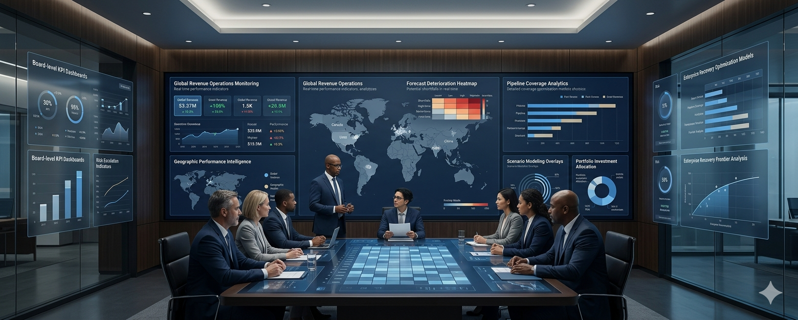
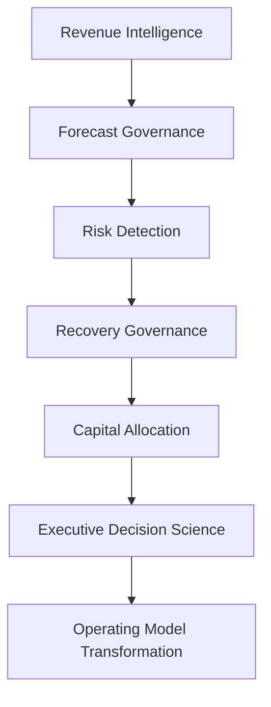
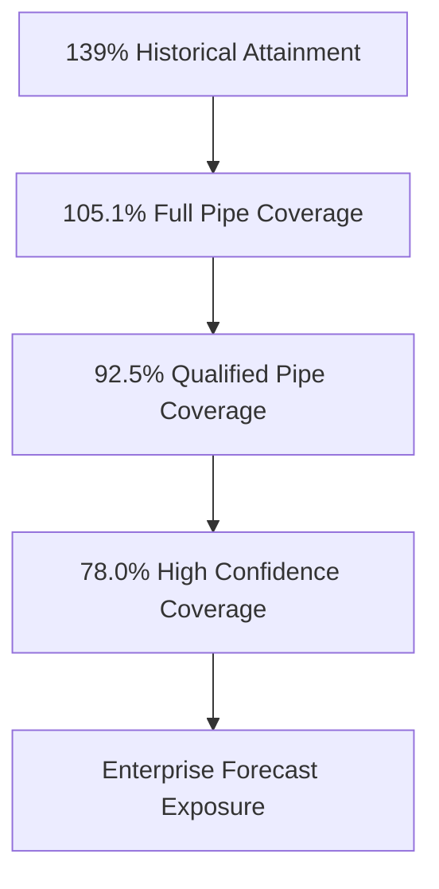
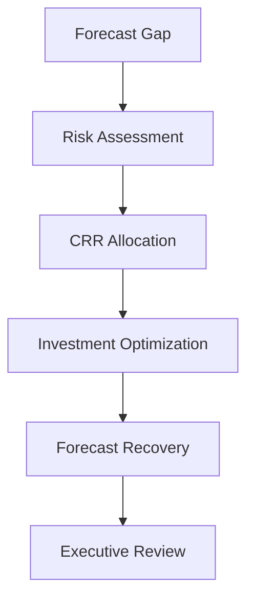

# 🚀 New Bridge SaaS Operating System

## 🏛️ Enterprise Revenue Operating System Reference Architecture

<p align="center">
  
</p>

<p align="center">


</p>

---

## 📌 What Is New Bridge?

New Bridge is a reference implementation of an **Enterprise Revenue Operating System** designed to help SaaS organizations govern forecasting, detect commercial risk earlier, optimize recovery investments, and improve executive decision-making.

The repository demonstrates how modern organizations can evolve from:

```text
Historical Reporting
        ↓
Forecasting
        ↓
Risk Detection
        ↓
Recovery Governance
        ↓
Capital Allocation
        ↓
Decision Science
```

Rather than focusing solely on dashboards and reporting, New Bridge explores how enterprise data, forecasting, governance, and investment decisions can work together as a unified operating model.

---

## 🎯 Why This Architecture Matters

Traditional forecasting environments typically answer:

### What happened?

Modern commercial organizations need to answer:

* What is likely to happen?
* What risks are emerging?
* How severe are those risks?
* What interventions are available?
* Which investments should leadership prioritize?
* How should the business respond?

The New Bridge architecture was designed to answer these questions through a structured governance framework.

---

## 🏛️ Commercial Governance Reference Architecture



Each layer builds on the previous layer to create a continuous commercial governance capability.

---

## 🧠 Core Architecture Principle

The architecture is built around a simple idea:

> Forecasting should be treated as a governance capability rather than a reporting process.

This changes the conversation from:

```text
What happened?
```

to:

```text
What should we do next?
```

---

## 📉 The Business Problem

At the end of Q3 FY26, New Bridge appeared operationally healthy when viewed through historical reporting.

| Metric                        |       Result |
| ----------------------------- | -----------: |
| Historical Revenue Attainment |         139% |
| Regional Performance          | Above Target |
| Pipeline Activity             |       Strong |
| Revenue Expansion             |      Healthy |

However, once leadership evaluated the full fiscal year outlook, a very different picture emerged.

| Forecast Scenario                 | Coverage |
| --------------------------------- | -------: |
| Full Pipeline Coverage            |   105.1% |
| Qualified Pipeline Coverage       |    92.5% |
| High-Confidence Pipeline Coverage |    78.0% |

The organization discovered that strong historical performance was concealing increasing forecast risk.

---

## ⚠️ Forecast Deterioration Journey



This became the catalyst for the recovery and governance programs explored throughout the repository.

---

## 🛡️ Central Risk Reserve (CRR)

One of the key concepts introduced in this architecture is the Central Risk Reserve (CRR).

The CRR is a structured investment framework used to support forecast recovery when commercial performance deteriorates.

The framework helps leadership answer:

* Where should recovery capital be deployed?
* Which interventions generate the strongest return?
* Which regions should be prioritized?
* What level of investment is justified?

---

## ⚙️ Recovery Optimization Framework



The objective is not to maximize spending.

The objective is to identify the minimum efficient intervention required to restore fiscal performance.

---

## 📊 Architecture Capability Map

| Capability Domain      | Business Purpose                  |
| ---------------------- | --------------------------------- |
| Revenue Intelligence   | ARR, ACV and Revenue Visibility   |
| Forecast Governance    | Coverage & Forecast Management    |
| Risk Detection         | Early Warning & Exposure Analysis |
| Recovery Governance    | Intervention Planning             |
| Capital Allocation     | Investment Prioritization         |
| Decision Science       | Executive Decision Support        |
| Operating Model Design | Continuous Improvement            |

---

## 📂 Reference Implementation Structure

The repository is organized as a reference implementation of the architecture.

| Architecture Layer      | Repository Section                 |
| ----------------------- | ---------------------------------- |
| Reference Architecture  | 00_Reference_Architecture          |
| Executive Overview      | 01_Executive_Summary               |
| Business Context        | 02_Business_Problem                |
| Enterprise Architecture | 03_Enterprise_Architecture         |
| Revenue Intelligence    | 04_SaaS_Financial_Model            |
| Forecast Governance     | 05_Pipeline_Governance             |
| Risk Detection          | 06_Forecast_Risk_Model             |
| Executive Reporting     | 07_PowerBI_Dashboards              |
| Recovery Governance     | 08_CRR_Optimization                |
| Capital Allocation      | 09_Recovery_Optimization           |
| Decision Science        | 10_Investment_Tradeoff_Analysis    |
| Institutional Learning  | 11_Executive_Lessons_Learned       |
| Future State Design     | 12_Next_Generation_Operating_Model |

---

## 🏗️ Technology & Analytics Stack

| Area               | Platform                        |
| ------------------ | ------------------------------- |
| Reporting          | Power BI                        |
| Data Modeling      | Power BI Semantic Models        |
| Data Engineering   | Python / Pandas                 |
| Financial Modeling | Excel                           |
| Optimization       | Linear Programming in Excel Solver                    |
| Forecasting        | Scenario Modeling               |
| Governance         | Commercial Operating Frameworks |
| Decision Support   | Executive Analytics             |

---

## 🎯 Strategic Outcomes

The New Bridge architecture demonstrates how organizations can:

✅ Improve forecast visibility

✅ Detect risk earlier

✅ Quantify commercial exposure

✅ Deploy recovery investments intelligently

✅ Improve capital allocation decisions

✅ Strengthen forecast governance

✅ Enhance executive decision quality

---

## 📚 Repository Navigation

Architecture Layer → Reference Implementation

| Folder                                 | Purpose                                                                           |
| -------------------------------------- | --------------------------------------------------------------------------------- |
| **00_Reference_Architecture**          | Commercial Governance Reference Architecture and capability model                 |
| **01_Executive_Summary**               | Executive overview, board brief, and strategic context                            |
| **02_Business_Problem**                | Definition of the forecasting challenge and business case for intervention        |
| **03_Enterprise_Architecture**         | Data, reporting, governance, and operating model architecture                     |
| **04_SaaS_Financial_Model**            | ARR, ACV, bookings, revenue realization, and IYRC financial frameworks            |
| **05_Pipeline_Governance**             | Pipeline coverage, confidence calibration, and forecast engineering methodologies |
| **06_Forecast_Risk_Model**             | Forecast deterioration analysis and risk exposure quantification                  |
| **07_PowerBI_Dashboards**              | Executive reporting experience and analytical visualization layer                 |
| **08_CRR_Optimization**                | Central Risk Reserve (CRR) framework and optimization design                      |
| **09_Recovery_Optimization**           | Capital allocation, forecast uplift modeling, and recovery economics              |
| **10_Investment_Tradeoff_Analysis**    | Executive decision framework and recovery investment tradeoff analysis            |
| **11_Executive_Lessons_Learned**       | Institutional learning and strategic insights derived from the program            |
| **12_Next_Generation_Operating_Model** | Future-state commercial governance and proactive operating model design           |


---

## 👤 Author

**Anil Jacob**
Enterprise BI • RevOps Strategy • Executive Analytics • Forecast Governance

---

## 📜 Repository Context

All datasets, forecasts, operating models, governance frameworks, optimization models, and business scenarios contained within this repository are synthetic and intended exclusively for portfolio, educational, and strategic demonstration purposes.

The architecture and implementation are designed to illustrate enterprise commercial governance concepts rather than represent any specific organization.
