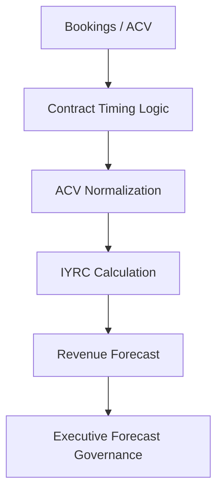
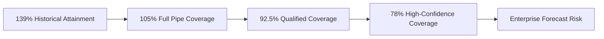
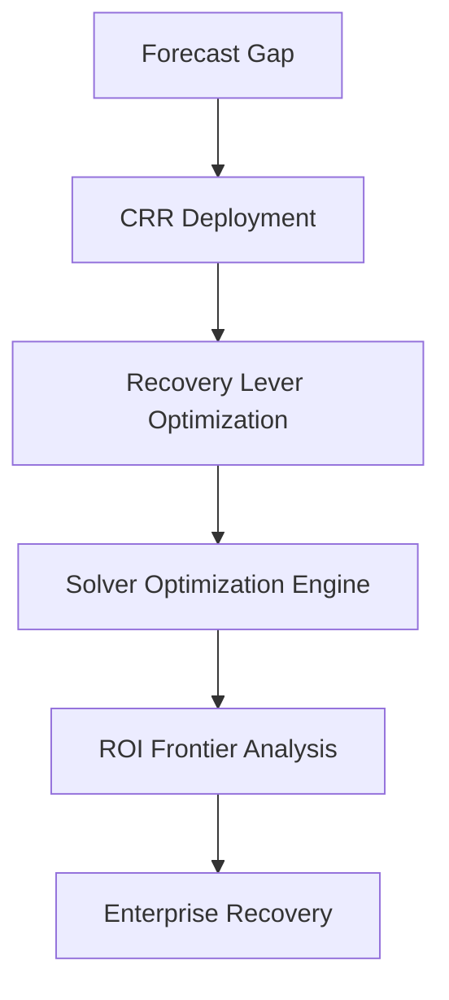

# 🚀 New Bridge SaaS Operating System  
## 🏛️ Board-Level Forecast Governance & Recovery Optimization Simulation

<p align="center">


</p>

---

# 📌 Executive Positioning

New Bridge is a simulated enterprise SaaS organization designed to model how modern subscription businesses govern:

- Revenue Operations (RevOps)
- Forecast Performance
- Pipeline Risk
- Commercial Governance
- Enterprise Recovery Strategies
- Board-Level Decision Systems

This repository demonstrates how a mature SaaS enterprise can:

✅ Operationalize commercial intelligence  
✅ Detect hidden forecast fragility  
✅ Quantify enterprise exposure  
✅ Deploy recovery capital strategically  
✅ Optimize enterprise survivability under stress  

Unlike traditional dashboard portfolios, this repository is intentionally structured as a:

# 🏢 Fortune 500 Strategy & Commercial Governance Simulation

combining:

- Enterprise BI
- RevOps
- SaaS Finance
- Forecast Governance
- Executive Analytics
- Portfolio Optimization
- Recovery Frontier Analysis

---

# 🧭 Strategic Narrative Structure

| Act | Executive Narrative |
|---|---|
| 🏗️ Act 1 | Build the SaaS Operating System |
| ⚠️ Act 2 | Discover Hidden Forecast Fragility |
| 🛡️ Act 3 | Deploy Institutional Recovery Governance |
| 📈 Act 4 | Reach the Enterprise Recovery Frontier |

---

# 🔘 Strategic Capability Areas

<p align="left">


</p>

---

# 🧠 Executive Summary

At the end of Fiscal Q3 FY26, New Bridge appeared operationally healthy from a historical performance perspective.

| Metric | Result |
|---|---|
| Historical Revenue Attainment | 139% |
| Geographic Performance | All major regions above target |
| Pipeline Activity | Strong |
| Revenue Expansion | Healthy |

However, once the organization transitioned from a reverse-looking operational perspective to a full-year forward forecast view, material enterprise risk emerged.

---

# 📉 Forecast Coverage Deterioration

| Forecast Scenario | Enterprise Coverage |
|---|---:|
| Full Pipeline Coverage | 105.0% |
| Qualified Pipeline Coverage | 92.5% |
| High-Confidence Pipeline Coverage | 78.0% |

This revealed a critical governance problem:

> Historical success was masking severe forward-looking forecast fragility.

The organization had become increasingly dependent on:

- Late-quarter execution
- Lower-confidence pipeline
- Geographic concentration
- Aggressive forecast assumptions

This created escalating enterprise exposure against fiscal commitments.

---

# 🧱 Enterprise SaaS Operating System

The platform models a complete SaaS commercial operating system including:

- ARR transaction modeling
- ACV normalization
- IYRC revenue realization
- Fiscal calendar alignment
- Pipeline governance
- Forecast scenario management
- Opportunity lifecycle simulation
- Executive KPI governance
- Geography-level calibration

---

# 🏛️ Enterprise Operating Model Architecture


---

# 🧮 ARR → Revenue Realization Framework



---

# ⚠️ Forecast Risk Escalation

The project intentionally demonstrates how strong historical performance can conceal structural forecast deterioration.

---

## 📊 Forecast Escalation Journey



---

# 🌍 Geography-Level Risk Governance

The simulation models risk deterioration across global regions including:

- NA West
- NA East
- DACH
- UKI
- India
- ANZ
- Brazil
- Middle East

The framework demonstrates how enterprise forecast deterioration becomes unevenly distributed across global operating units.

---

# 🛡️ Central Risk Reserve (CRR)

One of the project’s primary strategic innovations is the creation of a:

# 🏦 Central Risk Reserve (CRR)

The CRR functions as an institutional recovery-capital framework designed to preserve enterprise forecast attainment under deteriorating pipeline conditions.

---

## 🎯 Recovery Levers

| Lever | Strategic Purpose |
|---|---|
| RAF Acceleration | Pipeline expansion & recovery scaling |
| Renewal Optimization | Installed-base recovery efficiency |
| Tactical Discounts | Controlled late-stage recovery support |
| Geographic Allocation | Capital efficiency prioritization |

---

# ⚙️ Enterprise Recovery Optimization Framework



---

# 📈 Recovery Frontier Analysis

The repository models progressively severe enterprise stress scenarios.

| Scenario | Strategic Interpretation |
|---|---|
| S8 | Survivability Triage |
| S9A | Recovery Expansion |
| S9B | Near Recovery Frontier |
| S9C | Full Enterprise Recovery Frontier |

---

# 🧠 Solver Optimization & Decision Science

The project applies:

- Linear Programming
- Constraint Optimization
- Recovery ROI Analysis
- Capital Allocation Modeling
- Geographic Prioritization
- Marginal Efficiency Analysis

using:

- Microsoft Excel Solver
- Scenario Optimization Models
- Recovery Constraint Systems

---

# 📊 Recovery Frontier Progression


---

# 📌 S9C — Enterprise Recovery Frontier

| Metric | Value |
|---|---:|
| Total Enterprise CRR | 18.0M |
| Forecast Recovery Achieved | 34.76M |
| Residual Exposure | 0 |
| Effective Portfolio ROI | 1.93x |
| Recovery Efficiency | 100% |

Key conclusion:

> Complete global forecast recovery became mathematically achievable once scalable RAF acceleration and high-efficiency renewal optimization were sufficiently expanded while maintaining disciplined discount governance.

---

# 🧠 Executive Insights

The project demonstrates that enterprise SaaS survivability under severe forecast deterioration depends on:

✅ Institutional governance discipline  
✅ Economically rational capital deployment  
✅ Pipeline quality calibration  
✅ Geography-aware recovery prioritization  
✅ Controlled pricing governance  
✅ Executive decision intelligence  

---

# 🏗️ Enterprise Architecture Components

| Domain | Capability |
|---|---|
| Enterprise BI | Semantic modeling & executive reporting |
| RevOps | Pipeline governance & forecast operations |
| SaaS Finance | ARR / ACV / IYRC mechanics |
| Forecast Governance | Multi-scenario calibration |
| Executive Analytics | Board-level decision support |
| Commercial Strategy | Recovery optimization |
| Portfolio Governance | Geographic capital allocation |

---

# 🧰 Technology & Modeling Stack

| Area | Stack |
|---|---|
| Reporting | Power BI |
| Modeling | Excel / Solver |
| Data Engineering | Python / Pandas |
| Semantic Modeling | Microsoft Fabric |
| Optimization | Linear Programming |
| Forecast Governance | Scenario Modeling |
| Portfolio Analytics | Recovery Frontier Analysis |

---

# 📂 Repository Structure

```text
newbridge-saas-operating-system/
│
├── 01_Executive_Summary/
├── 02_Business_Problem/
├── 03_Data_Modeling/
├── 04_SaaS_Financial_Model/
├── 05_Pipeline_Governance/
├── 06_Forecast_Risk_Model/
├── 07_PowerBI_Dashboards/
├── 08_CRR_Optimization/
├── 09_Solver_Recovery_Scenarios/
├── 10_Recovery_Frontier_Analysis/
├── 11_Strategic_Insights/
├── 12_Executive_Presentation/
├── assets/
├── datasets/
├── notebooks/
└── README.md
```

---

# 🎯 Strategic Outcome

This repository demonstrates how enterprise SaaS organizations can:

- Govern commercial operations institutionally
- Detect hidden forecast deterioration early
- Quantify enterprise-wide risk exposure
- Deploy economically rational recovery mechanisms
- Preserve enterprise resilience under severe stress conditions

The project intentionally bridges:

- Enterprise BI
- RevOps
- SaaS Finance
- Forecast Governance
- Executive Analytics
- Commercial Strategy
- Portfolio Optimization

within a unified board-level operating simulation.

---

# 👤 Author

**Anil Jacob**  
Enterprise BI • RevOps Strategy • Executive Analytics • Forecast Governance

---

# 📜 License

This repository is published for portfolio and educational demonstration purposes.
