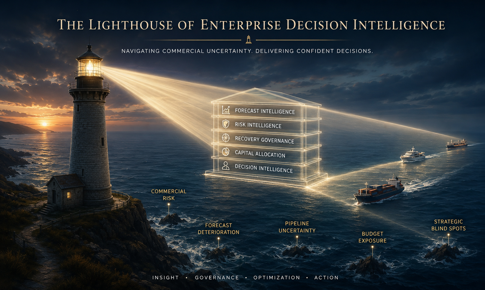
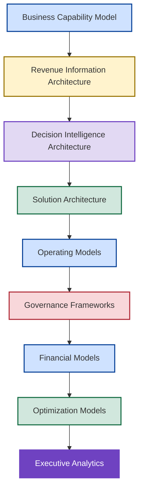
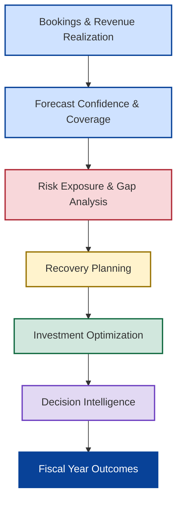
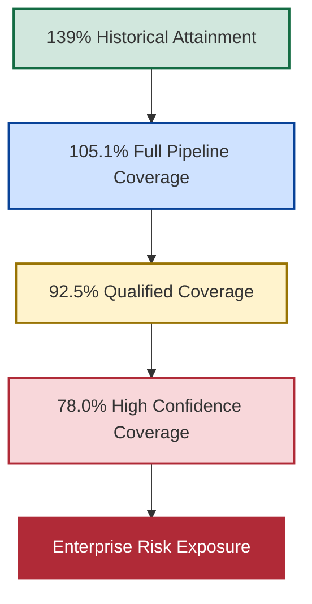
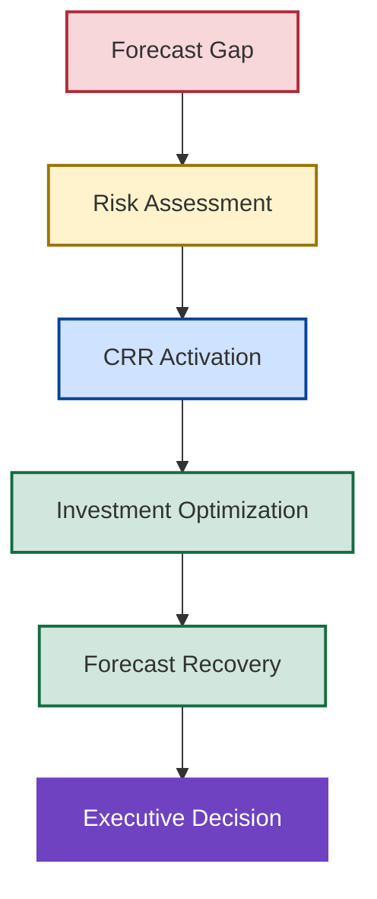

# 🚀 New Bridge

## Enterprise Revenue Governance & Decision Intelligence Operating System

<p align="center">
  
</p>

<p align="center">


</p>

---

## 📌 What Is New Bridge?

New Bridge is an Enterprise Revenue Governance and Decision Intelligence Operating System demonstrating how modern SaaS organizations can connect revenue realization, forecast governance, enterprise risk management, recovery planning, capital allocation, and executive decision-making into a unified operating environment.

The repository was developed to address a fundamental leadership challenge:

> How do organizations improve decision quality when future outcomes remain uncertain?

New Bridge demonstrates how forecasting can evolve from a reporting activity into a governance capability and ultimately into a structured decision intelligence system.

Rather than focusing solely on reporting, dashboards, or forecasting, the repository demonstrates how information, governance, optimization, and decision-making can be connected into a coherent enterprise operating model.

---

## 🏛️ Repository Architecture

New Bridge is organized as a layered enterprise architecture.

Each layer builds upon the previous layer to transform commercial activity into executive decision support.



---

## 🎯 Why This Repository Matters

Traditional forecasting environments typically answer:

### What happened?

Modern organizations must answer:

* What is likely to happen?
* How credible is the forecast?
* What risks are emerging?
* How severe are those risks?
* What intervention options exist?
* Where should capital be deployed?
* Which decision creates the best outcome?

New Bridge was designed to answer these questions through a structured governance and decision intelligence model.

---

## 🧠 Core Operating Principle

The repository is built around a simple principle:

> Forecasting should be treated as a governance capability rather than a reporting process.

This changes the conversation from:

```text
What happened?
```

to:

```text
What should we do next?
```

The objective is not visibility.

The objective is improved decision quality.

---

## 🏛️ The New Bridge Operating System



The operating system connects commercial performance, forecasting, risk management, recovery planning, optimization, and executive decision support into a unified governance model.

---

## 📉 The Business Problem

At the end of Q3 FY26, historical reporting suggested the business was performing strongly.

| Metric                        |       Result |
| ----------------------------- | -----------: |
| Historical Revenue Attainment |         139% |
| Regional Performance          | Above Target |
| Customer Expansion            |       Strong |
| Revenue Growth                |      Healthy |

However, once leadership evaluated the forward-looking fiscal outlook, a different picture emerged.

| Forecast Scenario           | Coverage |
| --------------------------- | -------: |
| Full Pipeline Coverage      |   105.1% |
| Qualified Pipeline Coverage |    92.5% |
| High Confidence Coverage    |    78.0% |

The challenge was no longer historical performance.

The challenge became:

> How should leadership respond before fiscal commitments are missed?

---

## ⚠️ Forecast Deterioration Journey



Forecast deterioration transforms uncertainty into measurable enterprise exposure.

What initially appears to be a healthy operating environment may conceal significant fiscal risk once confidence standards are applied.

---

## 🛡️ Central Risk Reserve (CRR)

One of the central concepts introduced within New Bridge is the Central Risk Reserve (CRR).

The CRR serves as a governed recovery mechanism designed to support forecast recovery when enterprise exposure becomes visible.

The objective is to determine:

* When intervention is required
* Which risks should be prioritized
* Which recovery levers should be activated
* Where capital should be invested
* How forecast exposure can be reduced

Recovery is treated as a governed capital allocation process rather than an ad hoc funding exercise.

---

## ⚙️ Recovery Optimization Framework



The objective is not to maximize spending.

The objective is to identify the most effective intervention required to improve fiscal-year outcomes.

---

## 🏗️ Repository Design Philosophy

The repository intentionally separates architecture, operating models, governance frameworks, financial models, optimization systems, and analytics.

| Artifact Type                      | Purpose                            |
| ---------------------------------- | ---------------------------------- |
| 03_Architecture/01-Business-Capability-Model          | Define enterprise capabilities     |
| 03_Architecture/02-Revenue-Information-Architecture   | Define information flow            |
| 03_Architecture/03-Decision-Intelligence-Architecture | Define decision flow               |
| 03_Architecture/04-Solution-Architecture              | Define implementation architecture |
| Operating Models                   | Define organizational behavior     |
| 00_Governance_Framework              | Define controls and accountability |
| 04_SaaS_Financial Models                   | Define revenue mechanics           |
| Optimization Models (08_CRR & 09_Recovery Optimization)                | Define intervention strategies     |
| Executive Analytics (07_PowerBI_Dashboards)               | Deliver decision visibility        |

---

## 🧭 Choose Your Journey

### 🏛️ Enterprise Architects

```text
Business Capability Model
        ↓
Revenue Information Architecture
        ↓
Decision Intelligence Architecture
        ↓
Solution Architecture
```

---

### 📊 BI & Analytics Leaders

```text
Solution Architecture
        ↓
SaaS Financial Model
        ↓
Pipeline Governance
        ↓
Power BI Dashboards
```

---

### 💰 CFOs & Finance Leaders

```text
SaaS Financial Model
        ↓
Forecast Risk Model
        ↓
CRR Optimization
        ↓
Investment Tradeoff Analysis
```

---

### 📈 Revenue Operations Leaders

```text
Pipeline Governance
        ↓
Forecast Risk Model
        ↓
Recovery Optimization
        ↓
Investment Tradeoff Analysis
```

---

### 🧠 Strategy & Transformation Leaders

```text
Decision Intelligence Architecture
        ↓
CRR Optimization
        ↓
Recovery Optimization
        ↓
Executive Lessons Learned
```

---

## 📂 Repository Structure

### Architecture Layer

| Artifact                           | Purpose                              |
| ---------------------------------- | ------------------------------------ |
| Business Capability Model          | Enterprise capability architecture   |
| Revenue Information Architecture   | Revenue information flow             |
| Decision Intelligence Architecture | Executive decision architecture      |
| Solution Architecture              | Platform implementation architecture |

---

### Operating Model Layer

| Section                         | Purpose                       |
| ------------------------------- | ----------------------------- |
| Next Generation Operating Model | Future-state operating vision |

---

### Governance Layer

| Section              | Purpose                    |
| -------------------- | -------------------------- |
| 00_Governance_Framework | Governance foundation      |
| 05_Pipeline_Governance  | Forecast governance        |
| 06_Forecast_Risk_Model  | Enterprise risk governance |

---

### Financial Intelligence Layer

| Section              | Purpose                             |
| -------------------- | ----------------------------------- |
| 04_SaaS_Financial_Model | ARR, ACV, IYRC, revenue realization |

---

### Optimization Layer

| Section                      | Purpose                       |
| ---------------------------- | ----------------------------- |
| 08_CRR_Optimization             | Recovery capital allocation   |
| 09_Recovery_Optimization        | Recovery pathway modeling     |
| 10_Investment_Tradeoff_Analysis | Recovery investment decisions |

---

### Analytics Layer

| Section             | Purpose                        |
| ------------------- | ------------------------------ |
| 07_PowerBI_Dashboards | Executive analytics experience |

---

# 🏗️ Technology & Analytics Stack

| Area               | Platform                      |
| ------------------ | ----------------------------- |
| Reporting          | Power BI                      |
| Semantic Modeling  | Power BI Semantic Models      |
| Data Engineering   | Python                        |
| Financial Modeling | Excel                         |
| Optimization       | Linear Programming            |
| Forecasting        | Scenario Modeling             |
| Governance         | Revenue Governance Frameworks |
| Decision Support   | Executive Analytics           |

---

## 🎯 Strategic Outcomes

The New Bridge operating system demonstrates how organizations can:

✅ Improve forecast quality

✅ Quantify enterprise risk

✅ Detect forecast deterioration earlier

✅ Strengthen recovery readiness

✅ Evaluate alternative recovery strategies

✅ Optimize capital allocation

✅ Improve decision quality

✅ Increase governance maturity

✅ Connect forecasting to executive action

✅ Transform forecasting into a decision intelligence capability

---

## 🌟 What Makes This Different?

Most analytics initiatives stop at:

```text
Data
    ↓
Dashboard
```

New Bridge extends the analytical value chain to:

```text
Revenue Realization
        ↓
Forecast Confidence
        ↓
Risk Exposure
        ↓
Recovery Planning
        ↓
Investment Optimization
        ↓
Decision Intelligence
        ↓
Executive Action
```

The result is a practical demonstration of how forecasting, governance, enterprise risk management, recovery planning, capital allocation, and executive decision support can be integrated into a unified operating system.

---

## 👤 Author

**Anil Jacob**

Enterprise BI • Revenue Operations Strategy • Executive Analytics • Forecast Governance

---

## 📜 Repository Context

All datasets, architectures, operating models, governance frameworks, financial models, optimization systems, forecasts, and business scenarios contained within this repository are synthetic and intended exclusively for portfolio, educational, and strategic demonstration purposes.

The repository serves as a practical demonstration of an Enterprise Revenue Governance and Decision Intelligence Operating System designed to illustrate how modern organizations can connect information, governance, optimization, and decision-making into a unified enterprise capability.
