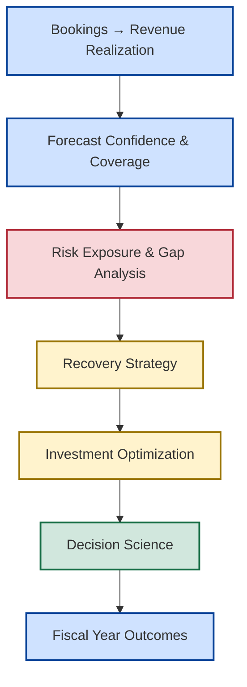
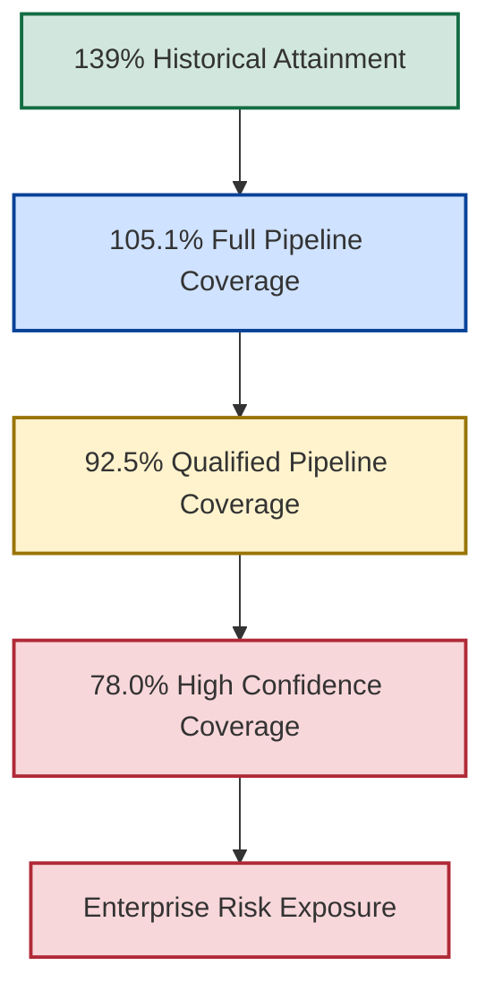
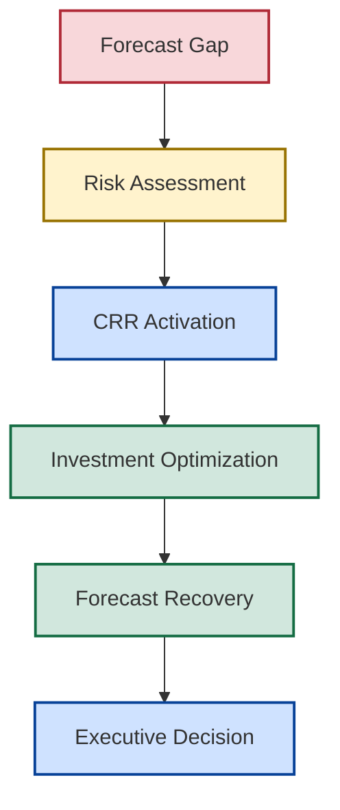

# 🚀 New Bridge

## Enterprise Revenue Governance and Decision Science Framework

<p align="center">
  
</p>

<p align="center">


</p>

---

# 📌 What Is New Bridge?

New Bridge is an Enterprise Revenue Governance and Decision Science Framework demonstrating how SaaS organizations can connect revenue realization, forecast governance, enterprise risk management, recovery planning, capital allocation, and executive decision-making into a unified governance model.

The framework was developed to address a common challenge facing modern commercial organizations:

> How do leaders make better decisions when future outcomes remain uncertain?

New Bridge transforms forecasting from a reporting activity into a strategic decision-making capability through structured governance, risk quantification, recovery planning, investment optimization, and executive decision science.

Rather than focusing solely on reporting and dashboards, the framework demonstrates how organizations can connect forecasting, risk management, recovery planning, and capital allocation into a coherent decision-making system.

---

# 🎯 Why This Framework Matters

Traditional forecasting environments typically answer:

## What happened?

Modern commercial organizations must answer:

* What is likely to happen?
* How credible is the forecast?
* What risks are emerging?
* How severe are those risks?
* What interventions are available?
* Which investments should leadership prioritize?
* What decision creates the best outcome?

The New Bridge framework was designed to answer these questions through a structured governance model.

---

# 🏛️ The New Bridge Governance Framework



The framework connects commercial activity, forecasting, enterprise risk management, recovery planning, capital allocation, and executive decision-making into a single governance system.

Each stage builds upon the previous stage, transforming commercial performance into informed leadership decisions.

---

# 🧠 Core Governance Principle

The framework is built around a simple idea:

> Forecasting should be treated as a governance capability rather than a reporting process.

This changes the conversation from:

```text
What happened?
```

to:

```text
What should we do next?
```

The objective is not simply to improve forecasting.

The objective is to improve enterprise outcomes.

---

# 📉 The Business Problem

At the end of Q3 FY26, New Bridge appeared operationally healthy when viewed through historical reporting.

| Metric                        |       Result |
| ----------------------------- | -----------: |
| Historical Revenue Attainment |         139% |
| Regional Performance          | Above Target |
| Pipeline Activity             |       Strong |
| Revenue Expansion             |      Healthy |

However, once leadership evaluated the full fiscal-year outlook, a very different picture emerged.

| Forecast Scenario                 | Coverage |
| --------------------------------- | -------: |
| Full Pipeline Coverage            |   105.1% |
| Qualified Pipeline Coverage       |    92.5% |
| High Confidence Pipeline Coverage |    78.0% |

The organization discovered that strong historical performance was concealing increasing forecast risk.

---

# ⚠️ Forecast Deterioration Journey



Forecast deterioration transforms uncertainty into measurable enterprise exposure.

What initially appears to be a healthy fiscal-year outlook may contain significant hidden risk once forecast confidence standards are applied.

This deterioration becomes the catalyst for recovery planning, capital allocation, and executive intervention.

---

# 🛡️ Central Risk Reserve (CRR)

One of the core concepts introduced within the framework is the Central Risk Reserve (CRR).

The CRR is a governed recovery mechanism designed to support forecast recovery when enterprise exposure becomes visible.

The framework helps leadership answer:

* Where should recovery capital be deployed?
* Which interventions generate the strongest recovery impact?
* Which regions should be prioritized?
* What level of investment is justified?
* How should limited resources be allocated?

The objective is not simply to provide funding.

The objective is to improve recovery effectiveness while maintaining capital discipline.

---

# ⚙️ Recovery Optimization Framework



Recovery is treated as a governed capital allocation process rather than an ad hoc funding exercise.

The objective is not to maximize spending.

The objective is to identify the most effective and efficient intervention required to improve fiscal-year outcomes.

---

# 📊 Framework Capability Map

| Framework Domain               | Business Purpose                 |
| ------------------------------ | -------------------------------- |
| Bookings → Revenue Realization | Revenue Materialization          |
| Forecast Confidence & Coverage | Forecast Credibility             |
| Risk Exposure & Gap Analysis   | Enterprise Risk Visibility       |
| Recovery Strategy              | Revenue Recovery Planning        |
| Investment Optimization        | Capital Efficiency               |
| Decision Science               | Executive Decision Support       |
| Fiscal Year Outcomes           | Strategic Performance Management |

---

# 📂 Repository Structure

The repository contains the business, analytical, governance, and optimization components supporting the framework.

| Framework Domain        | Repository Section                 |
| ----------------------- | ---------------------------------- |
| Governance Framework    | 00_Reference_Architecture          |
| Executive Overview      | 01_Executive_Summary               |
| Business Context        | 02_Business_Problem                |
| Enterprise Architecture | 03_Enterprise_Architecture         |
| Revenue Realization     | 04_SaaS_Financial_Model            |
| Forecast Confidence     | 05_Pipeline_Governance             |
| Risk Exposure           | 06_Forecast_Risk_Model             |
| Executive Reporting     | 07_PowerBI_Dashboards              |
| Recovery Strategy       | 08_CRR_Optimization                |
| Investment Optimization | 09_Recovery_Optimization           |
| Decision Science        | 10_Investment_Tradeoff_Analysis    |
| Strategic Lessons       | 11_Executive_Lessons_Learned       |
| Future-State Vision     | 12_Next_Generation_Operating_Model |

---

# 🏗️ Technology & Analytics Stack

| Area               | Platform                          |
| ------------------ | --------------------------------- |
| Reporting          | Power BI                          |
| Data Modeling      | Power BI Semantic Models          |
| Data Engineering   | Python / Pandas                   |
| Financial Modeling | Excel                             |
| Optimization       | Linear Programming (Excel Solver) |
| Forecasting        | Scenario Modeling                 |
| Governance         | Revenue Governance Frameworks     |
| Decision Support   | Executive Analytics               |

---

# 🎯 Strategic Outcomes

The New Bridge framework demonstrates how organizations can:

✅ Improve forecast quality

✅ Quantify enterprise risk

✅ Detect forecast deterioration earlier

✅ Strengthen recovery readiness

✅ Evaluate alternative recovery strategies

✅ Optimize capital allocation

✅ Improve executive decision quality

✅ Increase governance maturity

✅ Connect forecasting to strategic action

✅ Transform forecasting into a decision-making capability

---

# 📚 Repository Navigation

| Folder                                 | Purpose                                                               |
| -------------------------------------- | --------------------------------------------------------------------- |
| **00_00_Governance_Framework**          | Governance framework foundations and conceptual model                 |
| **01_Executive_Summary**               | Executive overview, board brief, and strategic context                |
| **02_Business_Problem**                | Forecasting challenge and business case for intervention              |
| **03_Enterprise_Architecture**         | Data, reporting, governance, and operating architecture               |
| **04_SaaS_Financial_Model**            | ARR, ACV, bookings, revenue realization, and IYRC frameworks          |
| **05_Pipeline_Governance**             | Pipeline coverage, forecast confidence, and forecasting methodologies |
| **06_Forecast_Risk_Model**             | Forecast deterioration analysis and enterprise risk quantification    |
| **07_PowerBI_Dashboards**              | Executive reporting and analytical visualization layer                |
| **08_CRR_Optimization**                | Central Risk Reserve framework and recovery governance                |
| **09_Recovery_Optimization**           | Investment optimization and recovery economics                        |
| **10_Investment_Tradeoff_Analysis**    | Decision science and recovery investment trade-off analysis           |
| **11_Executive_Lessons_Learned**       | Institutional learning and strategic insights                         |
| **12_Next_Generation_Operating_Model** | Future-state governance and decision-making vision                    |

---

# 👤 Author

**Anil Jacob**

Enterprise BI • Revenue Operations Strategy • Executive Analytics • Forecast Governance

---

# 📜 Repository Context

All datasets, forecasts, governance frameworks, optimization models, operating models, and business scenarios contained within this repository are synthetic and intended exclusively for portfolio, educational, and strategic demonstration purposes.

The repository serves as a practical demonstration of an Enterprise Revenue Governance and Decision Science Framework designed to illustrate revenue realization, forecast governance, enterprise risk management, recovery planning, capital allocation, and executive decision support concepts.
