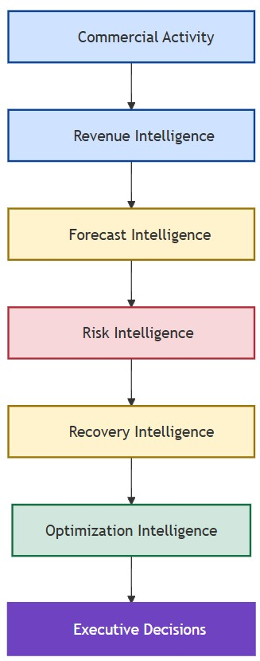
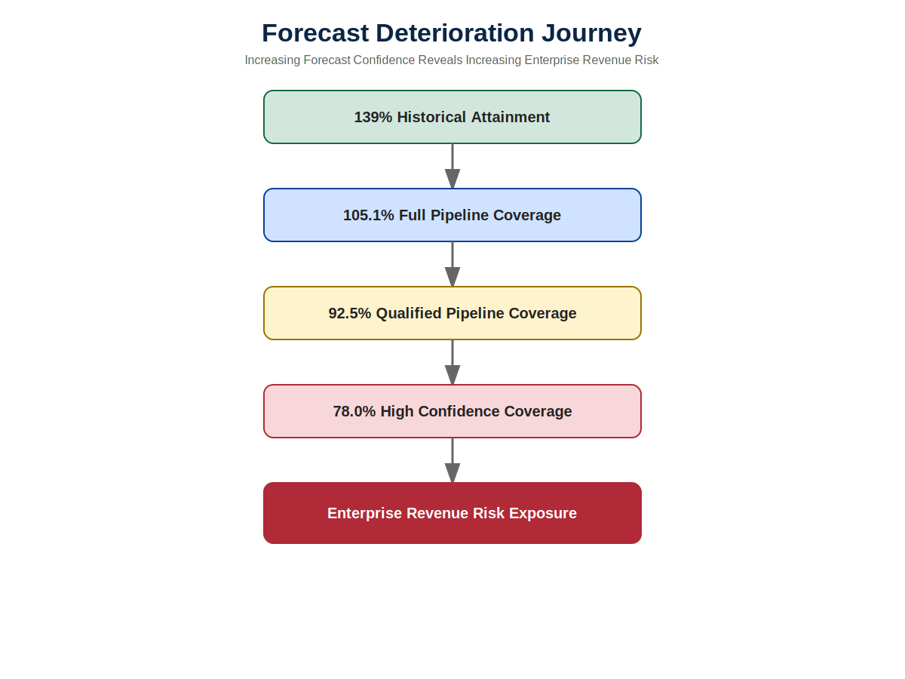
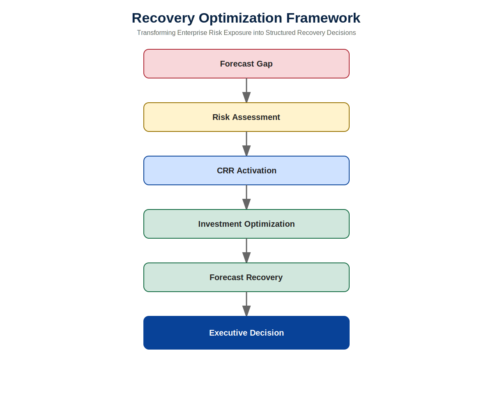
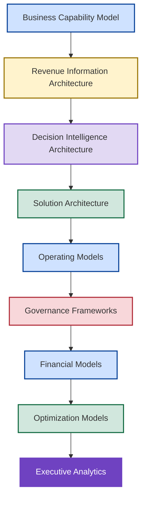

# 🚀 Executive Briefing & Repository Guide

<p align="center">
  
</p>

---

## 📌 Executive Brief

New Bridge is an Enterprise Revenue Governance and Decision Intelligence Operating System demonstrating how SaaS organizations can transform revenue intelligence, forecast governance, enterprise risk management, recovery planning, capital allocation, and executive decision-making into a unified operating model.

The repository explores a challenge faced by many commercial organizations:

> How do leaders make better decisions when future outcomes remain uncertain?

While most organizations invest heavily in reporting, forecasting, and analytics, relatively few possess a structured mechanism for translating information into high-quality decisions.

New Bridge demonstrates how organizations can move beyond dashboards and reporting toward a disciplined system of:

* Revenue Intelligence
* Forecast Governance
* Risk Management
* Recovery Planning
* Capital Allocation
* Decision Intelligence

The objective is not merely to improve visibility.

The objective is to improve decision quality.

---

# 🎯 The Executive Problem

Most organizations can answer:

> What happened?

Far fewer organizations can consistently answer:

* What is likely to happen?
* How credible is the forecast?
* What risks are emerging?
* How severe are those risks?
* Which recovery actions are available?
* Where should limited resources be invested?
* Which decision creates the best outcome?

New Bridge was built to answer these questions.

---

# 🧠 Decision Intelligence Value Chain

The repository is organized around a simple progression:

<p align="center">
  
</p>

Each stage transforms information into progressively higher forms of business value.

The architecture intentionally extends beyond traditional reporting environments and demonstrates how enterprise intelligence can support executive decision-making under uncertainty.

---

# 📉 The Business Challenge

At the end of Q3 FY26, historical reporting suggested the business was performing strongly.

| Metric                       |       Result |
| ---------------------------- | -----------: |
| Historical Budget Attainment |         139% |
| Regional Performance         | Above Target |
| Customer Expansion           |       Strong |
| Revenue Growth               |      Healthy |

However, once future forecast scenarios were evaluated, a very different picture emerged.

| Forecast Scenario           | Coverage |
| --------------------------- | -------: |
| Full Pipeline Coverage      |   105.1% |
| Qualified Pipeline Coverage |    92.5% |
| High Confidence Coverage    |    78.0% |

The challenge was no longer historical performance.

The challenge became:

> How should leadership respond before fiscal commitments are missed?

---

# ⚠️ Forecast Deterioration Journey

<p align="center">
  
</p>

Forecast deterioration transforms uncertainty into measurable enterprise exposure.

What initially appears to be a healthy fiscal-year outlook may conceal significant hidden risk once forecast confidence standards are applied.

This deterioration becomes the catalyst for recovery planning, capital allocation, and executive intervention.

---

# 🛡️ Recovery Optimization Framework

<p align="center">
  
</p>

The framework introduces a structured Central Risk Reserve (CRR) mechanism designed to support forecast recovery and enterprise risk mitigation.

Recovery is treated as a governed capital allocation process rather than an ad hoc funding exercise.

The objective is to determine:

* When intervention is required
* Which risks should be prioritized
* Which recovery levers should be activated
* Where capital should be invested
* How forecast exposure can be reduced

---

# 🏛️ Enterprise Architecture Stack

The repository is intentionally organized as a layered enterprise architecture.



This architecture demonstrates how business capabilities, information, governance, optimization, and executive analytics combine to form a unified decision intelligence operating system.

---

# 🧭 Choose Your Journey

## 🏛️ Board Members, CEOs, CFOs & CROs

Recommended path:

```text
Executive Summary
        ↓
Power BI Dashboards
        ↓
Investment Tradeoff Analysis
        ↓
Executive Lessons Learned
        ↓
Next Generation Operating Model
```

---

## 💰 Finance & Revenue Leaders

Recommended path:

```text
SaaS Financial Model
        ↓
Forecast Risk Model
        ↓
CRR Optimization
        ↓
Investment Tradeoff Analysis
```

---

## 📈 Revenue Operations & Commercial Strategy

Recommended path:

```text
Pipeline Governance
        ↓
Forecast Risk Model
        ↓
Recovery Optimization
        ↓
Investment Tradeoff Analysis
```

---

## 🏛️ Enterprise Architects

Recommended path:

```text
Business Capability Model
        ↓
Revenue Information Architecture
        ↓
Decision Intelligence Architecture
        ↓
Solution Architecture
        ↓
Next Generation Operating Model
```

---

## 📊 BI, Analytics & Data Leaders

Recommended path:

```text
Decision Intelligence Architecture
        ↓
Solution Architecture
        ↓
SaaS Financial Model
        ↓
Power BI Dashboards
```

---

## 🧠 Strategy, Transformation & Private Equity Leaders

Recommended path:

```text
Forecast Risk Model
        ↓
Recovery Optimization
        ↓
Investment Tradeoff Analysis
        ↓
Executive Lessons Learned
```

---

# 📂 Repository Components

## 🏛️ Architecture Layer

Defines enterprise structure, information flow, decision flow, and implementation architecture.

* Business Capability Model
* Revenue Information Architecture
* Decision Intelligence Architecture
* Solution Architecture

---

## ⚙️ Operating Model Layer

Defines how the enterprise operates.

* Next Generation Operating Model

---

## 🛡️ Governance Layer

Defines controls, accountability, and management disciplines.

* Governance Framework
* Pipeline Governance
* Forecast Risk Model

---

## 💰 Financial Intelligence Layer

Defines revenue realization mechanics and financial intelligence.

* SaaS Financial Model

---

## 📈 Optimization Layer

Defines recovery, intervention, and capital allocation strategies.

* CRR Optimization
* Recovery Optimization
* Investment Tradeoff Analysis

---

## 📊 Executive Analytics Layer

Provides decision visibility and executive reporting.

* Power BI Dashboards

---

# 🏆 Key Capabilities Demonstrated

| Capability               | Demonstrated |
| ------------------------ | ------------ |
| Revenue Governance       | ✅            |
| Revenue Realization      | ✅            |
| ARR & ACV Modeling       | ✅            |
| Forecast Governance      | ✅            |
| Pipeline Engineering     | ✅            |
| Risk Quantification      | ✅            |
| Scenario Planning        | ✅            |
| Recovery Strategy        | ✅            |
| Capital Allocation       | ✅            |
| Optimization Modeling    | ✅            |
| Executive Analytics      | ✅            |
| Decision Intelligence    | ✅            |
| Business Architecture    | ✅            |
| Information Architecture | ✅            |
| Solution Architecture    | ✅            |
| Operating Model Design   | ✅            |

---

# 🌟 What Makes This Different?

Most analytics initiatives stop at:

```text
Data
    ↓
Dashboard
```

New Bridge extends the analytical value chain to:

```text
Revenue Realization
        ↓
Forecast Intelligence
        ↓
Risk Intelligence
        ↓
Recovery Intelligence
        ↓
Optimization Intelligence
        ↓
Decision Intelligence
        ↓
Executive Action
```

The result is a practical demonstration of how forecasting, governance, enterprise risk management, recovery planning, capital allocation, and executive decision-making can be integrated into a unified operating system.

---

# 🎯 Strategic Outcomes

The New Bridge operating system demonstrates how organizations can:

✅ Improve forecast quality

✅ Quantify enterprise risk

✅ Detect forecast deterioration earlier

✅ Strengthen recovery readiness

✅ Evaluate alternative recovery strategies

✅ Optimize capital allocation

✅ Improve decision quality

✅ Increase governance maturity

✅ Connect forecasting to executive action

✅ Transform forecasting into a decision intelligence capability

---

## 👤 Author

**Anil Jacob**

Enterprise BI • Revenue Operations Strategy • Executive Analytics • Forecast Governance

---

## 📜 Repository Context

All datasets, architectures, operating models, governance frameworks, financial models, optimization systems, forecasts, and business scenarios contained within this repository are synthetic and intended exclusively for portfolio, educational, and strategic demonstration purposes.

The repository serves as a practical demonstration of an Enterprise Revenue Governance and Decision Intelligence Operating System designed to illustrate how modern organizations can connect information, governance, optimization, and decision-making into a unified enterprise capability.
