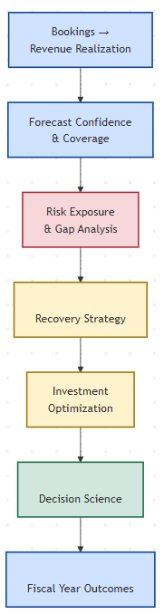
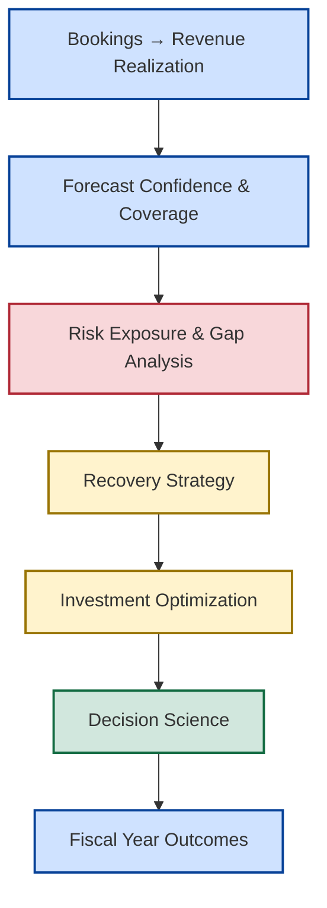
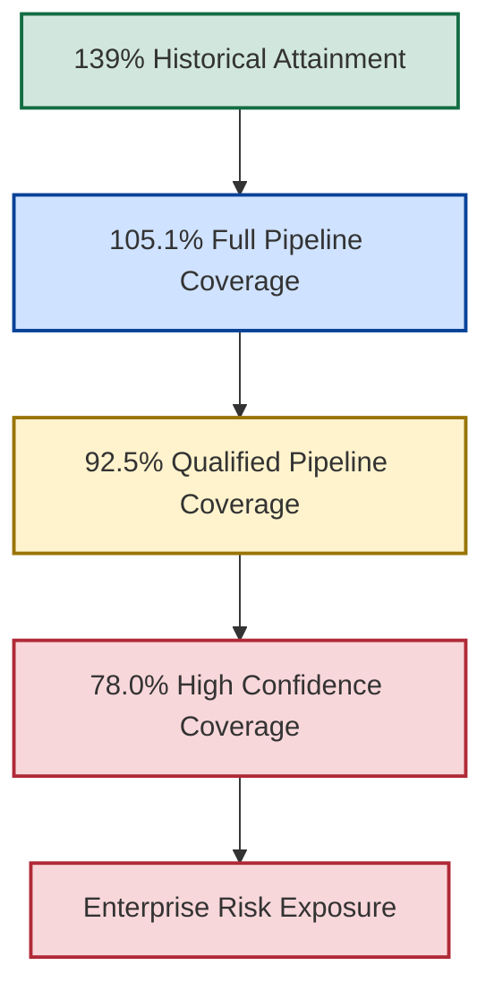
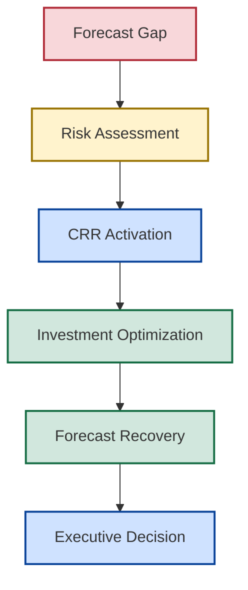

<p align="center">
  
</p>

---

## 📌 Executive Overview

New Bridge is an Enterprise Revenue Governance and Decision Science Framework demonstrating how SaaS organizations can connect revenue realization, forecast governance, enterprise risk management, recovery planning, capital allocation, and executive decision-making into a unified governance model.

The framework was developed to address a common challenge facing modern commercial organizations:

> How do leaders make better decisions when future outcomes remain uncertain?

New Bridge transforms forecasting from a reporting activity into a strategic decision-making capability through structured governance, risk quantification, recovery planning, investment optimization, and executive decision science.

The repository demonstrates how organizations can move beyond traditional reporting and toward a more disciplined approach to revenue management, enterprise risk assessment, recovery planning, and executive decision-making.

---

## 🎯 The Decision Problem

Most organizations can answer:

> What happened?

Far fewer organizations can consistently answer:

* How much revenue is likely to materialize?
* How credible is the forecast?
* What risks are emerging?
* How severe are those risks?
* Which recovery actions are available?
* Where should limited resources be invested?
* What decision creates the best outcome?

New Bridge was designed to answer these questions.

---

## 🏛️ The New Bridge Governance Framework

<p align="left">
  
</p>




The framework connects commercial activity, forecasting, enterprise risk management, recovery planning, capital allocation, and executive decision-making into a single governance system.

Each stage builds upon the previous stage, transforming commercial performance into informed leadership decisions.

---

## 🧠 Core Governance Principle

New Bridge is built around a simple philosophy:

> Forecasting should be treated as a governance capability rather than a reporting process.

This shifts the focus from:

```text
Visibility
```

to:

```text
Decision Quality
```

The objective is not simply to improve forecasting.

The objective is to improve enterprise outcomes.

---

## 📉 The Business Challenge

At the end of Q3 FY26, historical reporting suggested the business was performing strongly.

| Metric                       |       Result |
| ---------------------------- | -----------: |
| Historical Budget Attainment |         139% |
| Regional Performance         | Above Target |
| Customer Expansion           |       Strong |
| Revenue Growth               |      Healthy |

However, once future forecast scenarios were evaluated, a very different picture emerged.

| Forecast Scenario           | Coverage |
| --------------------------- | -------: |
| Full Pipeline Coverage      |   105.1% |
| Qualified Pipeline Coverage |    92.5% |
| High Confidence Coverage    |    78.0% |

The challenge was no longer reporting performance.

The challenge became:

> How should leadership respond to forecast deterioration before fiscal commitments are missed?

---

## ⚠️ Forecast Deterioration Journey



Forecast deterioration transforms uncertainty into measurable enterprise exposure.

What initially appears to be a healthy fiscal-year outlook may contain significant hidden risk once forecast confidence standards are applied.

This deterioration becomes the catalyst for recovery planning, capital allocation, and executive intervention.

---

## 🛡️ Recovery Framework

The New Bridge framework introduces a structured Central Risk Reserve (CRR) mechanism designed to support forecast recovery and enterprise risk mitigation.

The objective is to determine:

* When intervention is required
* Which risks should be prioritized
* Which recovery levers should be activated
* Where capital should be invested
* How forecast exposure can be reduced



Recovery is treated as a governed capital allocation process rather than an ad hoc funding exercise.

---

## 🧭 Choose Your Journey

### 🏛️ Executive Leadership Path

Recommended for:

* CEOs
* CFOs
* CROs
* Board Members
* Private Equity Operating Partners

```text
01 Executive Summary
        ↓
07 Power BI Dashboards
        ↓
10 Investment Tradeoff Analysis
        ↓
11 Executive Lessons Learned
        ↓
12 Next Generation Operating Model
```

---

### 📊 Data & Analytics Leadership Path

Recommended for:

* Heads of BI
* Heads of Analytics
* CDOs
* Data Strategy Leaders

```text
00 Reference Architecture
        ↓
03 Enterprise Architecture
        ↓
04 SaaS Financial Model
        ↓
05 Pipeline Governance
        ↓
06 Forecast Risk Model
        ↓
07 Power BI Dashboards
```

---

### 💰 Revenue Operations & Commercial Strategy Path

Recommended for:

* RevOps Leaders
* Commercial Excellence Teams
* Strategy Leaders
* Sales Operations

```text
05 Pipeline Governance
        ↓
06 Forecast Risk Model
        ↓
08 CRR Optimization
        ↓
09 Recovery Optimization
        ↓
10 Investment Tradeoff Analysis
```

---

### 🏗️ Enterprise Architecture & Governance Path

Recommended for:

* Enterprise Architects
* Governance Leaders
* Transformation Teams

```text
00 Reference Architecture
        ↓
03 Enterprise Architecture
        ↓
08 CRR Optimization
        ↓
11 Executive Lessons Learned
        ↓
12 Next Generation Operating Model
```

---

## 📂 Repository Structure

| Folder                             | Purpose                                                      |
| ---------------------------------- | ------------------------------------------------------------ |
| 00_Reference_Architecture          | Commercial governance architecture and framework foundations |
| 01_Executive_Summary               | Executive overview and board-level brief                     |
| 02_Business_Problem                | Business context and forecasting challenge                   |
| 03_Enterprise_Architecture         | Data, reporting and governance architecture                  |
| 04_SaaS_Financial_Model            | ARR, ACV, bookings and revenue frameworks                    |
| 05_Pipeline_Governance             | Pipeline coverage and forecast engineering                   |
| 06_Forecast_Risk_Model             | Risk identification and exposure analysis                    |
| 07_PowerBI_Dashboards              | Executive reporting experience                               |
| 08_CRR_Optimization                | Central Risk Reserve framework                               |
| 09_Recovery_Optimization           | Capital allocation and recovery economics                    |
| 10_Investment_Tradeoff_Analysis    | Recovery scenario comparison                                 |
| 11_Executive_Lessons_Learned       | Institutional learning and strategic insights                |
| 12_Next_Generation_Operating_Model | Future-state operating model                                 |

---

## 🏆 Key Capabilities Demonstrated

| Capability                    | Demonstrated |
| ----------------------------- | ------------ |
| Revenue Realization Framework | ✅            |
| ARR & ACV Modeling            | ✅            |
| Forecast Governance           | ✅            |
| Pipeline Engineering          | ✅            |
| Risk Quantification           | ✅            |
| Scenario Planning             | ✅            |
| Recovery Strategy             | ✅            |
| Capital Allocation            | ✅            |
| Investment Optimization       | ✅            |
| Executive Analytics           | ✅            |
| Decision Science              | ✅            |
| Governance Framework Design   | ✅            |

---

## 🌟 What Makes This Different?

Most analytics projects stop at:

```text
Data
    ↓
Dashboard
```

New Bridge extends the conversation to:

```text
Revenue Realization
        ↓
Forecast Confidence
        ↓
Risk Exposure
        ↓
Recovery Strategy
        ↓
Investment Optimization
        ↓
Decision Science
        ↓
Fiscal Year Outcomes
```

The result is a practical framework for connecting forecasting, governance, enterprise risk management, recovery planning, capital allocation, and executive decision-making into a unified decision system.

---

## 🎯 Strategic Outcomes

The New Bridge framework demonstrates how organizations can:

✅ Improve forecast quality

✅ Quantify enterprise risk

✅ Detect exposure earlier

✅ Strengthen recovery readiness

✅ Evaluate alternative recovery scenarios

✅ Optimize capital allocation

✅ Improve decision quality

✅ Increase governance maturity

✅ Connect forecasting to executive action

---

### 👤 Author

**Anil Jacob**

Enterprise BI • Revenue Operations Strategy • Executive Analytics • Forecast Governance

---

### 📜 Repository Context

All datasets, forecasts, governance frameworks, optimization models, operating models, and business scenarios contained within this repository are synthetic and intended exclusively for portfolio, educational, and strategic demonstration purposes.

The repository serves as a practical demonstration of an Enterprise Revenue Governance and Decision Science Framework designed to illustrate revenue realization, forecast governance, enterprise risk management, recovery planning, capital allocation, and executive decision support concepts.
