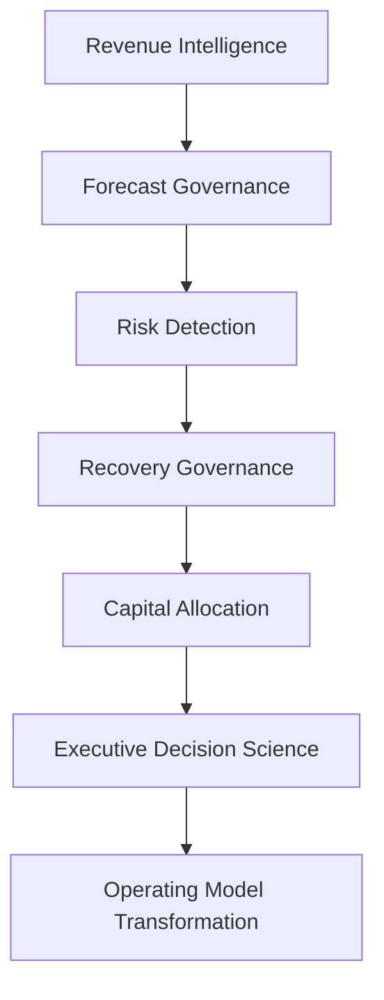
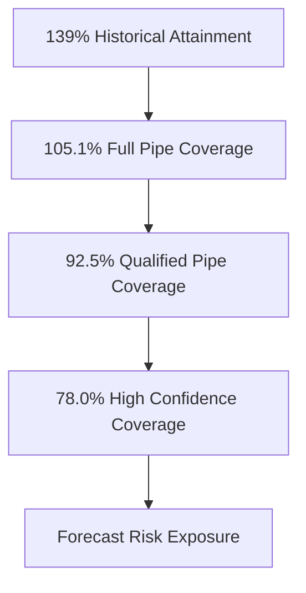
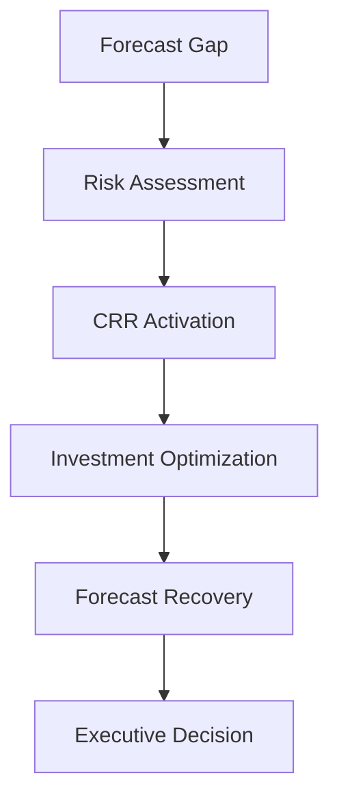

# 🚀 New Bridge SaaS Operating System

## 🏛️ Commercial Governance Reference Architecture & Reference Implementation

<p align="center">
  
</p>

<p align="center">


</p>

---

## 📌 Executive Overview

New Bridge is a reference implementation of an Enterprise Revenue Operating System designed to help SaaS organizations:

* improve forecast governance,
* detect commercial risk earlier,
* evaluate recovery scenarios,
* optimize capital allocation,
* and strengthen executive decision-making.

The repository demonstrates how modern organizations can evolve beyond traditional reporting into a disciplined commercial governance framework.

---

## 🎯 The Core Business Question

Most organizations can answer:

> What happened?

Few organizations can consistently answer:

* What is likely to happen?
* What risks are emerging?
* How severe are those risks?
* What interventions are available?
* Where should recovery investments be deployed?
* How should leadership respond?

New Bridge was designed to answer those questions.

---

## 🏛️ Commercial Governance Reference Architecture



Each capability builds upon the previous capability to create a continuous commercial governance operating model.

---

## 📉 The Business Challenge

At the end of Q3 FY26, historical reporting suggested the business was performing strongly.

| Metric                       |       Result |
| ---------------------------- | -----------: |
| Historical Budget Attainment |         139% |
| Regional Performance         | Above Target |
| Customer Expansion           |       Strong |
| Revenue Growth               |      Healthy |

However, once future forecast scenarios were evaluated, a very different picture emerged.

| Forecast Scenario           | Coverage |
| --------------------------- | -------: |
| Full Pipeline Coverage      |   105.1% |
| Qualified Pipeline Coverage |    92.5% |
| High Confidence Coverage    |    78.0% |

The challenge was no longer reporting performance.

The challenge became:

> How should leadership respond to forecast deterioration before fiscal commitments are missed?

---

## ⚠️ Forecast Deterioration Journey



This forecast deterioration became the catalyst for recovery governance and capital allocation planning.

---

## 🛡️ Recovery Governance Framework

The New Bridge operating model introduces a structured Central Risk Reserve (CRR) framework.

The objective is to determine:

* when intervention is required,
* where capital should be invested,
* which recovery levers should be activated,
* and how forecast exposure can be mitigated.



---

## 🧭 Choose Your Journey

---

### 🏛️ Executive Leadership Path

Recommended for:

* CEOs
* CFOs
* CROs
* Board Members
* Private Equity Operating Partners

```text
01 Executive Summary
        ↓
07 Power BI Dashboards
        ↓
10 Investment Tradeoff Analysis
        ↓
11 Executive Lessons Learned
        ↓
12 Next Generation Operating Model
```

---

### 📊 Data & Analytics Leadership Path

Recommended for:

* Heads of BI
* Heads of Analytics
* CDOs
* Data Strategy Leaders

```text
00 Reference Architecture
        ↓
03 Enterprise Architecture
        ↓
04 SaaS Financial Model
        ↓
05 Pipeline Governance
        ↓
06 Forecast Risk Model
        ↓
07 Power BI Dashboards
```

---

### 💰 Revenue Operations & Commercial Strategy Path

Recommended for:

* RevOps Leaders
* Commercial Excellence Teams
* Strategy Leaders
* Sales Operations

```text
05 Pipeline Governance
        ↓
06 Forecast Risk Model
        ↓
08 CRR Optimization
        ↓
09 Recovery Optimization
        ↓
10 Investment Tradeoff Analysis
```

---

### 🏗️ Enterprise Architecture & Governance Path

Recommended for:

* Enterprise Architects
* Governance Leaders
* Transformation Teams

```text
00 Reference Architecture
        ↓
03 Enterprise Architecture
        ↓
08 CRR Optimization
        ↓
11 Executive Lessons Learned
        ↓
12 Next Generation Operating Model
```

---

## 📂 Repository Structure

| Folder                             | Purpose                                       |
| ---------------------------------- | --------------------------------------------- |
| 00_Reference_Architecture          | Commercial Governance Reference Architecture  |
| 01_Executive_Summary               | Executive overview and board-level brief      |
| 02_Business_Problem                | Business context and forecasting challenge    |
| 03_Enterprise_Architecture         | Data, reporting and governance architecture   |
| 04_SaaS_Financial_Model            | ARR, ACV, Bookings and Revenue frameworks     |
| 05_Pipeline_Governance             | Pipeline coverage and forecast engineering    |
| 06_Forecast_Risk_Model             | Risk identification and exposure analysis     |
| 07_PowerBI_Dashboards              | Executive reporting experience                |
| 08_CRR_Optimization                | Central Risk Reserve framework                |
| 09_Recovery_Optimization           | Capital allocation and recovery economics     |
| 10_Investment_Tradeoff_Analysis    | Recovery scenario comparison                  |
| 11_Executive_Lessons_Learned       | Institutional learning and strategic insights |
| 12_Next_Generation_Operating_Model | Future-state operating model                  |

---

## 🏆 Key Capabilities Demonstrated

| Capability             | Demonstrated |
| ---------------------- | ------------ |
| Revenue Intelligence   | ✅            |
| ARR & ACV Modeling     | ✅            |
| Forecast Governance    | ✅            |
| Pipeline Engineering   | ✅            |
| Risk Detection         | ✅            |
| Scenario Planning      | ✅            |
| Recovery Governance    | ✅            |
| Capital Allocation     | ✅            |
| Optimization           | ✅            |
| Executive Analytics    | ✅            |
| Decision Science       | ✅            |
| Operating Model Design | ✅            |

---

## 🌟 What Makes This Different?

Most analytics projects stop at:

```text
Data
    ↓
Dashboard
```

New Bridge extends the conversation to:

```text
Revenue Intelligence
        ↓
Forecast Governance
        ↓
Risk Detection
        ↓
Recovery Governance
        ↓
Capital Allocation
        ↓
Decision Science
        ↓
Operating Model Transformation
```

The result is a practical framework for connecting analytics, forecasting, governance, and executive decision-making into a single operating model.

---

## 🎯 Strategic Outcome

The New Bridge framework demonstrates how organizations can:

✅ Improve forecast visibility

✅ Detect risk earlier

✅ Evaluate multiple forecast scenarios

✅ Deploy recovery investments intelligently

✅ Improve capital allocation decisions

✅ Strengthen governance maturity

✅ Enhance executive decision quality

---

### 👤 Author

**Anil Jacob**
Enterprise BI • RevOps Strategy • Executive Analytics • Forecast Governance

---

### 📜 Repository Context

All datasets, forecasts, governance frameworks, optimization models, operating models, and business scenarios contained within this repository are synthetic and intended exclusively for portfolio, educational, and strategic demonstration purposes.

This repository serves as a reference implementation of a Commercial Governance Reference Architecture designed to illustrate enterprise forecasting, recovery governance, capital allocation, and executive decision support concepts.
